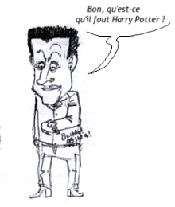

<!-- HTML -->

<!-- / HTML -->

# Publié le 30-09-08 à 17:48
  	
[Entretien avec M. Jan Peter BALKENENDE, Premier ministre du Royaume des Pays-Bas](http://www.elysee.fr/documents/index.php?lang=fr&mode=view&cat_id=8&press_id=1858)

Le Président de la République recevra M. Jan Peter BALKENENDE, Premier ministre du Royaume des Pays-Bas, mercredi 1er octobre 2008 à 17h30 au Palais de l'Elysée, pour un entretien qui portera sur la préparation du Conseil européen des 15 et 16 octobre prochains, et notamment sur la réponse européenne à la crise financière.

<!-- HTML -->

<!-- / HTML -->

Tiens, *Jan Peter* va rendre visite à *Nicolas*, c'est toujours bien d'entretenir de bonnes relations entre [pays voisins](/15km-de-frontiere-commune). OK je note, c'est juste au début du mois.

<!-- HTML -->

<!-- / HTML -->

[Balkenende to visit the French president Nicolas Sarkozy](http://www.minaz.nl/english/News/Press_releases_and_news_items/2008/Oktober/Balkenende_to_visit_the_French_president_Nicolas_Sarkozy)

# Press release | 01-10-2008

On Wednesday, 2 October, Prime Minister Balkenende will visit the French president Nicolas Sarkozy, who currently holds the position of President of the European Council.

The objective of the Prime Minister's visit is to prepare the upcoming European Council meeting on 15 and 16 October. Important topics for discussion include the situation of the financial markets, measures to halt climate change and the Treaty of Lisbon.

<!-- HTML -->

<!-- / HTML -->

Aux *Ministerie van Algemene Zaken* (Ministère des Affaires Générales) aussi, ils ont pris bonne note. C'est toujours en début de mois mais hélas ce n'est pas la même date. C'est parfois difficile de se mettre d'accord entre dirigeants. Dans l'agenda du Président de la République, la rencontre doit se faire le premier.

{.center}

<!-- HTML -->

# Publié le 01-10-08 à 18:55
[Communiqué rectificatif de la rencontre entre M. le Président de la République et M. Jan Peter BALKENENDE, Premier ministre du Royaume des Pays-Bas](http://www.elysee.fr/documents/index.php?lang=fr&mode=view&cat_id=8&press_id=1867)
	

M. Jan Peter BALKENENDE Premier ministre du Royaume des Pays-Bas, n'a pu se rendre à son entretien de ce jour à 17h30 au Palais de l'Elysée avec M. le Président de la République.

Le chef de l'Etat le recevra donc, jeudi 2 octobre 2008 à 13h00 pour un déjeuner de travail qui portera sur la préparation du Conseil européen des 15 et 16 octobre prochains, et notamment sur la réponse européenne à la crise financière.

<!-- / HTML -->

Voilà le rendez-vous décalé parce que Jan Peter a eu un empèchement (d'après ce que je comprends). C'est pas très bien organisé tout ça. Je me demande pourquoi ça caffouille comme ça dans les cabinets ? On est en crise ou quoi ?
