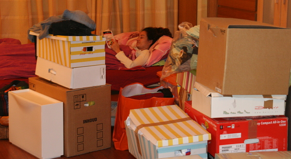
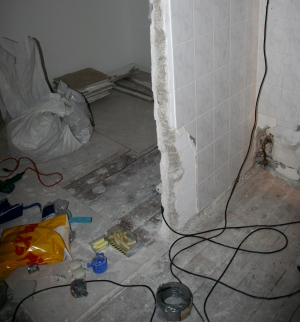
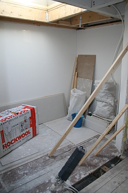
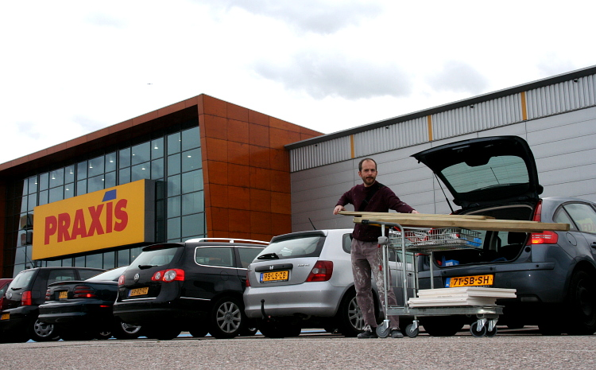

Quelques nouvelles de l'appartement et de comment j'y vis...

Une fois l'appartement acheté, nous avons décidé de ne pas l'investir tout de suite pour y effectuer quelques améliorations. Pas grand chose, juste quelques murs à abattre pour que la chambre énorme et le cagibis deviennent un grande et une petite chambre. Quatre mois ont passés et ce n'est toujours pas terminé. Pourtant je ne compte pas les soirées passées à essuyer les plâtres ou à dérouler les câbles, les jours de congés pris ça et là pour aller acheter des matériaux et les week-ends passés sans mettre le nez dehors alors que le rare soleil montrait quelques uns de ses rayons.

<!-- HTML -->

<!-- / HTML -->
{.center}  
voici à peut près où on vit tous les jours
<!-- HTML -->

<!-- / HTML -->

Il faut dire aussi que les journées de travail me laissent peu de temps et que je veux quand même partir en week-end et en congés de temps en temps. Le temps qui passe a eu raison de ma motivation et j'ai accepté de refiler le boulot à un professionnel pour aller plus vite. Hélas, le professionnel travaille peut être plus vite sur un chantier mais quand il en a plusieurs c'est pas vraiment ça. On passe autant de temps à attendre qu'il revienne finir. 

Le plombier qui est venu réparer les fuites que j'avais créées, ne répond plus au téléphone et n'a donc jamais pu revenir pour finir la plomberie (un raccordement EPR-cuivre et et déplacement de chauffage). Un entrepreneur est venu jeudi dernier et comme le travail n'était pas fini à quatre heures, il m'a proposé de revenir, s'il pouvait, le jeudi suivant. J'attends donc le jeudi suivant pour faire les plâtres avant de les essuyer... Mais plutôt que de m'attarder sur des détails que tout le monde fait l'expérience s'il fait des travaux, voici quelques photos de ma vie au quotidien...

<!-- HTML -->
<table align="center"><tr><td>
<!-- / HTML -->
{.center}  
Ces deux photos montrent le même endroit  
à un mois d'intervale.  
Beaucoup de changements,  
mais toujours pas terminé...

<!-- HTML -->
</td><td>
<!-- / HTML -->

{.center}
<!-- HTML -->
</td></tr></table>
<!-- / HTML -->

<!-- HTML -->

<!-- / HTML -->
{.center}  
les courses du samedi après-midi
<!-- HTML -->

<!-- / HTML -->

## Voir aussi
[Comment je pose un va et vient en hollandais](/va-et-vient-wisselschrakeling).
---