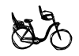

Il y a maintenant un mois que je n'ai plus mon vélo, il semble que je l'ai perdu stupidement avec l'aide d'un voleur. J'utilise donc quotidiennement le vélo de Sophie qui est un vrai vélo hollandais d'homme, pour les vrais hommes hollandais. Je regrette beaucoup [mon btwin](/un-b-twin-a-amsterdam) mais près un temps je me suis habitué à ce nouveau vélo et je vais avoir du mal à le rendre... Les vélos hollandais, c'est un peu vague, il y a tellement de vélos aux Pays-Bas (plus que d'habitants en age de faire du vélo) qu'il y a forcément toutes sortes de bicyclettes. Il y a quand même quelques caractéristiques communes que que l'on retrouve sur les vélos hollandais et je vais les énumérer ici.

### Chapitre 1 : Particularités des vélos hollandais

**Le vélo hollandais classique a généralement un petit plateau** (ce qui oblige de faire un gros effort pour démarrer) et pas de vitesse. Ceci s'explique par le peu de côtes de ce plat pays. Le guidon est large avec un retour prononcé qui permet de conserver une assise stable et confortable avec un dos droit. 

Généralement **les freins sont à rétropédalage** ce qui permet de garder les mains libres pour tenir un parapluie, un téléphone ou la main de son amoureux(se). Les vélos hollandais sont souvent noir et leurs propriétaires inventent toutes sortes de décorations pour les reconnaître. Parmi ces élément il y a [les fleurs en plastique](/sophie-pas-numero) et la peinture, ou les graffitis. Néanmoins, de nos jours, on trouve de plus en plus de [vélos en couleur](/les-velos-en-couleur) de série. Le porte-panier à l'avant n'est pas systématique mais il est très répandu. Le porte-bagages à l'arrière l'est encore plus. 

Presque tous les vélos ont les **jantes latérales réfléchissantes** et le garde-boue arrière est peint en blanc sur une hauteur de 20 cm avec une plaque réfléchissante rouge au milieu. Ceci avait été rendu obligatoire il y a quelques temps pour des raisons de sécurité.

Un **cadenas de série est fixé sur la roue arrière**. Ouvert et fermé en deux temps trois mouvements, [ce cadenas](/cadenas-special-velo) est très pratique pour les arrêts de courte durée. Si le vélo dors dehors, une bonne chaîne est indispensable et ce cadenas est un bon complément pour bloquer la roue arrière.

Un dernier détail qui a son importance, **la chaîne est toujours protégée** par un carter et même souvent, elle est y complètement enfermée. C'est un gros avantage pour les bas de pantalon mais c'est aussi un avantage pour la chaine qui semble moins souffrir de la pluie.

<!-- HTML -->

<!-- / HTML -->
{.center}  
Le vélo multicolore de Sophie  
C'est forcément un vélo hollandais puisqu'il est devant un moulin 
<!-- HTML -->

<!-- / HTML -->

Rappelez-vous [la révision de mon B'twin](/revision-du-btwin) et ses petits détails qui faisaient que mon vélo n'était pas hollandais...

<!-- HTML -->

<a href="/plein-de-velos-hollandais" title="tout savoir sur la bicyclette aux Pays-Bas">
<!-- / HTML -->
**Plein de vélos hollandais**  
{.center}  
1) Les avantages  
<!-- HTML -->
</a>

<!-- / HTML -->

<!-- HTML -->

<a href="/plein-de-velos" title="tout savoir sur la bicyclette aux Pays-Bas">
<!-- / HTML -->
**Plein de vélos hollandais**  
{.center}  
2) Les styles
<!-- HTML -->
</a>

<!-- / HTML -->

<!-- HTML -->

<a href="/plein-de-velos-hollandais-3" title="tout savoir sur la bicyclette aux Pays-Bas">
<!-- / HTML -->
**Plein de vélos hollandais**  
{.center}  
3) Les marques
<!-- HTML -->
</a>

<!-- / HTML -->

<!-- HTML -->

<a href="/plein-de-velos-pas-hollandais-4" title="tout savoir sur la bicyclette aux Pays-Bas">
<!-- / HTML -->
**Plein de vélos hollandais**  
{.center}  
4) Les marques étrangères
<!-- HTML -->
</a>

<!-- / HTML -->

<!-- HTML -->

<a href="/une-heure-sans-velo" title="tout savoir sur la bicyclette aux Pays-Bas">
<!-- / HTML -->
**Plein de vélos hollandais**  
{.center}  
5) Parking à vélos
<!-- HTML -->
</a>

<!-- / HTML -->

<!-- HTML -->

<a href="/les-velos-de-location" title="tout savoir sur la bicyclette aux Pays-Bas">
<!-- / HTML -->
**Plein de vélos hollandais**  
{.center}  
6) Vélos de location
<!-- HTML -->
</a>

<!-- / HTML -->

<!-- HTML -->

<!-- / HTML -->
---