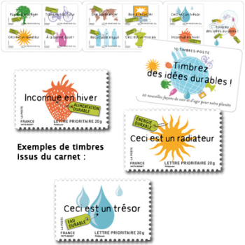
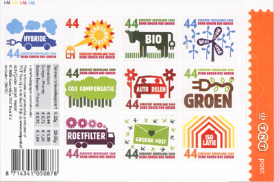

Le 30 Juin dernier, la Poste française sortait un carnet de 10 timbres intitulé *des idées durables*. 10 timbres écolos incitant à faire attention à l'eau, utiliser mois de détergents, se chauffer au soleil et manger moins de fraises en hiver. Une belle initiative mené conjointement avec le [Programme des Nations Unies pour l'environnement](http://www.unep.org/french/) pas très joliement illustrée par Patte & Besset.

[{.center}](http://timbres.laposte.fr/detailarticle.jgi?idCarac=&idGamme=035&idArbo=009&page=1&index=3&idArticle=1108485)

On se demande où La Poste est allée pêcher ces idées...

Le 1er janvier dernier, la Poste Néerlandaise (répondant au doux nom de [TNT](/la-poste-prends-les-couleurs-d-halloween)) lançait pour la nouvelle année une série de 10 nouveaux timbres d'usage courant [au nouveau tarif de 44 cents](/augmentation-du-prix-du-timbre). Pour 2008, l'entreprise privé de services postaux a essayé de [soigner son image](http://www.tntpost.nl/voorthuis/groen/) en utilisant une thématique écologique. Un carnet de 10 timbres écolos incitant à partager sa voiture, à manger bio ou à isoler sa maison. Une belle initiative au design simple et efficace même si je me demande ce que signifie le timbre *groen post* (la poste verte).

[{.center}](http://www.tntpost.nl/voorthuis/groen/groenepostzegels/index.aspx)

Je suis sûr que cette idée donnera des idées aux pays voisins...

Rappellons à nos lecteurs assidus que comme tous les ans, la poste Néerlandaise propose des timbres saisonniers pour envoyer ses voeux de fin d'année à tarif préférentiel (34 cents au lieu de 44 cette année). Tout est [expliqué ici](/les-timbres-de-saison).
