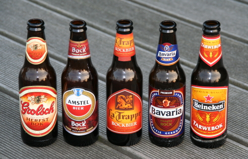

Aux [derniers jours de l'été](/c-est-la-fin-de-l-ete), les magasins on vu fleurir dans leur rayons, une nouvelle sorte de bière. La **BokBier** ou **Bockbier**. Cette bière spéciale est d'origine allemande mais depuis quelques années, elle rencontre un succès grandissant aux Pays-Bas si bien qu'aujourd'hui tous les grands brasseurs du pays proposent cette bière à l'arrivée de l'automne.

## Bockbier c'est quoi ?
D'après Wikipedia, la Bockbier est une bière de fermentation basse qui aurait été inventée en Allamagne dans la ville d'**Einbecker**. Les moines-brasseurs y auraient inventé une bière contenant de fortes quantités de levures, qui, fort nourissantes pouvaient faire passer la faim en période de carème. Les levures plus nombreuses augmentent la fermentation et donc le degré d'alcool. La *Einbecker bier* est devenue *Becker bier* puis *Bock bier* en gagnant en notoriété. Elle est aujourd'hui connue comme une bière de saison, sortant en février (pour le carème) et en octobre (pour répondre à la demande), en Allemagne mais aussi en Autriche, Tchéquie, Belgique et aux Pays-Bas.

Son apparition aux Pays-Bas est recente. [Wikipedia](http://nl.wikipedia.org/wiki/Bokbier) nous révèle que c'est en 1983 que la **première bockbier** est produite par la *Arcense Bierbrouwerij* et que c'est la même année qu'Amstel a lancé une bockbier en bouteille dans le commerce traditionnel. Depuis quelques années la bockbier remporte un véritable succès populaire en apparaissant en tête de gondole aux périodes clefs. aucune grande brasserie Néerlandaise ne se permet d'être en dehors de ce marché en croissance (Alors que le marché de la *pils* est moribond), comme le montre la photo ci-dessous.

[{.center}](http://commons.wikimedia.org/wiki/Image:Bock-bieren-van-Nederland.jpg)

## Bock c'est quoi ?

Vous remarquerez sur cette photo que plusieurs bouteilles sont illustrées avec un bouquetin, un mouflon ou tout simplement une chêvre. *Bok* signifie bouc en Néerlandais et son pluriel (*bokken*) est utilisé pour parler de la famille caprine. Cette *Herfst Bokbier* pourrait donc s'appeller **bière de chêvre d'automne** en français. Mais les connaisseurs disent simplement *bockbier*, reprenant le mot allemand.

La grande période de la bockbier est tout au long du mois d'octobre. Si je ne vous en ai pas parlé avant comme l'[un des signes de la fin de l'été](/c-est-la-fin-de-l-ete), c'est parce qu'il faut consommer l'alcool avec modération. Je ne suis malgré tout pas en retard pour que vous puissiez y goûter. La bockbier est encore en vente un peu partout jusque début décembre. Son goût riche et un peu caramélisé en font une bière idéale pour supporter les premiers frimas et avec le temps qu'il fait, c'est exactement ce qu'il faut.

## Encore plus

Les [nouvelles bockbier de l'automne](/les-nouvelles-bieres-d-automne), deux ans plus tard, elles sont encore plus nombreuses...
