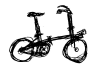

Il y a maintenant plus d'un mois que je n'ai plus mon vélo, il semble vous avoir dit que je l'ai perdu stupidement avec l'aide d'un voleur. Alors maintenant que je dois chercher un vélo, je me renseigne un peu plus sur les différents type de bicyclettes que l'on peut trouver ici aux Pays-Bas. La Hollande est connue pour [ses vélos hollandais](/plein-de-velos-hollandais) mais c'est oublier que le pays compte plus de vélos que d'habitants (en age de faire du vélo). Il y a donc une grande variété de bicyclettes pour une grande variété d'utilisateurs.

{.center}

<!-- HTML -->

### Le *omafiets* (le vélo hollandais classique) 
{.left}
Le nom de ce vélo signifie vélo de grand mère, c'est peut-être parce que ce modèle existe depuis bien longtemps. Pourtant il n'est pas démodé du tout et c'est sans hésitation le vélo le plus rependu ici en ville. À noter que bien que sa forme et son nom en fasse indéniablement un vélo féminin, ses utilisateurs sont aussi bien des hommes et que des femmes. Le fait d'être un grand classique fait que ce vélo simple et ordinaire devient très vite le vélo de tout le monde. Les caractéristiques les plus répandues sont celles que je vous décrivais récemment concernant les vélos hollandais (rétropédalage, guidon recourbé, carter...) même si les variantes existent. Depuis quelques années ces vélos revivent une nouvelle jeunesse avec plein de modèles en couleur solides et bon marché que [je vous ai déjà montré](/les-velos-en-couleur).

<!-- HTML -->

### Le *opafiets* (le vélo hollandais classique, pour nous, les hommes)
{.left}
Comme son nom l'indique, c'est la version masculine du omafiets. (*Opa* signifie grand père). Mêmes caractéristiques que son modèle féminin mais avec une barre horizontale qui transforme tout vélo en vélo d'homme. Je ne connais pas la signification de cette différence entre les vélos masculins et les féminins mais voilà, le vélo hollandais est un vélo féminin mais ils font les même pour hommes. Ces modèles ont moins de succès et les magasins de bicyclettes ont généralement moins de choix surtout pour ce qui est des couleurs. Pas étonnant que les hommes choisissent aussi des *omafiets*. On remarquera ici où là quelques variantes d'opafiets avec une deuxième barre de renfort horizontale, rendant le cadre plus solide et surtout plus original.

<!-- HTML -->

### Le *tourfiets* ou *allround* (le vélo de tourisme)
{.left}
Les grandes marques de vélos néerlandaises **Gazelle** et **Batavus** ont fait de ce modèle leur tête de catalogue. Pour résumer, le vélo de tourisme est le vélo pour se balader de longues heures à la campagne, il a donc besoin d'être solide comme un vélo hollandais mais aussi d'être équipé en conséquence. Les freins à patins y sont donc plus rependus, huit vitesses au minimum, un large porte bagage arrière pour porter des sacoches, des lumières intégrées à l'avant et à l'arrière et un guidon un peu moins courbe caractérise le toerfiets. Mais attention, ce n'est pas un vélo de sport, il y a toujours des garde-boues et même plus de protections encore parce qu'il faut bien justifier le prix élevé de ces vélos là.

<!-- HTML -->

### Le *transportfiets* (ou *delivery bike*) (le vélo de livraison)
{.left}
Beaucoup de vélos de ville sont proposés avec un panier à l'avant pour transporter les courses. Ce n'est pas une bête panier pourri fixé au guidon par on ne sait quel enfant chinois comme on retrouve parfois dans les supermarchés français. Le vélo vendu avec panier, est conçu pour porter ce panier, avec un support solide et solidaire posé à l'avant et une double béquille permettant de charger le vélo sans qu'il se renverse. Ce type de vélo est une alternative bien pratique au vélo de ville pour qui a les moyens. Et vu le succès de ce certains modèles, il y en a qui ont les moyens. Certaines marque comme **FietsFabriek** ou **DutchiD** se sont spécialisés dans ce type de vélos qu'ils déclinent de manière originale et avec un certain succès.

<!-- HTML -->

### Le *bakfiets* (la vélo à baquet)
{.left}
Inspiré aussi des vélos de livraison, le *bakfiets* moderne est surtout utilisé pour le transport des enfants. C'est un vélo avec un grand bac à l'avant, dans la continuité du cadre (un vélo-benne en quelque sorte). Ce vélo a un centre de gravité très près du sol, ce qui le rend extrêmement manœuvrable et bien équilibré même à pleine charge, avec trois marmailles dans le bac à l'avant. Il remporte un réel succès auprès des jeunes parents bobos et même auprès d'un public plus large et ce malgré son prix dépassant les 1500 euros. **Bakfiets** est une marque aussi bien que le nom de ce modèle mais ceci n'empêche pas la plupart des marques de vélo hollandais de proposer leur *bakfiets* au catalogue. Je vous ai déjà parlé d'une [parade de vélo-bennes](/pas-de-voiture-des-gros-velos) organisée par ** De FietsFabriek**.

<!-- HTML -->

### Le *beach cruiser* (le vélo de plage)
{.left}
Ce vélo que je trouve très californien, avec cadre arrondi, a beaucoup de succès à Amsterdam,. Je ne sais pas si c'est du aux pneus larges qui ne se prennent pas dans les rails de tram ou au guidon à fort retour et à la selle qui tous deux permettent d'avoir une bonne assise comme sur un omafiets. Le *beach cruiser*, contrairement au omafiets, n'a pas besoin d'être en couleur pour être cool. Pourtant, il est souvent en couleur, avec parfois des motifs sur le cadre, des poignées stylés et une selle assortie. Le must, ce sont les pneus à flancs blancs ; comme ils sont larges, ils en jettent forcément. La marque Néerlandaise **Johnny Locco** est spécialisée dans ce genre de vélos, elle propose même un modèle avec des roues à rayons serrés et chromés, la jante luxe des vélos de plage.

<!-- HTML -->

### Le *mountain bike* (le VTT)
Le VTT est le vélo qui a remis le vélo à la mode dans las années 80. Les hollandais n'ont pas attendu cette mode pour ce mettre au vélo mais le succès mondial du VTT s'est exporté jusque dans ce pays quand même. Ici on ne dit pas VTT mais *mountain bike*. Parce qu'aux Pays-Bas, il n'y a pas de montagnes mais il y a des vélos. Ce vélo, conçu pour aller sur les chemins de montagne possède un guidon droit et de larges roues pour l'équilibre ainsi qu'un solide fourche avec amortisseurs pour éviter de transmettre les vibrations dans les bras. Pratique pour les chemins le long des canaux, il est aussi pratique en ville pour passer les trottoirs et les dos d'âne. On en croise régulièrement mais ce n'est pas le vélo le plus courant ici. C'est peut être pour cela qu'il n'y a pas de marque néerlandaise connue pour ses VTT.

<!-- HTML -->

### Le *racefiets* (le vélo de course)
Tous ceux qui regardent le tour de France sur la 2 savent ce qu'est un vélo de course. Un vélo léger une selle, des roues et un cadre très fins pour limiter la prise au vent et un guidon retourné pour pouvoir se baisser dans les descentes et pédaler en danseuse dans les cotes. Le vélo de course est souvent disponible avec un nombre impressionnant de vitesse. Bien que ce ne soit pas très utile pour une ville plate comme Amsterdam, il est m'est arrivé d'en croiser. Enfin, quand je dis *croiser* je devrais préciser que je me faisais double. Les vélo de course sont fait pour aller vite et leurs usagers vont vite. Ce vélo n'est pas typique hollandais mais les deux **Gazelle** et **Batavus** en proposent à leur catalogue.

<!-- HTML -->

### Le *vouwfiets* (le vélo pliant)
{.left}
Même si ce n'est pas le vélo le plus répandu, c'est sans doute le vélo hollandais le plus énigmatique. Le vélo pliant est un vrai vélo mais les roues sont plus petites ce qui rend le pédalage plus laborieux. Léger, il reste confortable et efficace. Son principal atout est évidement d'´être pliable et transportable. C'est le seul vélo accepté dans les trains aux heures de pointe et c'est donc le vélo idéal pour les commuteurs habitant et bossant suffisemment loin d'une gare. Nombreux sont ceux qui font du vélo-train-vélo pour leur trajets maison-gare-boulot. L'autre avantage est la possibilité de ne pas laisser son vélo dormir dans la rue, un simple placard peut servir de garage. La marque **Brompton** est semble-t-il le must du genre mais d'autres marques comme **A-bike** (vélos aux roues minuscules) ou **Dahon** sont spécialisées dans le vélo pliant. Cher mais solide, l'achat d'un vélo pliant reste un investissement.

<!-- HTML -->

### Le *elektrische fiets* (le vélo à assistance électrique)
{.left}
Ce dernier vélo est équipé d'un moteur électrique permettant d'entraîner le vélo jusqu'à 25 km/h. Le moteur électrique est alimenté par une batterie qui se recharge en pédalant. Ainsi le moteur prend des forces dans les descentes pour aider le cycliste dans les côtes. Une sorte de vélosolex sans le bruit et les odeurs... C'est la marque **Sparta** qui est à l'origine de cette bicyclette aujourd'hui disponible sur le catalogue d'autre marques. Bien que Sparta ne soit plus indépendant (la société est maintenant filiale de Batavus), le **Sparta Ion** est encore aujourd'hui le vélo à assistance électrique le plus connu.

# D'autres types de bicyclettes

<!-- HTML -->

## Le fabriekfiets (le vélo d'usine)
{.left}
Comme si l'on avait confié aux ouvriers d'une usine le soin de fabriquer un vélo rapidement avec ce qu'ils trouvaient sur place, le vélo d'usine ressemble à deux roues reliées par trois tubes. Le vélo d'usine est un vélo simple et très solide qui a vraisemblablement été inventé pour aller d'un hangar à l'autre sur les sites industriels néerlandais. Il est reconnaissable car son cadre est formé d'une grosse tige épaisse et solide au lieu du traditionnel cadre triangle. Peu de marques proposent des fabriekfiets mais on peut signaler **Azor**.

<!-- HTML -->

## Le ligtfiets (le vélo couché)
{.left}
Se vélo pourrait avoir sa propre page tellement il est spécial. Conçu pour permettre les longues randonnées de plusieurs mois sans casser le dos, il soutient le cycliste selon la meilleur position possible, façon chaise longue. Les jambes pédalent à l'avant pour entraîner une roue arrière ce qui oblige de disposer d'une chaine de plusieurs mètres. Même s'il est peu répandu, sûrement à cause de son prix, le *ligtfiets* a ses adeptes qui ne changeraient de vélo pour rien au monde. C'est vraiment un produit à part, les fabricants de vélos couchés ne fabriquent pas de vélo assis et n'ont généralement pas plus de 5 modèles à leur gamme. Citons **Roeifiets**, **Nasca**, **Zephyr**, **Flevobike** ou **Optima**. Notons aussi que **Gazelle** et **Giant** proposent des vélos dont l'ergonomie est proche du vélo couché.

<!-- HTML -->

## Le moederfiets (le vélo de maman)
{.left}
Ce vélo est une combinaison de omafiets et de transportfiets dont les paniers aurait été remplacés par des sièges pour enfants. Du transportfiets. il reprend la solidité (pour porter les mioches) et la stabilité (pour les attacher à leur siège sans renverser le vélo). Du omafiets, il reprend la forme ergonomique permettant de monter en selle sans lever les jambes. Mieux encore que le omafiets, le cadre du moederfiets est très bas, permettant à la maman de monter et descendre très rapidement pour stabiliser la machine et protéger ses enfants. Les vélos **Er-Go** illustrent bien cette histoire de cadre rabaissé tandis que les **Fietsfarbriek** repoussent les limites du nombre d'enfants transportables à vélo.

<!-- HTML -->

## Le Tandem
{.left}
Le tandem est une forme de vélo très connue. Deux vélocipédistes peuvent monter sur la même machine et conjuguer leur forces pour avancer. Le modèle que je vous présente est une variante de ce principe puisque l'une des selle est plus basse pour pouvoir accueillir un enfant. Ce dernier pédale d'ailleurs souvent dans le vide laissant au parent le soin de porter tout le monde, comme dans un bakfiets. D'ailleurs certains de ces tandems sont des bakfiets dont on peut remplacer la benne par une selle. **Onderwater** est un bel exemple du genre tandis que les marques comme **Gazelle**, **Sparta** et **Batavus** proposent aussi des tandem à leur catalogue.

<!-- HTML -->

## Le Kinderfiets (vélo d'enfant)
Il fallait que je le liste pour rappeler que le vélo s'apprend très jeune. Les parents qui n'ont pas envie de porter les enfants, peuvent toujours leur donner un vélo d'enfant (*kinderfiets*) et les attendre à chaque croisement. Le kinderfiets est  souvent utilisé le week end uniquement pour que l'enfant apprenne le vélo quand les parents peuvent rester dans les parages. Les déplacements quotidiens se faisant en bakfiets ou moederfiets.

<!-- HTML -->

## Le chopper
{.left}
J'ai déjà parlé des beach cruiser d'inspiration américaine, les chopper sont eux aussi d'inspiration américaines et le but est d'en mettre plein la vue. C'est l'équivalent des montures customisées qu'on voit dans les festivals de motos américains. Les guidons sont hauts et les châssis sont allongés et c'est pareil pour ces vélos. Les cadres sont bombés et arrondis tous en étant prêt du sol. Les pneus sont larges et les rayons serrés. Le must avec ce genre de vélo est d'avoir l'antivol en forme de menottes. Il n'y a pas de marque de Chopper vraiment hollandaise, la plupart de ces engins étant importés des États-Unis mais on peut signaler **Electra**, marque étasunienne qui appartient à un groupe hollandais.

<!-- HTML -->

## Le Filibus (filibus)
{.left}
Parmi les nombreux transportfiets différent, le *filibus* en un un que l'on retrouve souvent dans les rues d'Amsterdam. Il est plus long et peut donc transporter un bac plus grand. Il est suffisamment costaud pour transporter mioches et clébards ou des parpaings. il est malgré tout moins compliqué à garer qu'un bakfiets puisque sa largeur n'est pas imposante. bien que d'allure rustique et masculine, il est souvent conduit par des femmes ce qui doit être une mode. Il est fabriqué par plusieurs marque qui lui donne toujours le même nom de Filibus. **'t Mannetje**, **Dutch-ID**, **de Fietsfabriek**, l'affichent à leur catalogue, avec une préférence pour le dernier dont le cadre est plus stylisé.

<!-- HTML -->

## Le cross fiets (bicross)
{.left}
Alors qu'il était à la mode partout dans les années 80, le bicross a presque disparu d'Amsterdam. Il faut dire que son absence de grade boue, sa chaine apparente et son cadre bas n'en fait pas vraiment un vélo taillé pour la ville. On croise encore ces vélos, enfourchés par des jeunes peu friqués loin du centre ville. Ces derniers ont trouvé une bonne occasion qui leur permettent de s'amuser à bon prix et sans suivre les modes. Certains s'attaquent avec brio au mobilier urbain avec leur BMX mais ce n'est pas le sport le plus couru ici.
