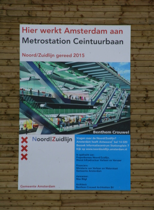
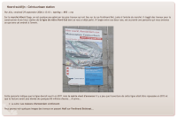

Après [les travaux qui n'en finissent pas](/des-travaux-finissent-pas) et [les travaux qui n'en finissent pas encore](/des-travaux-qui-n-en-finissent-pas-encore), je vais cette fois-ci vais vous parler de la Nordzuid Lijn...

L'autre jours je prenais le tram (parce que je n'avais plus de vélo, [on me l'a volé|]) et en passant devant l'arrêt de bus Albert Cuyp, je passe devant les travaux de **la future station Centuurbaan**. Ici, un panneau auquel je ne fais plus attention me signale l'ouverture prochaine de la station... **en 2015**.

{.center}

Si vous suivez bien ce blog, vous vous souvenez de ce même panneau pris en photo il y a deux ans pour vous parler de la [Centuurbaan Metrostation](/noord-zuidlijn-ceintuurbaan-station) alors que Laurent nous indiquait que la mairie de l'arrondissement a demandé que cette dernière s'appelle *de pijp*. À l'époque le panneau annonçait l'ouverture de la ligne pour 2011 et j'ajoutais que la date avait été reportée à 2013 avec un surcoût. 

[{.center}](/noord-zuidlijn-ceintuurbaan-station)

Si vous suivez ce blog, vous savez aussi, que cette été, la construction de [la Noord Zuidlijn](/la-ligne-du-nord-au-sud) a causé de gros dégâts en centre ville avec [des maisons qui s'enfoncent](/les-maisons-s-enfoncent) et tout ça. Après des aléas aussi spectaculaires l'augmentation de la facture et la prolongation des travaux trouvaient leur justification. 

En allant sur le site de la ligne du Nord au Sud, on voit que c'est en fait en avril 2008 que [tout ceci a été annoncé](http://www.noordzuidlijn.amsterdam.nl/live/main.asp?name=nieuws&item_id=NL_AMS_IVV_100000000749). J'ai un peu délaissé ce site depuis quelque temps parce que je me focalisais sur d'autres travaux, [dans ma rue](/des-travaux-dans-ma-rue) ou [dans mon chez-moi](/des-travaux-finissent-pas) mais je vous en recommande encore la lecture, on apprend entre autres que pendant que [les travaux de la station Vijzelgracht font s'écrouler les maisons](http://www.noordzuidlijn.nl/live/main.asp?name=pagina&item_id=1664), les travaux de la station Rokin sont [interrompus pour des fouilles archéologiques](http://www.noordzuidlijn.amsterdam.nl/live/main.asp?name=nieuws&item_id=NL_AMS_IVV_100000000731)

Quand je pense que quand je suis arrivé dans cette ville en 2005, on annonçait que cette ligne allait être utilisable dès 2007... Oui, c'était l'année dernière.
---