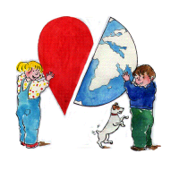

Les propositions de sorties sont parfois trop nombreuses pour qui travaille dur à refaire son appartement (et bien oui, ça prend du temps). Mais les propositions de cette semaine sont quand même intéresantes pour un français à Amsterdam. Il se peut donc que j'aille y faire un tour. Voici donc ce qui me tente :

## Ciné premières
Le festival annuel de cinéma francophone [dont je vous ai parlé en 2006](/du-cinema-en-francais) a commencé depuis plus d'une semaine. Cette année, le programme est aussi eclectique que d'habitude et nous permet de voir ici les films français qui ont marqué l'année avec *Entre les murs*, *Regarde-moi* ou ''L'empreinte de l'ange''. Dépéchez-vous, c'est jusqu'au 20 Novembre. [Cinépremières](http://www.cinepremieres.nl/).

## Chagrin d'école à la Maison Descartes
Daniel Pennac vient à Amsterdam. Il sera à la Maison Descartes le 18 Novembre pour parler de son nouveau livre ''Chagrin d'école'' ou il raconte sa vie de cancre. Je pense qu'on aura quelques pensées pour Malausène qui aurait très bien pu vivre dans le pijp[^1] qui a beaucoup de points communs avec Belleville, y compris la boboïsation actuelle et les projets immobiliers qui [défigurent le quartier](http://laurentchambon.blogspot.com/2008/11/plan-doccupation-des-sols.html). [Pennac à la Maison Descartes](http://www.maisondescartes.com/site/nl/activites-culturelles/daniel-pennac-18-novembre-2008.html).

## Le Beaujolais nouveau
Au Pays-Bas aussi on fête le beaujolais nouveau. Ce n'est pas que ce vin soit très recherché par les bataves mais il est une bonne excuse pour les français pour se retrouver et boire un coup, le troisième jeudi de novembre comme le veut la tradition. C'est [le forum des hollandais](/le-forum-des-hollandais) qui en profite pour faire sa soirée annuelle et bouscule un peu la tradition en organisant [cette soirée le vendredi 21](http://www.leforum.nl/phpBB/viewtopic.php?f=6&t=17306) dans un café au nom bordelais... C'est [DJ Natachka](http://www.oh-la-la.nl/?pagename=contact) qui sera derrière les platines nous promettant des franco-thunes de [radio oh la la](http://www.oh-la-la.nl/).

## Traverser les frontières (festival)
Le véritable jour du beaujolais nouveau, il y aura un français au [festival Crossingborders](http://www.crossingborder.nl/) de La Haye. Les auteurs Frédéric Beigbeder[^2], Ariel Kenig et Abdallah Taïa (19h 30) puis les musiciens Fabian Beghin et Didier Laloy, les belges du [duo Cryptonique](http://www.cryptonique.be/blog/) se produiront sur la scène du Théâtre Royal de La Haye. L'Alliance française de La Haye, qui avait l'habitude de nous inviter à déguster le beaujolais le troisième jeudi de novembre, nous propose cette fois d'aller au théâtre avec un billet à tarif réduit. [Alliance Française Den Haag](http://www.aflahaye.nl/).

## La kermesse francophone
{.left}
Tous les ans, des français de La Haye et d'ailleurs 9et aussi d'autres francophones) organisent une kermesse dont les bénéfices vont soutenir des projets de développement en Afrique. Cette kermesse est une initiative soutenue par de nombreux parents d'élève du [Lycée Vincent Van Gogh](/van-gogh-fete-ses-60-ans). C'est [la kermesse francophone](http://kermessefrancophone.nl/) et ça fait 40 ans que ça dure... Ce samedi ce sera donc la 40ème édition de cette kermesse et elle aura lieu de 12.00 à 18.00 au Sorghvliet Gymnasium de *Den Haag* à La Haye. Selon [le Lion bleu](http://www.lelionbleu.nl/?p=65) qui s'y connait en trucs francophones, c'est *la plus importante des manifestations francophones aux Pays-Bas*. Raison de plus pour ne pas la manquer...

Voir aussi [Les rendez-vous francophones de la fin d'année](/rendez-vous-francophones-fin-d-annee)
---
[^1]: Ses copains Mo le Mossi et Simon le Kabyle aurait été Sranantongo Mo et Simon l'Alévi mais on ne va pas commencer à passer en revue toute la tribu.
[^2]: Ai-je dit que le film 99 francs était au programme de cinépemières ? non ? et bien maintenant c'est dit.