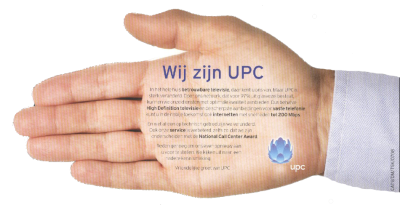

{.left}
Quand j'ai changé de domicile, j'ai du résilier mon abonnement internet par le câble qui m'avait causé tant de [déboires](/upc-m-a-lacher). Vous vous souvenez peut-être de l'[installation difficile de ma connexion](/chello-installatiepakket-8). En fait, bien que je ne l'ai pas raconté ensuite, **cet abonnement UPC était pourri**. Je ne compte pas le nombre de coupures ni le nombre de fois ou la vitesse de connexion rendait internet impraticable. C'était vraiment à regretter le minitel. J'ai eu plusieurs week end sans connexion ni téléphone. L'assistance téléphonique n'étant ouverte que pendant les heures de bureaux, il me fallait attendre le lundi, 9 heures, pour signaler mon problème. Parfois la connexion revenait avant que je passe mon coup de fil ce qui me permettait d'économiser un appel surtaxé. 

UPC est une société de merde qui vend un service qu'elle n'est pas capable d'assurer correctement. Surtout ne souscrivez pas d'abonnement internet chez eux vous seriez coincés. J'ai tenté de résilier mon contrat mais d'après ce que j'ai compris, je ne pouvais pas le faire au moment ou je le faisais ou bien il fallait que je déménage. Je ne sais pas trop si c'est légal mais je ne suis pas très armé pour faire face à une société locale qui connaît mieux la langue et les lois du pays. Je crois tout simplement qu'UPC a une politique de rupture d'abonnement stricte parce que c'est leur seul moyen pour conserver leur clientèle. **J'étais coincé avec cet abonnement de merde**. Que faire...

Au moment de [déménager](/en-vrac-et-dans-la-vraie-vie), je me suis dit que je pouvais enfin les quitter. Hélas, si l'on déménage dans une ville ou UPC assure encore le service, notre abonnement nous suit. Coincé ? Non, pas moi il m'a fallut officiellement déménager en France et aussi insister longuement devant leurs comptoirs pour enfin annuler ce contrat qui m'avait tant fait chier. Je me suis senti libre de quitter cette filiale de [Liberty Global Inc](http://lgi.com/).

[{.left}](http://www.xs4all.nl/)
Aujourd'hui je me suis réinstallé officiellement à Amsterdam et mon abonnement internet ne passe pas par le câble, c'est un vrai abonnement ADSL qui marche. Sur les conseils de mon entourage, je suis allé chez XS4ALL et je ne suis pas déçu. Je vous ferais un état des lieux des fournisseurs d'accès ADSL aux Pays-Bas, vous verrez que de toutes façons, il n'y a guère le choix. Qu'importe, **XS4ALL m'apporte toute satisfaction**. J'avais droit à une installation gratuite mais tout était si simple que j'ai tout fait moi même . J'ai du congédier le technicien qui appelait pour un rendez-vous. Le seul bémol est la semaine d'attente entre ma demande et l'envoi du modem. Je pouvais tout suivre sur leur site web et je trouvais ça long...

Maintenant je que j'ai une vraie connexion internet sans coupure ni rien, vous allez me demander de poster plus régulièrement sur ce blog. Je ne sais pas si je pourrais, mais je veux bien essayer...

Depuis notre aménagement, nous recevons des courriers publicitaires divers mais ciblés envers les nouveaux propriétaires que nous sommes. C'est rarement intéressant, c'est même chiant parfois mais ça n'a rien d'étonnant. Et bien deux jours seulement après avoir installé mon ADSL XS4ALL, je reçois une publicité d'UPC. Bonjour, nous sommes UPC, venez nous voir... Surtout pas.

{.center}

  