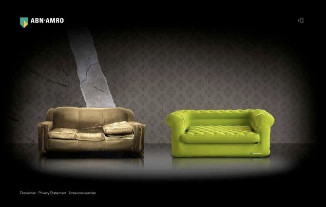

Apparemment **la Postbank va changer de nom**. Tous ses clients vont avoir [une nouvelle banque](/les-lions-cons): **ING**. Peut être que certains clients ne vont pas changer de banque comme prévu dans les plaquettes en papier glacé. C'est peut-être une bonne occasion pour vraiment changer de banque. Voyons donc ce qu'on nous propose...

<object width="425" height="344"><param name="movie" value="http://www.youtube.com/v/elMEZOZXNOI&hl=fr&fs=1"></param><param name="allowFullScreen" value="true"></param><param name="allowscriptaccess" value="always"></param><embed src="http://www.youtube.com/v/elMEZOZXNOI&hl=fr&fs=1" type="application/x-shockwave-flash" allowscriptaccess="always" allowfullscreen="true" width="425" height="344"></embed></object>

Ce petit flim trouvé récemment a du tourner sur internet il y a quelques années. Il fait la promotion d'un site *dumpjeoudebank.nl* (jetez votre ancienne banque) lancé par la banque [ABN AMRO](/abn-amro-banque). Ironie de l'histoire la Postbank est en passe de disparaître [pour devenir ING](/les-bleus-et-les-oranges), certes, mais ABN AMRO ne devrait pas tarder à disparaître non plus puisque qu'elle a été [rachetée à l'été 2007](/les-petites-courses-de-l-ete) et les agences néerlandaises appartiennent maintenant à la branche rabougrie de Fortis des Pays-Bas.

## Nouveau mot: bank
Le site *dumpjeoudebank.nl* n'existe plus, il a disparu, tout comme l'argent et la bonne santé de toutes ces banques. Mais il est interessant parce qu'il faisait un jeu de mot avec *bank* (**la banque**) et *bank* (**la canapé**). Le premier vient de l'anglais *bank* alors que le second vient sûrement du français *banc* ou *banquette*. dumpjeoudebank.nl est [une campagne de 2006](http://www.creatie.nl/creatie/select/expression/10989.do) à destination des étudiants. Une jolie banquette verte fluo devait les inciter à aller chez ABN AMRO pour bénéficier des avantages pour étudiants. Je pense qu'[un vélo gratuit](/les-velos-gratuits) de chez Rabobank c'est mieux qu'un canapé virtuel.

{.center}
