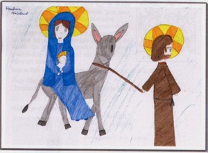

Chers touristes qui préparez votre voyage à Amsterdam. Si vous vous demandez si ça vaut le coup d'aller à la messe *de minuit*. Ne cherchez plus, ça vaut le coup, c'est tout en français et c'est pour vous (aussi). La paroisse francophone n'est pas en vacance et assure la vraie fête de Noël tout en français. Ma paroisse utilisant la petite église catholique du béguinage à beaucoup évolué depuis que [je vous ai en ai parlé](/bonne-fete-pascales). Voici tout ce que j'ai découvert.

## Le caté des français
Ce dimanche, troisième dimanche de l'aven, la messe était dédiée aux famille. C'est à dire qu'elle est organisée autour des enfants qui vont au catéchisme et ça permet d'inviter du même coup les parents qui ne viennent pas toujours à la messe sinon. C'est bête mais avant cela, je ne savais pas qu'il était possible d'inscrire son enfant au [catéchisme en français à Amsterdam](http://www.messecatholiqueamsterdam.org/cathechisme.html). Trois mamans ont organisé la prise en charge des enfants de 4 à 8 ans. Ayant assisté à leur messe de Noël, j'ai pu voir des enfants bien enthousiastes et ouvert. Du caté efficace il me semble. 

{.right}
## Un site web et un bulletin
Le [site web de la paroisse](http://www.messecatholiqueamsterdam.org) a ouvert juste après mon article de pâques 2007. Il est simple et complet. On y trouve tous les renseignements pratiques pour prendre part à la vie de la communauté et une page d'histoire très intéressante. La paroisse réalise aussi un [bulletin de Noël](http://www.messecatholiqueamsterdam.org/news.html) (dessin de couverture ci-contre) avec la participation de tous ceux qui veulent y participer. Ce bulletin parle de la venue de Jesus (de Noël quoi) et donne des nouvelles de la paroisse. Il a été distribué ce dimanche et j'y apprends plein de choses. Il devrait être disponible en ligne sous peu.

## La messe de Noël
Ma dernière messe de Noël à Amsterdam était organisée conjointement avec les autochtones occupant la même église. Cette année la paroisse a organisé un temps de noël tout entier francophone. Les dates sont affichées sur le site de la paroisse. La messe *de minuit* a lieu à 19h et elle est suivit d'un petit réveillon ou ceux qui veulent peuvent apporter à manger à partager. Le jour de noël aussi il y a une messe le matin à l'horaire habituel du dimanche, à 11h15.

Voilà, vous savez tout, il ne vous reste plus qu'à ne pas vous perdre en chemin.
