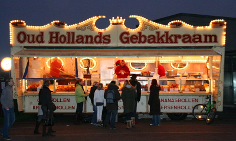
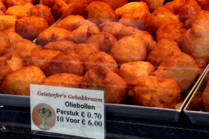

Parmi les choses marquantes de l'hiver aux Pays-Bas, il y en a des culinaires qu'on attend plus volontier que [le froid](/la-temperature-ressentie). C'est le cas des *oliebollen* (**croustillons** en français). Cette année ils sont apparus très tôt avant le froid, si bien que j'aurais pu les lister comme [signes de la fin de l'été](/c-est-la-fin-de-l-ete). Mais laissez-moi vous décrire ce que sont les *oliebollen*.

Les **Oliebollen** sont des beignets ronds frits dans l'huile qui sont vendus par des forains dans les kermesses et sur les places durant l'hiver. Aux Pays-Bas c'est traditionnellement la pâtisserie du réveillon du nouvel an mais le froid arrivant tôt, les *olibollen* se vendent maintenant dès les premiers frimas. Cette année, les roulottes sont apparues très tôt, dès le mois d'octobre. On aurait presque oublié que ces beignets sont biens gros et bien gras pour nous permettre de nous réchauffer durant l'hiver. Le nom hollandais de cette spécialité (*oliebol* au singulier) signifie **huile boule** mais comme les belges produisent aussi cette spécialité, elle se retrouve avec le nom beaucoup plus attractif de **croustillon**.

Comme en Belgique cette spécialité est vendu dans les foires (*kermis*) et sur les places aux alentours du jour de l'an. Il semblerait que les endroits touristiques comme Amsterdam en proposent dès qu'il fait un peu plus frais. On ne s'en plaint pas, les roulottes donne un coté pittoresque aux places. 

[{.center}](http://commons.wikimedia.org/wiki/Image:Oud-Hollands-Gebakkraam.jpg)

Comme en Belgique aussi, les variantes de croustillons existent avec des pépites de chocolat, de raison ou bien fourrés avec tout plein de choses que je ne saurait toujours décrire. Même si une certaine variété est intéressante, les vrai *oliebollen* sont les natures. D'ailleurs on ne commande pas des *oliebollen* natures mais des *oliebollen* (tout court).

{.center}
La [page Wikipedia des croustillons](http://fr.wikipedia.org/wiki/Croustillon), il est signalé que les croustillons sont aussi appelés *smoutebollen* en Flandre et *püpperchen* en Alsace. Je ne sais pas Si l'invention de cette pâtisserie est à mettre au crédit des alsaciens, des belges ou des hollandais mais on peut affirmer aujourd'hui que c'est une spécialité de ces trois régions. Si donc vous voulez passer un [Noël à la mode Pays-Bas](/noel-des-pays-bas), vous pouvez essayer cette [recette simple du croustillon](http://www.marmiton.org/recettes/recette.cfm?num_recette=13215).
---