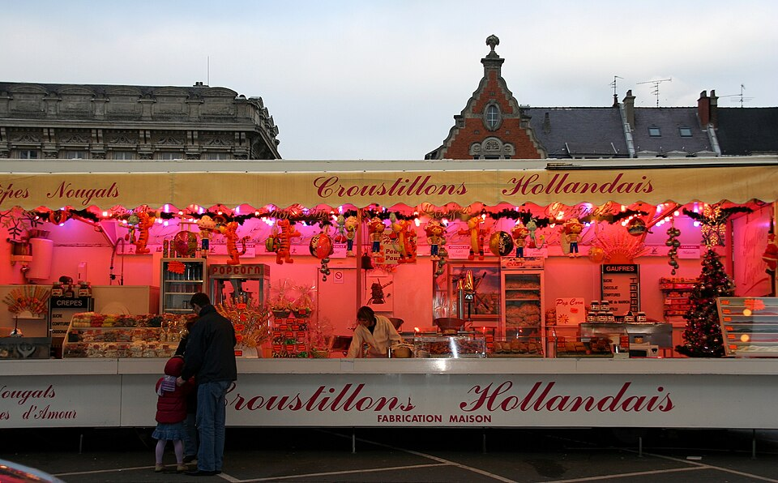

Je suis d'accord, le petit gout sucré des raisins secs efface un peu le gout de l'huile de friture. Après cela, il y a des grands débats en ville pour savoir ou acheter les meilleurs croustillons. Et puis, le 31, il est trop tard pour aller loin alors les gens font la queue devant la roulotte de *Oliebollen* la plus proche.

