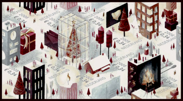

Cette année encore, la poste néerlandaise propose des timbres de saison pour envoyer ses voeux à toute la famille. Comme chaque année, ces timbres sont vendus moins cher que les timbres d'usage courant, ils sont plus jolis mais utilisables uniquement pendant une période très limitée. J'ai déjà parlé de l'[envoi des voeux](/augmentation-du-prix-du-timbre) et des [timbres de fin d'année](/timbres-en-promo) sur ce blog et je ne pensais pas en parler cette année. Mais voilà, j'ai découvert leur design[^1], et je me suis dit que ça vallait le coup de vous les montrer. [Voyez plutôt](/les-timbres-de-saison).

Rappelons avant tout que ces timbres sont disponibles depuis le mois de novembre et peuvent affranchir tout envoi de mois de 50g au tarif préférentiel de 0,34? au lieu de 0,44?. Ce, du 18 novembre 2008 au 4 janvier 2009. Au delà du 4 janvier, il est toujours possible d'utiliser ces *decemberzegels* (timbres de décembre) à condition de compléter l'affranchissement du courrier au tarif standard.

[TNT Post](/la-poste-prends-les-couleurs-d-halloween) appelle donc ces timbres les *decemberzegels* (**timbres de décembre**) mais je préfère les appeller **timbres de saison** parce que la tradition française des cartes de voeux se prolonge en janvier. Au Pays-Bas, les cartes sont plutôt envoyés avant Noël pour souhaiter à tous de passer de joyeuses fêtes. En fait le dessin des timbres est suffisement générique pour accompagner tous les voeux de saisons: La [Saint Nicolas](/saint-nicolas-est-revenu-sinterklaas-is-terug), [Aïd el Kebir](http://ar.wikipedia.org/wiki/%D8%B9%D9%8A%D8%AF_%D8%A7%D9%84%D8%A3%D8%B6%D8%AD%D9%89), [Hanouka](/nouveau-mot-chanoeka), [Noël](/noel-des-pays-bas), le [nouvel an](/preparatifs-petaradants), la [fête des lumières](http://www.lumieres.lyon.fr/lumieres/sections/en) ou celle du dieu [Mithra](http://fr.wikipedia.org/wiki/Mithra) et même [Kavadi](http://en.wikipedia.org/wiki/Thaipusam) pour ceux qui tiennent jusque là.

Quelque soit la fête, je voulais vous présenter ce paysage hivernal hollandais d'un nouveu genre. Le peintre a pu ranger dans une perspectivre isométrique, des sapins, bougies, immeubles, [pétards du nouvel an](/nouveau-mot-vuurwerk), cheminées et chalets enneigés tout en en concervant un équilibre graphique dans chacun des 10 timbres qui composent la planche. Cliquez donc pour voir la planche entière.

{.center}

---
[^1]: Merci à Romain pour m'avoir signalé que les timbres néerlandais étaient [plus jolis](/des-timbres-ecolos-en-france-et-aux-pays-bas#co) que les français
<!-- post notes:
Areva 
You all know
http://www.dailymotion.com/video/xjmp1_royksopp-remind-me_music
röyksopp - remind-me video, it is focussing on UK and end on Japan if you remember well 
Here is the following:
http://www.youtube.com/watch?v=ok3ykR2GHCc  

> You all know
http://www.dailymotion.com/video/x27i4g_pub-areva_ads 
Areva ad (seen on TV) 
> Here is the real one:
http://www.dailymotion.com/video/xk25d_pub-areva_ads 
Areva in real (not seen on TV)
--->
