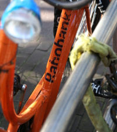
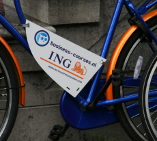

Depuis que je me suis fait voler mon vélo, je suis à la recherche d'un autre. Je cherche un vélo le moins cher possible et gratuit si ce n'est pas trop demander. Il y a plusieurs plans de vélos gratuits que je détaille ci-cessous. Mais apparemment j'arrive trop tard...

## Les vélos de banque pour étudiants
On a embarqué mon b'twin au mois d'octobre alors que les nouveaux étudiants étaient déjà arrivés dans la ville. Je vous ai parlé de leurs [activités de la rentrée](/la-rentree-a-amsterdam) et de leurs [fêtes d'intégration](http://www.intreeweek.nl/). Mais je ne vous ai pas parlé des vélos gratuits auxquels certains privilégiés avaient droit.

  

Ancien vélo Rabobank

  

  

Un nouveau vélo ING  
(encore avec sa plaque publicitaire)

  

[{.left}](/files/2008/2008-Rabobank-Breda-fiets-studenten.png)
Les banques aiment bien les étudiants. Généralement les étudiants poursuivent leurs études et trouvent ensuite plus facilement un boulot qui leur assure des revenus confortables. Comme les gens changent rarement de banque, il est bon de capter les clients intéressants dès qu'ils sont étudiants. La Rabobank l'a bien compris et propose depuis plusieurs années déjà, d'offrir un vélo neuf à tout étudiant ouvrant un nouveau compte dans l'une de ses agences. L'étudiant qui vient d'ouvrir son compte peut aller chercher son vélo dans un dépôt en banlieue à une unique date précise. **Le vélo Rabobank** est aux couleurs de la banque. Jadis, c'était un [omafiets](/plein-de-velos#omafiets) orange avec le logo de la banque mais depuis deux ans, les étudiants ont droit à un joli [beach-cruiser](/plein-de-velos#beach-cruiser) orange et bleu toujours avec le logo de la banque. Des vélos de bonne qualité.

Hélas, dans les [conditions générales](/files/2008/2008-Rabobankfiets-studenten_actievoorwaarden.pdf), il est clairement indiqué que l'offre est valable jusqu'au 15 septembre 2008. Trop tard pour moi donc. Il faudra surveiller l'année prochaine...

Une autre banque aussi (**ING**) a cette année proposé des vélos aux étudiants. Ces derniers pouvaient devenir propriétaires de leur vélo [pour 7,50 euros par mois](http://fietsen.web-log.nl/fietsen/2008/02/banken_leveren_.html). Les vélos sont des omafiets, eux aussi orange et bleu aux couleurs de la banque sponsor mais ils portent en plus une plaque publicitaire pour [business-courses.nl](http://www.business-courses.nl/). Inutile de vous dire que quelques mois après la fin de cette opération, on croise encore ces vélos mais aucun ne conserve sa plaque publicitaire.

## Le vélo syndical

Le syndicat étudiant d'Amsterdam (*ASVA-studentenunie*) propose aussi des vélos neufs à un prix imbattable. D'après [la photo sur le site ASVA](http://welkomthuis.asva.nl/welkomthuis_fietsen.html), il s'aggit aussi d'un beach-cruiser orange. Pour l'obtenir, il faut débourser 60 euros. 15 euros de cotisation au syndicat et 45 euros pour acheter le vélo. Il faut faire un virement à l'avance et le vélo est à retirer en banlieue le 25 août 2008. Encore une fois je suis en retard. Mais c'est un bon plan pour qui a déjà un compte en banque. Il faudra surveiller l'année prochaine...

<!-- post notes:
http://fietsen.web-log.nl/fietsen/2008/02/banken_leveren_.html 
http://www.business-courses.nl/php/public/fietsenplan.php 
http://www.verzekeringen-online.nl/fietsverzekering/ <-- assurance vélo pas cher
--->
