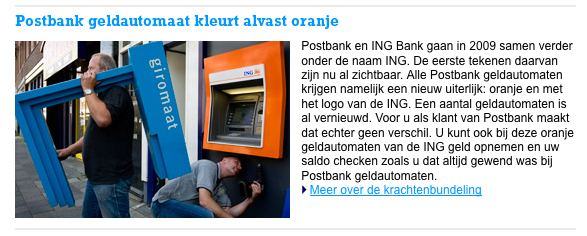

[Ma banque](/postbank-amsterdam), la Postbank, va bientôt reprendre la marque ING. Toute la signalétique ancienne de la banque va passer du bleu à l'orange à commencer par la mascotte le lion bleu qui devient orange. Tout ceci a été annoncé en fanfare [l'été dernier](/les-bleus-et-les-oranges), j'ai vu les distributeurs de billet changer puis plus rien. Que  s'est-il passé ?

J'ai bien vu [les spot télé](/les-lions-cons) annonçant le changement et je l'ai même constaté autour de moi. Les [distributeurs de billets](/choisir-une-banque) de la Postbank sont tous devenus oranges. Le reçu qu'ils délivrent est maintenant estampillé **ING**. Le jour ou la **Postbank** va disparaître est proche... Mon [site de gestion bancaire](/internetbankiren-experience) (*Internetbankiren*) se fait l'écho de ce changement on montrant le montage des nouveau distributeurs (la façade uniquement).

{.center}

Et alors depuis cet automne, plus rien, je suis pressé de recevoir ma nouvelle carte bleue-orange et de voir le design de mes nouveaux relevés de compte. Le changement devrait se faire en 2009 mais on arrive en décembre 2008 et voilà un mois que la banque ne communique plus là dessus.

L'explication est peut-être [ici](http://www.postbank.nl/ing/pp/page/article/detail/0,2842,1859_103918_898405563,00.html?linktype=int&furl=nullß). Un petit lien mis en évidence sur la première page de mon site *Internetbankiren* m'invite à lire un récent communiqué de presse de la banque ING. Suite à la crise dite *des subprimes* les gouvernements donnent des sous aux banques qui ne vont pas bien. Fortis Nederland a été nationnalisée et un plan a été mis en place pour *aider* d'autres banques néerlandaises. ING a ainsi pu toucher 10 miliards d'euros du gouvernement le 19 octobre dernier[^1]. Le communiqué le rappelle et indique que tout va bien à ING, que la banque est saine mais que par les temps qui courent, un peu d'argent frais ça fait toujours du bien.

Beaucoup de gens ont déjà lu ce genre de communiqués en Europe dernièrement. Souvent ces communiqués précédait des nouvelles moins joyeuses pour l'établissement concerné. Je ne sais pas s'il reste beaucoup de gens pour croire les communiqués de leur banque. Je ne sais pas si c'est un hasard mais depuis j'essaye de voir mon compte en banque devenir ING Mais la marque Postbank est encore là partout.

---
[^1]: comme le ministre des finances l'avait proposé à tous les établissement financiers du pays, l'état néerlandais est entré au capital de la banque à hauteur de 10 miliards d'euros le dimanche 19 octobre 2008.