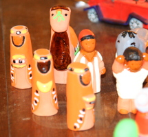

{.right}
L'épiphanie est fêtée aussi aux Pays-Bas et porte le nom des trois rois (*driekoningen*). Cette fête est célébrée à la fois dans les milieux catholiques et dans les milieux protestants mais évidement, les Pays-Bas s'illustrent par une tradition différente de ce que nous connaissons en France. Je ne vois pas beaucoup de galettes des rois dans les boulangeries à part au [Fournil de Sébastien](/le-fournil-de-sebastien) qui essaye d'introduire des douceurs françaises dans les salles à manger bataves.

Selon [kindengeloof](http://www.kindengeloof.nl/thema-driekoningen.html), un site de catéchisme, les enfants parcourent les rues déguisés en rois en portant une étoile devant eux (en fait il s'agit d'un lampion). Ils rappellent ainsi les rois qui, selon la légende, avait trouvé Jésus en suivant une étoile. Ils passent de portes en portes et chantent des chansons sur le thème des rois mages et du petit Jésus. En retour il reçoivent des bonbons ou bien des pâtisseries. Le site parle d'une pâtisserie dans laquelle deux haricots blancs et un haricot noir sont cachés. Ceci pour rappeler la couleur de peau des trois rois mages. Celui qui récupère le haricot noir devient roi pour un jour, il est le chef pour tout le monde (*de baas over iedereen*). Le site indique que cette histoire de haricot noir est pratiqué uniquement dans certaines villes des Pays-Bas et dans les Flandres. 

En Belgique l'Épiphanie est célébrée comme en France avec des galettes des rois disponibles un peu partout à l'approche de la fête. J'imagine bien la pâtisserie évoquée plus haut en tant que galette et ce haricot qu'on appelle aussi fève. La promenade aux lampions rappelle par contre une autre fête locale [la Saint Martin](/saint-martin-l-autre-sint-des-enfants), beaucoup plus populaire à Amsterdam que ces trois rois-mages.

## Driekoningen, une erreur exégétique

On peut souligner ici que les néerlandais, de tradition protestante et très portés sur l'étude rigoureuse des récits bibliques, se sont plantés en nommant cette fête *Driekoningen* qui veut dire **les trois rois**. L'évangile de Mathieu (au chapitre 2) ne parle que de mages, venus d'orient et ayant vu des signes dans le ciel. Les légendes populaires ont transformé ces mages en rois allant même jusqu'à leur donner des noms (*Gaspar*, *Melchior* et *Balthazar*) et une couleur de peau qui permet de les reconnaître. Cette légende est en fait une histoire pour expliquer la fête de l'épiphanie, révélation de Jésus au monde. Les rois mages représentent les trois continents connus alors, Europe, Asie et Afrique (c'est pour ça que Balthazar est noir). L'[épiphanie](http://fr.wikipedia.org/wiki/%C3%89piphanie) est une fête très ancienne qui célèbre la manifestation de Jésus à travers la nativité, l'adoration des mages et le baptême par Jean Baptiste. En fait avec la création d'une fête de la nativité à Noël, l'épiphanie s'est recentrée sur l'histoire des mages. Les Néerlandais ont carrément fait le saut en nommant la fête **les trois rois**. Eux qui ont déjà [deux noël](/noel-des-pays-bas).

Driekoningen est aussi la date ou les Amtelodamois jettent leur sapin (encore une tradition païenne). De nombreux conifères morts sont abandonnés dans la rue et je suis obligé de slalomer avec [mon vélo](/mon-nouveau-velo) pour aller au boulot.
