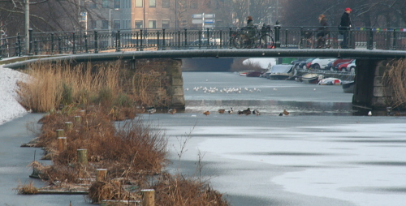
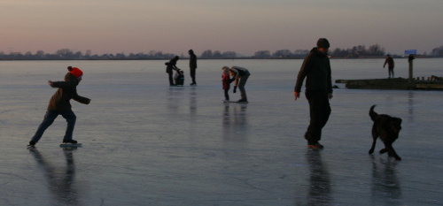
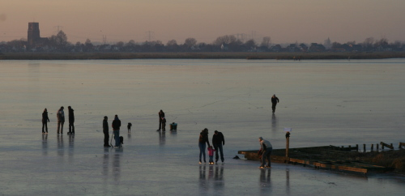
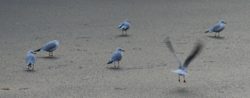

Quelques photos de la semaine dernière, la semaine la plus froide depuis des années, j'ai eu la chance de voir les canaux geler suffisamment pour permettre aux gens de marcher sur l'eau à pied sec. Moment rare et attendu par tous comme [les jours de soleil](/revisions-sous-le-soleil). La presse expliquait qu'on n'avait pas eu ces températures (de -1ºC à -6ºC) depuis 1996. 

{.center}

L'état des canaux a donc commencé à faire la une de l'actualité jusqu'à ce week end ou tout le monde a voulu faire du patin à glace. Je n'ai pas pris de photo de files d'attente devant les magasin de sport mais ces dernier ont réellement fait un très bon chiffre rien qu'en vendant des patins. On pouvait voir la glace 

Les routes pour aller vers les canaux de campagnes était très encombrés. Il semble que tout le monde ait eu la même idée. Le pays entier s'est rappelé qu'il était une nation du patinage sur glace. Voici quelques photos de patineurs sur l'étang [Kinselmeer](http://maps.yahoo.com/#mvt=h&lat=52.391211&lon=5.018692&zoom=15) au nord d'Amsterdam. Des scènes comme ça, il y en avait partout.

{.center}

{.center}

En fait ce week-end était le moment le mieux choisit pour aller sur la glace, ce lundi, les températures ont remonté et le redoux devrait se confirmer avec de la pluie cette semaine. Et vous qu'avez vous fait ce week-end ?

{.center}

<!-- [Voir toutes les photos qu'on m'a envoyé](/les-canaux-gelent#co) en commentaire -->
