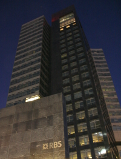

La Royal Bank of Scotland fait à nouveau la une de l'actualité aujourd'hui à cause de la crise financière qui secoue le monde. [Le Monde annonce](http://www.lemonde.fr/la-crise-financiere/article/2009/01/19/royal-bank-of-scotland-sombre_1143789_1101386.html) que la banque écossaise vient de découvrir (ô stupeur!) qu'elle allait perdre plus de 30 milliard d'euros et la majeure partie de ses pertes serait dues à la banque ABN AMRO qu'elle à racheté en 2007. Je serait tenté de dire qu'il sufisait de ne pas la racheter mais on va me traîter de rabat-joie.

Je me souvient avoir parlé de ce rachat [à l'été 2007](/les-petites-courses-de-l-ete). Je n'avait peut être pas donné mon opinion mais l'offre de fusion de Barclays, [dont j'avait aussi parlé](/abn-amro-banque) était bien plus cohérente[^1]. l'OPA hostile de 3 banques a fait monter la sauce inutilement en ne révélant pas vraiment de synergies... RBS était déjà présente aux Etats-Unis, Santander était déjà présent au Brésil et Fortis aux Pays-Bas. Ils ont payé au prix fort une croissance externe incertaine. Ils pensaient sûrement s'offrir ce paquet à bon prix avec le crédit facile de l'époque[^2]. Les politiques ne sont pas là pour prévenir les catastrophes, sinon ça se saurait. Wouter Bos, Ministre des finances a donné son accord pour le dépeçage de la plus grande banque du pays.

{.left}
Le résultat des opérations se voit à l'ancien siège international d'ABN AMRO. Un timide logo RBS s'affiche en bas de l'immeuble mais le fier logo d'ABN AMRO reste moulé en haut de la grande tour. RBS a récupéré tous les actifs américains d'ABN AMRO, toutes les *subprimes* pourries et peut être encore d'autres actifs douteux de par le monde. Il y a encore des centaines de personnes qui travaillent dans ces bureaux à Amsterdam. Je ne peux pas dire comment ils voient leur avenir dans leur beau quartier de [Zuidas](/un-buurt-nomme-zuidas).

- La banque Espagnole Santander, qui a récupéré Banco Real au Brésil et Banca Antonveneta en Italie, n'est plus en super forme, elle est tès touchée par les *subprimes* pouraves, la chute de l'immobilier en Espagne et l'escroquerie Madoff à hauteur de 2 à 3 millions d'euros. Elle entend [virer 400 personnes au Bresil](http://beta.americaeconomia.com/207482-Santander-Brasil-despedir%C3%A1-400-empleados.note.aspx). 

- [Fortis](/j-appartiens-a-la-societe-fortis-anonyme) n'existe plus, sa partie néerlandaise a été nationalisée par un Wouter Bos (qu'on qualifie maintenant de héros de la crise). Les reliquats belges (en fait, le plus gros des actifs de la banque) ont été repris par la BNP. 

- De son coté RBS se porte à merveille, touchée de plein fouet par la chute de l'immobilier britanique elle vient de se rendre compte qu'elle a payé au prix fort une banque enormément touché par la crise des *subprimes*.

Les *trois banques* qui se la pétaient arrogantes, avec leur contre OPA non constructive se prennent aujourd'hui de plein fouet le résultat de leur calculs hasardeux. C'est bien fait pour elles.

---
[^1]: Même si dans les fait, c'était une offre de rachat de la part de Barclays, la complémentarité entre les deux groupes était réele et l'offre était respectueuse de l'entreprise hollandaise à l'image de ce qu'Air France a fait avec KLM. La banque Barclays annonçait même vouloir installer son siège à Amsterdam.
[^2]: ils pensaient sûrement qu'une bulle peut gonfler à l'infini...