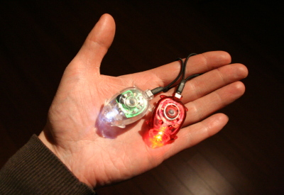
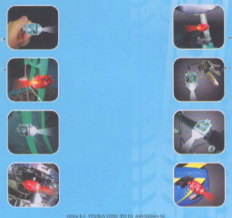

Après avoir parlé des [lampes pour vélos](/lumieres-hiver) obligatoires et des [lampes pour vélos amovibles](/les-nouvelles-lampes-de-la-nuit), vous pensiez que j'avais épuisé le sujet. Mais non, voici les lampes pour vélos pratiques. Voyez plutôt:

Voici les plus petites lampes disponibles pour voir et être vu quand on pédale sur sa bicyclette dans la nuit. **Les lampes HEMA**.

{.center}

En fait je les appelle *lampes HEMA* parce que celle que je vous présente sur la photo ci-dessus sont des petites lampes achetées chez HEMA, cette chaîne de magasins Néerlandaise qui, [rachetée l'année dernière par un groupe font de capital risque anglais](/les-petites-courses-de-l-ete) a ouvert une première succursale en France cette année. Cette chaîne est connue pour ses saucisses Unox et ses articles de déco, pratiques, design et pas cher. HEMA organise même un [concours de design](/le-design-c-est-hema) tous les ans dont les meilleurs objets deviennent des produits vendus dans le magasin. Je ne sais pas si c'est le cas de ces petites lumières de poche mais elles sont tellement bien pensées qu'elles auraient mérité le prix du design HEMA l'année de leur lancement.

Les deux lampes tiennent dans la main et dans la poche. Elles sont solides et ne craignent pas la pluie. L'anneau élastique qui forme leur terminaison permet de les tenir ou de les attacher à peu près n'importe où, La plupart des usagers les attachent à l'avant et à l'arrière de leur vélo et s'en est fini des amendes pour mauvais éclairage. Tout cela pour environ 5 euros. Il n'y a pas que les magasins HEMA qui [vendent](http://www.hema.nl/nl-nl/winkel/beestenboel.aspx) ces lampes si pratiques, on en retrouve chez Blokker et sur [le marché Albert Cuyp](/albert-cuyp-le-marche) pour ne citer que les lieux de vente que je connais. Le site web [fietslampjes](http://www.fietslampjes.nl/) en a d'ailleurs fait sa spécialité. Bien que *fietslampjes* veuille dire **petites lampes pour vélo**, le site évoque aussi un usage intéressant de porte-clefs qui rassurent tous ceux qui ne savent pas trouver le trou de leur serrure dans le noir.

{.center}

Ci-dessus quelques suggestions d'utilisation proposées sur l'emballage. Maintenant que HEMA s'est implanté à Créteil, il reste à savoir si cette spécialité Néerlandaise se vend en France...

