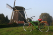
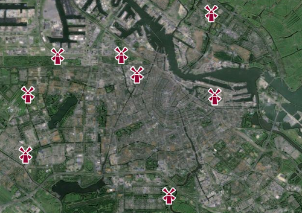

Il reste **huit moulins visibles dans la ville d'Amsterdam**, auxquels j'ai rendu visite depuis que je suis ici. J'ai ensuite créé la notice Wikipedia de chacun de ces moulins et essayé autant que possible d'y ajouter une jolie photo. Quatre à l'intérieur du ring, quatre à l'extérieur, un au nord, 7 au sud, un visitable et trois habités, **voici donc la liste exhaustive des huit [moulins d'Amsterdam](/les-moulins-d-amsterdam)**.

### De Gooyer
<!-- [{.right}](http://commons.wikimedia.org/wiki/File:De-Gooyer-Molen-ij-brouwerij-img_4031carre800.jpg) -->
De Gooyer est le nom d'un moulin à galerie situé à Amsterdam entre la Sarphatistraat et la Singelgracht sur le quai Funen. L'envergure du moulin est de 26,6 m.

Ce moulin est le dernier d'un important groupe de moulins à blé implantés entre le XVIIe siècle et fin du XIXe siècle sur les remparts extérieurs du Singelgracht. A l'époque cette situation, à la périphérie de la ville, était idéale, ils bénéficiaient ainsi de suffisamment de vent. Les derniers moulins de ce groupe à l'exception du De Gooyer ont été démolis vers 1900.

Le moulin d'origine fut construit au XVIe siècle. Il fut ensuite plusieurs fois déplacé et détruit. En 1725 il fut reconstruit à l'actuel emplacement de la caserne Orange Nassau. Enfin en 1814, le moulin est à nouveau déplacé et reconstruit au quai de Funen sur les fondations d'un moulin à eau détruit en 1812. Il perdit ses ailes pendant une tempête le 13 novembre 1972. Celles-ci furent replacées quelques années plus tard, à l'occasion d'une restauration.

Le moulin est aujourd'hui propriété de la ville d'Amsterdam et n'est pas visitable. Au pied du de ce moulin, un ancien bâtiment de bains publics abrite aujourd'hui une brasserie artisanale Het IJ. Le moulin doit son nom au fait qu'il offre une vue imprenable sur le paysage de la région nommée Het Gooi, la région de [Naarden](/naarden-c-etait-dimanche), Weesp, Hilversum...

----
[{.right}](/plein-de-velos-hollandais)
### De Riekermolen

Le moulin Rieker (ou Riekermolen) est un moulin à vent Néerlandais situé au bord de la rivière Amstel, au sud de la commune d'Amsterdam. C'est ce moulin qui a servit de décor à [mon vélo hollandais](/plein-de-velos-hollandais) d'emprunt. 

Ce moulin a été construit en 1636 dans le village de Sloten. Il servait de moulin de polder pour le polder du même nom (Riekerpolder). Le pompage des eaux du polder a été pris en charge par une station de pompage électrique en 1932 et le moulin a ensuite été démonté lors du creusement du polder pour y créer en autres le lac Het Nieuw Meer.

Le moulin a été remonté en 1961 à quelques 8 kilomètres de là au bord de l'Amstel, entre les voies de Kalfjeslaan et de Borcht. Les rive de l'Amstel à cet endroit sont très fréquenté par les touristes et les promeneurs et c'est une place de choix pour un ancien moulin à vent Néerlandais. Une statue de Rembrandt a été érigée à proximité de ce moulin pour rappeler que le peintre a réalisé de nombreux dessins sur les rives de cette rivière.

----
<!-- HTML -->

<!-- / HTML -->
### De 1100 Roe
<!-- [{.right}](http://www.flickr.com/photos/13274211@N00/2275226657/) -->
De 1100 Roe est un moulin à vent de poler situé à Amsterdam dans le quartier d'Osdorp. Autrefois, ce moulin se trouvait sur le Haarlemmerweg, la route qui mène à Haarlem. Il tient son nom (1100 'batons') de la distance qui le séparait de la Haarlemmerpoort, soit environ quatre kilomètres.

Ce moulin a été construit en 1674 après la construction du Haarlemmertrekvaart et a servi à l'assèchement des polders de Sloterbinnen et Middelveld. Le moulin a été rénové en 1757 et en 1951. A cette dernière date, le moulin a perdu sa fonction de moulin de polder. En 1961 le moulin a été démonté pour être remonté en 1965 près du complexe sportif *Ookmeer*. Il assure aujourd'hui la régulation de la wateringue du complexe sportif. De par sa nouvelle situation, ce moulin est aussi connu aujourd'hui en tant que **Ookmeermolen**.

<!-- HTML -->

<!-- / HTML -->
----
### De 1200 Roe
<!-- [{.right}](http://fr.wikipedia.org/wiki/Fichier:1200-roe.jpg) -->
De 1200 Roe est un moulin à vent de poler situé à Amsterdam sur le Haarlemmerweg, la route qui mène à Haarlem. Il tient son nom (1200 batons) de la distance qui le sépare de la Haarlemmerpoort, soit environ quatre kilometres.

Ce moulin a été construit en 1632 après la construction du Haarlemmertrekvaart et a servi à la régulation de la wateringue du polder intérieur d'Osdorp (Osdorper Binnenpolder). En 1951 ce moulin a arrêté d'exercer cette fonction mais il fut laissé sur place en souvenir du passé. Il a été restauré entre 1977 et 1979 et sert aujourd'hui d'habitation privée. Il n'est donc pas possible de le visiter. Mais on peut le voir de l'extérieur et voir en même temps les éoliennes de Sloterdijk.

----
<!-- [{.right}](http://www.flickr.com/photos/13274211@N00/634276388/) -->
### De Bloem
De Bloem (où De Blom) est un moulin à blé situé à Amsterdam sur le Haarlemmerweg, la route qui mène à Haarlem. Ce moulin à vent a été construit en 1786 et faisait partie des dixaines de moulins à blé qui opéraient sur les remparts extérieurs du Singelgracht jusqu'en 1878.

C'est le premier moulin que j'ai pris [en photo](http://www.flickr.com/photos/13274211@N00/634276388/) à Amsterdam, sur le [chemin de Sloterdijk](/un-tour-a-sloterdijk).

----
<!-- [{.right}](http://commons.wikimedia.org/wiki/File:Molen-van-Sloten.jpg) -->
### Moulin de Sloten

De Moulin de Sloten (*Molen van Sloten*) est un moulin à vent de polder dans le village de Sloten au sud-ouest d'Amsterdam. Ce moulin sert a réguler le niveau d'eau des wateringues au bord du *Ringvaart*, le canal de ceinture du polder d'Haarlemmermeer.

Ce moulin est **le seul moulin d'Amsterdam ouvert aux visiteurs et aussi l'un des seuls moulins des Pays-Bas que l'on peut visiter tous les jours**. Depuis avril 2005 la maison à proximité du moulin a été aménagée en musée de la tonnellerie.

----
<!-- [((http://upload.wikimedia.org/wikipedia/commons/thumb/1/13/D%27Admiraal_Molen.jpg/104px-D%27Admiraal_Molen.jpg|D'admiraal|R))|http://commons.wikimedia.org/wiki/File:D%27Admiraal_Molen.jpg] -->
### Moulin d'Admiraal

Moulin d'Admiraal est un moulin à vent Néerlandais situé dans l'ancien village de Buiksloot au nord de la commune d'Amsterdam. Ce moulin a été construit en 1792 et servait à broyer la craie. C'est le dernier exemplaire de ce type encore debout.

Le moulin a été construit en 1792 et 1793 par Symon Krol pour le compte de Roelof de Leeuw. Roelof de Leeuw était marié à Elisabeth Admiraal qui a donné son nom au moulin. Le moulin a servit a moudre du tuf. Mélangé à de la chaux, le tuf broyé servait à faire du mortier de construction.

----
<!-- [{.right}](http://www.flickr.com/photos/13274211@N00/707403921/) -->
### De Otter

De Otter est un moulin à bois d'Amsterdam situé dans le quartier de Westerpark à l'ouest de la ville. C'est le dernier moulin d'un groupe de moulins à bois construits entre le XVIIe siècle et la fin le XIXe siècle à l'ouest du Singelgracht qui à l'époque formait la limite de la ville. Le moulin De Otter, construit en 1631, et est le plus ancien moulin du type Paltrokmolen dont seul cinq exemplaires subsistent aux Pays-Bas. Les quatre autres exemplaires sont situés à Haarlem, Zaandam, Zaanse Schans et Arnhem.

À l'époque de sa construction, ce moulin était idéalement situé. Il bénéficiait de beaucoup de vent à l'extérieur ouest de la ville et était à proximité des voies d'acheminement du bois. Son existence était menacée par l'urbanisation et la construction de grands bâtiments à proximité lui coupant littéralement le vent. Malgré sa restauration récente en 1996 il était prévu de le déplacer à Uitgeest mais l'arrondissement de Westerpark a refusé de donner son accord. L'affaire a donc été portée devant les tribunaux. La décision de fut rendue le 23 août 2006 déclarant que le moulin devait rester à Amsterdam. Le meunier, Paul Rijkers, a donc quitté le moulin qui est immobile depuis lors.

----
Tous ces moulins sont répertoriés dans la catégorie [moulins à vent des Pays-Bas](https://fr.wikipedia.org/wiki/Cat%C3%A9gorie:Moulin_%C3%A0_vent_aux_Pays-Bas) de Wikipedia. Je vous invite à y corriger mes fautes et à y ajouter des informations. Vous pouvez aussi retourner au [pays des vélos des moulins et des tulipes](/pays-des-velos-moulins-tulipes).

----
Voyez aussi la [carte des moulins d'Amsterdam](/la-carte-des-moulins-d-amsterdam)

[{.center}](/la-carte-des-moulins-d-amsterdam)
---