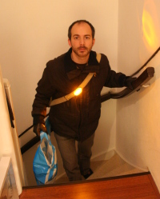

Je vous ai parlé des [lumières pour bicyclettes](/lumieres-hiver), celles qu'il faut avoir allumées en ville si on ne veut pas avoir d'amende. L'année dernière il n'était pas autorisé de porter les lumières portatives sur le corps, elles devaient obligatoirement être fixées au cycle sous peine d'amende[^1] (encore). Depuis le 1er novembre, il est possible de fixer les lumières sur le torse et dans le dos[^2]. Pour autant, avoir ses lumières bien fixées est important et à l'occasion de cette nouvelle loi, la *sécurité routière* locale[^3] a lancé [un site web](/les-nouvelles-lampes-de-la-nuit) ludique pour informer les usagers des pistes cyclables.

<!-- HTML -->

<!-- / HTML -->
  
Autoportrait genre j'ai fait les courses à vélo  
un dimanche soir de février 2009
<!-- HTML -->

<!-- / HTML -->
## On revient de loin

La loi disait que les vélos devait posséder une lumière mais son interprétation faisait débat. [Miguel Sloendregt explique sur son blog](http://miguelsloendregt.web-log.nl/miguelsloendregt/2007/11/dossier_fietsla.html) les débats politiques et médiatiques qu'il y a eu sur le sujet à l'hiver 2007. Je me souviens qu'[au boulot](/mon-nouveau-boulot-3), le sujet a provoqué un troll sur une mailing-list. Finalement, à l'époque la ministre Eurlings a tranché les lampes qui n'étaient pas attachées aux vélos n'étaient pas permises donnant à la police des directives claires. Dans les fait, la police d'Amsterdam était plutôt coulante sur ces lumières. dans une logique de prévention, il semblait préférable de ne pas décourager ceux qui au moins avait une lumière... Depuis la loi a changé, les usage des lampes détachables est précisé et l'on peut les fixer sur la bicyclette comme sur le cycliste.

## Losse lampjes mogen ook

Le ministère a donc payé un [joli site web](http://www.losselampjesmogenook.nl/) pour annoncer aux cyclistes la bonne nouvelle. *Losse lampjes mogen ook* (On peut aussi utiliser des lampes amovibles). Une photos de lumières sur un porte-manteau explique en image pour ceux qui n'avaient pas encore compris. La suite du site est un jeu de piste. Il faut d'abord trouver des questions en éclairant la page avec une de ces lampes pour cyclistes détachables[^4] et ensuite répondre aux questions. À chaque bonne réponse on gagne une pièce de vélo, le but du jeu étant de reconstituer le vélo complet. Les questions portent sur les bonnes façons d'attacher sa lampe, sur les jambes (non), les lampes clignotantes sont-elle autorisées (non) etc. Dans ma [recherche de vélo gratuit](/les-velos-gratuits), j'ai fait le jeu jusqu'au bout. Hélas, quand on a reconstitué le vélo en répondant à toutes les questions, on ne le gagne pas. tant pis.
---
[^1]: Crac # 20 euros !
[^2]: Ceux qui on été verbalisé l'année dernière doivent s'en mordre les doigts...
[^3]: Il n'y a pas d'organisme *sécurité routière* comme en France, les campagnes sont directement signées par le ministère des transports et des voies d'eaux. *Ministerie van Verkeer en Waterstaat* ([voir site](http://www.verkeerenwaterstaat.nl/)).
[^4]: la lampe, pas le cycliste