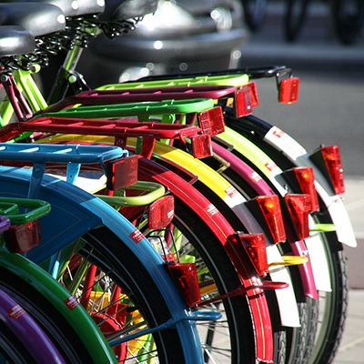

Il y a deux ans et demi, je vous parlais pour la première fois des **vélos hollandais** en vous en montrant des [vrais vélos hollandais de toutes les couleurs](/les-velos-en-couleur). Si ces derniers sont traditionnellement noirs, il est aujourd'hui courant d'en voir des colorés. C'est plus joli et pratique pour retrouver son vélo dans [les grands parkings à vélo](/une-heure-sans-velo). Les marchands de deux-roues connaissent le pouvoir d'attraction des couleurs vives et exposent souvent un bel arc-en-ciel de bicyclettes devant leurs magasin.

Ces allignements colorés sont photogéniques et j'ai oublié de vous montrer cette nouvelle photo, prise par derrière cette fois dans un tout autre coin de la ville. Apparemment ces photos plaisent beaucoup à voir le nombre de *comments* et de *fav* que je reçois [sur flickr](http://www.flickr.com/photos/13274211@N00/). J'en suis fier. Aujourd'hui je viens de voir qu'un site suédois a utilisé cette photo pour parler de [la petite reine à Amsterdam](http://www.treehugger.com/files/2009/02/amsterdam-overtake-copenhagen-in-bike-love.php). C'est gratifiant. À mon tour maintenant d'exposer cette photo sur mon blog.

[{.center}](http://www.flickr.com/photos/13274211@N00/2649371288/)

