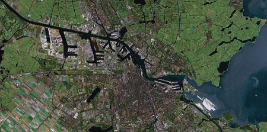
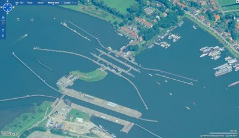

Nous avons vu que IJ était une lettre avec une histoire tellement singulière que certains écrivent des [billets de blog entiers](/nouveau-mot-ij) pour la décrire.

IJ est aussi un mot puisque **c'est le nom de la principale rivière de la ville**. Elle sépare les quartiers nord du reste de la ville. Le port d'Amsterdam est d'ailleurs installé sur les rives de ce fleuve depuis la création de la ville et c'est ainsi la voie navigable la plus utilisée puisque même les navires de grand tonnage peuvent y naviguer. 

[Le periphérique d'Amsterdam](/peripherique-amsterdam) franchit cette rivière par deux tunnels, le *Coentunnel* et le *IJtunnel* qui porte justement le nom de la rivière traversée.

Cette était auparavant un bras de mer qui se jetait dans la
*Zuiderzee*, ou Mer du sud, offrant une route vers la mer à Amsterdam. La
*Zuiderzee* étant fermée aujourd'hui, l'accès à la mer se fait en
amont de l'IJ par le *Noordzeekanaal*, ou Canal de la Mer du Nord. L'IJ n'a plus vraiment de sens
d'écoulement naturel aujourd'hui parce qu'elle est entièrement
aménagée. Son niveau est maintenu à -40cm en hiver et -20cm en été
tout comme le *Markenmeer*, ou lac de Marken.
<!-- HTML -->

<!-- / HTML -->
{.center} 
**Vue satellite d'Amsterdam et du bassin de l'IJ**.   À l'ouest on voit le canal de la mer du Nord (*Noordzeekanaal*) avec le nouveau port industriel  
et à l'est, le lac de Marken (*Markenmeer*) près duquel on devine la construction de nouvelles îles artificielles dont **IJburg** (en blanc)
<!-- HTML -->

<!-- / HTML -->
Étant la principale coupure de la ville en même temps que sa
principale voie de communication, l'IJ est importante dans la vie
d'Amsterdam. de milliers de bateaux et de voitures la traversent
chaque jour et des constructions  parcourent ses rives. J'aurais
sûrement l'occasion de vous en parler.

<!-- HTML -->

<!-- / HTML -->
[{.center}](http://maps.live.com/default.aspx?v=2&FORM=LMLTCP&cp=sqx67nhdd1tp&style=o&lvl=1&tilt=-90&dir=0&alt=-1000&scene=42241901&phx=0&phy=0&phscl=1&encType=1)
Écluse amont sur l'IJ à l'est d'Amsterdam
<!-- HTML -->

<!-- / HTML -->
---
<!-- post notes:
http://www.zeeburgnieuws.nl/plannen/ijburg/ijm_regiokaart.html
--->
