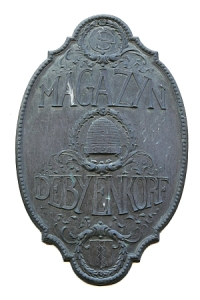
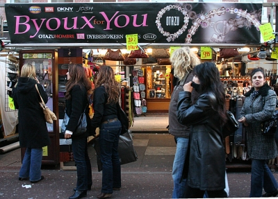

Aujourd'hui le nouveau mot n'est pas un mot c'est une lettre. Une
lettre inconnue dans l'alphabet français mais largement utilisée en
néerlandais: le ?.

### Nouvelle lettre : un diagramme

En fait de nouvelle lettre, il s'agit plutôt d'un diagramme,
c'est-à-dire d'un groupe de deux lettres formant un son nouveau et
pouvant être considéré comme une nouvelle lettre. Ce diagramme est le
**?** que l'on peut écrire aussi **IJ**. Cette nouvelle lettre se prononce *éï* comme dans *meilleur* mais il y a des variantes selon les accents[^1]. Cette diphtongue a exactement le même son qu'une autre que l'on écrit **ei** et que l'on
retrouve aussi souvent dans le néerlandais. A cause de cette similitude, les petits néerlandais doivent apprendre par c?ur l'orthographe avec des listes de mots comprenant des **ij** et des **ei**

Grâce à mes explication vous pouvez enfin prononcer comme il faut
quelques mot Néerlandais  de renommée internationale comme *Rijsel*[^2], *De Stijl*, *François Thijssen* ou *Anton Corbijn*... et puis, si vous êtes perdus dans mon quartier, vous saurez m'appeler quand vous serez arrivés devant le café *DE PIJP*[^3]...

## Une variante de prononciation
Quand cette lettre fait partie du suffixe -*lijk*, elle est alors
prononcée comme un *schwa*, une espèce de *eu* muet. Maintenant
vous savez aussi prononcer le mot
*[koninklijk](/koninklijk-le-predicat-royal)*
ou le nom du musée [Stedelijk](/stedelijk-musee-hors-murs).

## Comment écrire
Cette lettre est vraisemblablement un dérivé d'une écriture d'un
*i* long notté *ii*. en France ce double i est devenu grec, le
*y*. D'ailleurs autrefois, le *ij* holandais s'écrivait *y* ou
plutôt *ÿ* et il l'est toujours parfois en écriture manuscrite.
L'ancienne majuscule du diagramme ressemble plutôt à un *U*
incomplet. Les exemples suivant sont tirés des photos prise au grand
magasin Bijenkorf d'Amsterdam.
<!-- HTML -->
<table border="0"><tr><td rowspan="2" style="padding-right:50px;
vertical-align:top;">
Plaque <b>DEBYENKORF</b> à l'entrée du magasin
<!-- / HTML -->

<!-- HTML -->
</td><td style="vertical-align:top;">
Enseigne <b>DE B?ENKORF</b> sur le fronton du
magasin 
<!-- / HTML -->

<!-- HTML -->
</td></tr><tr><td>
<!-- / HTML -->
Enseigne **de Bijenkorf** au dessus du parking  
  

<!-- HTML -->
</td></tr></table>
<!-- / HTML -->

Aujourd'hui, cette lettre s'écrit *?* et la typographie permet au
diagramme d'occuper la place d'une seule lettre. Hélas l'informatique
n'a pas beaucoup donné de crédit a ce diagramme. L'encodage HTML et
unicode existent mais dans les documents informatisés il est
recommandé d'y substituer les caractères ASCII. Cette lettre est
délaissée des traitements de texte qui ne marquent pas la ligature
automatiquement. Cette lettre est aussi la seule lettre latine
européenne qu'il n'est pas possible d'écrire directement clavier. Les
Néerlandais ne semblent pas s'en émouvoir.

<!-- HTML -->

<b>?</b> et <b>?</b> s'écrivent donc de plus en plus <b>ij</b> et <b>IJ</b> 

Vous ne voyez pas de différence et pourtant je n'ai pas écrit les mêmes caractères 
Les créateurs de fontes n'ont pas pris la peine de de créer le caractère ? alors l'ordinateur affiche cette lettre comme un I et un J.

<!-- / HTML -->
Cette façon d'écrire le diagramme est parfois source de confusion dans
les mots d'origine étrangère ou les groupe *ij* doit être prononcé
comme en français. Le mot bijection est très souvent mal prononcé par
les jeunes élèves tandis que le mot français bijou est parfois écrit
par erreur *byou*...
<!-- HTML -->

<!-- / HTML -->
{.center}
Boutique **Byoux for You** au [marché Albert Cuyp](/albert-cuyp-le-marche)
<!-- HTML -->

<!-- / HTML -->

Autre signification: [Nouveau mot : IJ (2)](/nouveau-mot-ij-2)
---
[^1]: parfois j'entends *êï* comme dans *abeille* ou encore le son *aï* comme dans *maïs*.
[^2]: Vous savez, [la ville de Lille a aussi un nom Néerlandais](/le-nom-des-villes).
[^3]: Le quartier de la pipe.