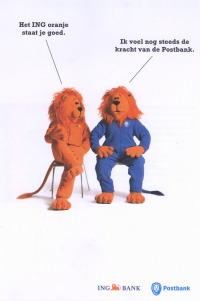
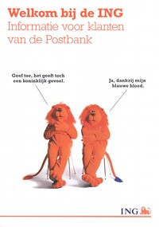

Contrairement à ce que j'affirmais en décembre dernier, les problèmes d'ING dus à la crise financière,  n'ont pas ralenti l'intégration de Postbank au sein de la banque orange. Depuis presque [deux ans qu'on nous le martèle](/les-lions-cons), Postbank devient ING. Le lion bleu, symbole de l'ancienne banque d'état est maintenant devenu un lion orange, symbole d'ING, premier groupe de bancassurance Néerlandais. Un [site web](http://www.ing.nl/samenvoeging/) explique tout ça.

Voici les changements qui sont intervenus depuis le remplacement des distributeurs de billets en décembre 2008. Le plus visible se trouve dans les bureaux de poste. Ces derniers sont maintenant repérables dans la rue grâce à aux enseignes de deux compagnies privées à trois lettres: **TNT** et **ING**. À l'intérieur de ces bureaux de poste, les comptoirs, affiches et brochures sont toutes désormais aux couleurs d'ING. Une nouvelle publicité montre le lion Postbank très fièr de sa couleur orange rappelant à son collège ING qu'il a toujours le sang bleu...

<!-- HTML -->

<!-- / HTML -->
[{.center}](/public/images/scans/postbank-ing.jpg)  
Lion bleu en décembre  
(Sauf la tête)
<!-- HTML -->

<!-- / HTML -->
[{.center}](/public/images/scans/Welkom-bij-de-ING-big.jpg)
(())  
Lion orange en janvier  
(Sauf la queue)
<!-- HTML -->

<!-- / HTML -->

<!-- HTML -->

<!-- / HTML -->

Mon relevé de compte et ma carte de paiement conservent les couleurs de la Postbank mais j'ai reçu un courrier m'indiquant qu'ils allaient bientôt changer sans que je perde les avantages qui y sont liés[^1].

### Des années de travail

Comme souvent, les plus gros changement sont invisibles. Depuis le 1er janvier 2009, la gestion informatique des comptes particuliers des clients Postbank et ING a été regroupés.  On parle ici de 7,5 millions de comptes Postbank et surement 800.000[^2] comptes ING qui doivent être gérés en commun tout en continuant à offrir les mêmes avantages à chaque client. Comme en France, les comptes postaux avait avant un autre statut que les comptes bancaires classique. Une des différences était leur numéro qui tient sur 7 caractères alors qu'un compte *normal* comprend 9 caractères. Pour unifier les systèmes ING et Postbank il faut ajouter 2 caractères aux comptes Postbank; facile. Mais il faut ensuite que les applications Postbank puissent reconnaitre ce numéro qui *rentre pas dans les cases*. 300 applications et des millions de lignes de code à reprendre comme au bon vieux temps du bug de l'an 2000. Ce lourd projet a occupé 1500 informaticiens pendant un an et demi.[^3]. 

### Ce n'est pas terminé.

En attendant que ma carte de paiement devienne orange, il reste du travail à tous ces informaticiens ING. En effet il leur faut encore fusionner les services informatiques des services professionnels (*zakelijk*) des deux banques. Un projet de moindre ampleur. Si Postbank est la première banque des particuliers aux Pays-Bas, elle est bien moins positionné pour la clientèle entreprise. Il reste que c'est un projet important aussi, Postbank revendique environ 600.000 «comptes entreprises». De plus, de par sa position de première banque du pays, ING devrait continuer d'attirer les entreprises à l'avenir[^4]. L'objectif est de regrouper les services «entreprise» des deux banques en 2010, 2011.

---- 
Si vous aimez le lion bleu, retournez le voir danser sur [Changement de banque](/changement-de-banque)...

### Lire aussi :
 **[France / Pays bas: Comparatif des services bancaires](/france-pays-bas-comparatif-des-services-bancaires)**

 **[Le nouveau Rabo Scanner](/nouveau-Rabo-Scanner)**

 **[Une banque qui demande moins de sous](/une-banque-qui-demande-moins-de-sous)**

 **[La fin du porte monnaie électronique](/Porte-monnaie-electronique-la-fin-du-Chipknip)**

 **[Aventures à la carte bancaire](/aventures-carte-bancaire)**

 **[Les sécurité des sites bancaires](/la-securite-des-sites-bancaires)**

 **[Attention, emprunter de l'argent coûte de l'argent](/emprunter-de-l-argent-coute-de-l-argent)**

 **[Changement de banque: Rabobank](/changement-de-banque-rabobank)**

 **[Choisir une banque](/choisir-une-banque)**
---
[^1]: Si mon épargne diminue à cause de la crise, elle devrait continuer à diminuer...
[^2]: Ce chiffre est une estimation.
[^3]: Ces chiffres proviennent d'un employé Postbank.
[^4]: Il y en a bien quelques unes qui ne se casseront pas la gueule quand même...