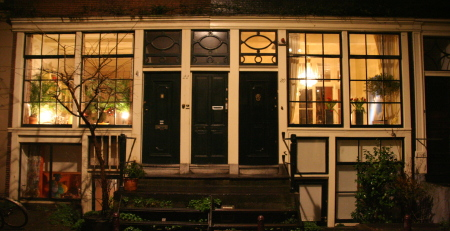
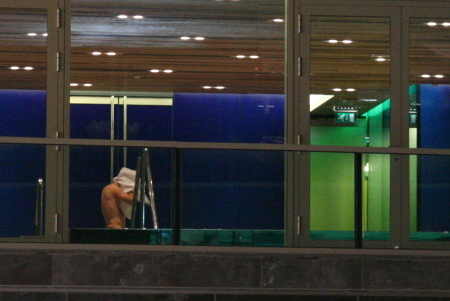

Alors que les jours rallongent, il me faut vous parler d'une tradition très forte aux Pays-Bas : **l'absence de rideaux aux fenêtres**. L'hiver met en évidence cette invitation à regarder chez les gens parce que [la nuit tombe vite](/c-est-la-fin-de-l-ete).Les gens semble nous inviter à regarder ce qu'il se passe chez eux. Leurs intérieurs sont entièrement visibles de la rue, de jolis intérieurs bien arrangés propres et design comme dans un catalogue de modes et travaux. Parfois on y découvre les habitants vaquant à leurs occupations (mangeant ou regardant la télé le plus souvent).  Même les fenêtres au rez-de-chaussée sont concernées.

{.center}

Les touristes ou les nouveaux venus français sont le plus impressionnés par cette habitude puisqu'en France la maison est dans la sphère privé et la sphère privée, c'est comme qui dirait privé... caché, protégé, privé...

## Manque de soleil
Il y a plusieurs explications à ce phénomène aussi marquant qu'il est répandu. La première est pratique et se retrouve dans l'architecture de la vielle ville. Les jours étant courts et le ciel souvent couvert, il est primordial de profiter au maximum de la lumière du soleil[^1]. Cela explique les [larges fenêtres](http://www.flickr.com/photos/13274211@N00/487851153/) et l'absence de rideau.

## Une tradition calviniste
Un autre explication est religieuse. La société néerlandaise est marqué par [le protestantisme de Calvin](/catholiques-et-protestants) (ou Calvinisme). Dans cette tradition, il est important de montrer que l'on a une vie droite et ordonnée. L'absence de rideaux aux fenêtres permet de montrer qu'il n'y a pas de péchés dans cette maison. Au contraire, la présence de rideaux signifie qu'il y a quelque chose à cacher, peut être des choses honteuses ? Bien sûr il reste des pièces à l'abri des regards, les chambres et les salles-de bain donnent souvent sur les cours arrières et sont parfois pourvues de rideaux ou de stores, histoire de cacher ce qui ne saurait être vu, même dans la tradition calviniste.

[{.center}](http://www.flickr.com/photos/13274211@N00/3304303044/)

## Une tradition de parvenu
La dernière explication peut aussi découler du calvinisme. En effet, le travail est une grande valeur du calvinisme et l'argent est une façon de montrer que l'on travaille beaucoup ou bien. Les intérieurs néerlandais qui sont visibles des fenêtres donnant sur la rue sont vraiment bien arrangées et ressemblent à de véritables *showrooms*. Ils donnent l'impression d'une mise en scène pour les passants, histoire de montrer calmement qu'on est capable de s'offrir. Quand on voit l'arrière des maisons, et le désordre ambiant des jardins et sur certain balcons à l'arrière des maison, on imagine combien ces intérieurs sur rue sont des mises-en scène. Une sorte d'exhibitionnisme design.

## Une tradition exhibitionniste ?
Transition toute trouvée pour répondre à la question qui vous taraude tous. Est-ce que l'absence de rideau traduit un certain exhibitionnisme ? En tout cas, pas chez mes voisins (ni voisines). Moi qui suis un voyeur, je n'ai pas eu l'occasion de me rincer l'œil. Peut-être est-ce parce que j'ai beaucoup de voisins absents pour [cause de travaux](/des-travaux-dans-ma-rue), peut-être est-ce parce que cette exhibition des intérieurs ne s'étend pas aux personnes qui y organisent leur intimité.

Petite consolation pour ceux que ça intéresse, la nouvelle piscine de [Zuidas](/un-buurt-nomme-zuidas) reste ouverte tard le soir et ne possède pas, elle non plus de rideaux aux fenêtres.

{.center}
---
[^1]: On an vu que [sortir dès que le soleil se montrait](/revisions-sous-le-soleil) était une tradition.