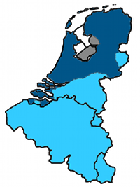

Il me faut faire un billet ces deux familles chrétiennes. Leurs rivalités et leurs actions communes ont modelé le Benelux et imprègnent encore fortement la vie sociale et politique des Pays-Bas. beaucoup de choses s'expliquent par l'histoire religieuse du pays. Les français, de tradition catholique et laïque ne comprennent pas toujours cet historique. Quoi de mieux que la période du carème pour parler des chrétiens des Pays-Bas.

## La réforme
De par sa position minoritaire et autrefois combattue par le pouvoir en place, l'idée protestante a, en France, un accent libertaire. Les dogmes les plus retenus sont la libre interprétation des écritures et le refus de la hiérarchie comme on trouve chez les catholiques. Quand on relit Luther, on constate que ces choix sont la conséquence de son opposition au Pape d'alors, Léon X. L'utilisation des [indulgences](http://fr.wikipedia.org/wiki/Indulgence_(catholicisme)) de plus en plus utilisées par l'église pour renflouer les caisses et permettant un laxisme des croyants. Selon Luther, remettre les pécher par la remise d'indulgences n'est pas vraie piétée. La papauté et le haut clergé se sont opposé à ses positions en l'affrontant et lui faisant un procès en excommunication. En bon théologien, il refuse cette autorité des hommes et s'en remet à l'autorité de la bible qu'il utilise pour se défendre. Aux Pays-Bas, pays ou les protestants ont été majoritaires et proche du pouvoir, c'est cette position centrale de la bible et cette piété qui ressortent le plus des protestants. Les catholiques apparaissant comme des chrétiens un peu laxistes et hauts en couleur.

## L'indépendance
Ne vous y trompez pas, catholiques et protestants ont les mêmes dogmes et sont chacun les mêmes dans les deux pays mais leur positions politiques et sociales ont été différente dans l'histoire. Les protestants se sont affirmés comme différents dès le début de la réforme à cause d'un affrontement hélas sanglant qui a conduit les uns à faire des choses pas chrétiennes comme [le sac de Rome](http://fr.wikipedia.org/wiki/Sac_de_Rome_(1527)) ou le [massacre de la Saint Barthélemy](http://fr.wikipedia.org/wiki/Massacre_de_la_Saint-Barth%C3%A9lemy). En France le protestantisme a été interdit alors qu'il se dévelopait dans le nord de l'Europe, notamment aux Pays-Bas. Là, les catholiques étaient tolérés avec interdiction de pratiquer leur religion ostensiblement.

Beaucoup de dogmes protestants se retrouvent aujourd'hui dans la vie quotidienne aux Pays-Bas. Le refus d'invoquer les saints s'est par exemple traduit par une absence d'icônes, de statues et peintures dans les églises.

Ont dit Les Néerlandais calvinistes. Jean Calvin était un théologien français pour qui tout être était prédestiné (au salut où à l'enfer). Les fidèles calvinistes vont donc chercher dans leur travail et la réussite sociale une confirmation de leur prédestination. La richesse devient un signe de piété et la recherche méthodique de richesses devient parfois une obsession.[^1]

On peut aussi trouver dans *la réforme permanente'' du protestantisme cette propension à écouter les avis divergeant. La démocratie de polder est aussi un signe de société protestante.

## Collision puis collusion...
<!-- HTML -->

<b>carte du Benelux</b>  

{.left}

<table><tr><td>

</td><td>
   catholiques
</td></tr><tr><td>

</td><td>
  protestants
</td></tr></table>

<!-- / HTML -->
Par deux fois les Pays-Bas se sont scindés en deux pour des histoires de préférences religieuses. 

La première fois, après la victoire contre l'occupation Espagnole, les provinces du sud, de Cambrai à Bois-le-Duc, pas si calvinistes que ça, continuèrent de prêter allégeance au roi d'Espagne et à rester catholiques[^2].

La deuxième fois, après les guerres napoléoniennes, la Belgique, catholique et libérale prend son indépendance d'un royaume des Pays-Bas gouverné par un Guillaume II protestant et réactionnaire. En position de force, le monarque conserve quelques provinces du sud (Brabant et Limbourg) à majorité catholique. La carte des traditions religieuses actuelles  au Benelux[^3] met en évidence cette scission entre catholiques et protestants. La frontière se retrouve aujourd'hui aux Pays-Bas. Ce pays est donc un pays calviniste avec **une très forte minorité catholique**, essentiellement dans le sud du pays.

Au XIXe siècle, le pouvoir grandissant des libéraux, libres penseurs et anti-cléricaux, a poussé les autorités à reconnaître les catholiques comme partie prenante dans les affaires du pays. Ces derniers ont enfin eu le droit de construire des églises et de faire sonner leurs cloches. Mais surtout, ils prirent part officiellement à la vie sociale et politique du pays, créant leurs partis, leurs écoles, leurs syndicats, leurs journaux et leurs hôpitaux. C'est l'époque de la [pillarisation de la société](/nouveau-mot-verzuiling) (*verzuiling*). Les communautés protestantes, catholiques et libérales, vivent cote-à-cote, en se tolérant mais sans vraiment se côtoyer.

## La déchristianisation

Au XXe siècle, comme ailleurs, les Pays-Bas se déchristianisent. La religion perd de l'importance dans la société mais le système des piliers perdurent. Le camp athée prends de plus en plus d'importance mais parce qu'il est moins communautaire, il tend surtout à atténuer l'importance de la présence chrétienne et les oppositions cités ci dessus. La ville de Groningue est par exemple à majorité catholique dans une région à majorité protestante mais sa plus grande particularité est d'être une ville étudiante entourée de grandes étendues agricoles. Les communautés s'ouvrent de plus en plus et la société se mélange.

Le système des piliers est officiellement abandonné comme modèle après la seconde guerre mondiale ou l'on table sur **la société multiculturelle**. Mais ce système reste quand même ancré et les immigrants de la décolonisation, venant principalement de Surinam ou d'Indonésie, s'organisent aussi en communautés. Les *allochtones* arrivés plus récemment comme les turcs et les marocains ont plus de mal à créer leur communautés sur le modèle des piliers. Ils sont donc plus impliqués dans la société, plus visibles et créent donc plus de tentions auprès de gens qui pensent que leur communauté est menacée. Les allochtones turcs et marocains étant souvent musulmans, ils focalisent l'attention politique des libéraux[^4] pour qui cette rigueur religieuse n'est pas compatible avec la société Néerlandaise telle qu'ils l'entendent.

Le pays est aujourd'hui séculier avec une majorité de la population hors église selon [un article d'eurotopics](http://www.eurotopics.net/fr/magazin/gesellschaft-verteilerseite/religion/religion-niederlande/)[^5]. Les personnes hors église représenteraient 61% de la population en 2006, les catholiques 16% de la population et les protestants 14% de la population. Bien que peu représentées aujourd'hui l'histoire et la pensée de ces deux familles chrétiennes continuent de constituer la base de la culture et des relations sociales du pays. Je n'ai d'ailleurs pas attendu le carême 2009 pour [en parler](/tag/religion/).

---
[^1]: Max Weber explique ça beaucoup mieux dans ''L'Éthique protestante et l'esprit du capitalisme*.
[^2]: En fait, cet épisode des guerres de religions en Europe pourrait prendre des pages à raconter. de part et d'autre de cette [frontière reconnue par le traité de Westphalie](http://upload.wikimedia.org/wikipedia/commons/d/d5/Netherlands_1559-1608.jpg), les familles restées fidèles à la religion adverse furent vite assimilées de gré ou de force. Amsterdam et Midleburg devinrent protestantes. Anvers, Bruges et Breda devinrent catholiques. 
[^3]: . La déchristianisation du XXe sciècle aidant, les préférences religieuses sont moins fortes qu'avant, mais les traditions restent fortement encrées dans [chaque régions](/les-provinces-des-pays-bas).
[^4]: Les plus célèbres d'entre eux se présentent et agisent comme des libéraux. Je n'ai pas eu la chance de connaitre Pim Fortuyn mais Geert Wilders, la nouvelle coqueluche anti-islam est un pur libéral dont le mentor politique est un certain Fritz Bolkestein.
[^5]: Les chiffres ne sont pas sourcés mais il semble que l'article sorte de l'*Agemeene Dagblad*