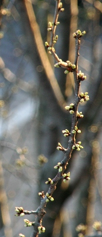

J'ai presque honte de donner un pareil titre digne d'un marronnier mais la vie aux Pays-Bas comme ailleurs, la vie est ponctuée par les saisons. Seulement ici, s'il est nécessaire de suivre le fil des saisons, ce n'est peut-être pas pour les mêmes raisons qu'ailleurs.

{.left}
Le goût des fruits de saisons n'est pas forcément plus prononcé... Les maraîchers locaux éclairent leur serres jour et nuit en été comme en hiver. pour un résultat... non, ce n'est pas ça.

Si comme tout le monde j'ai noté l'arrivée du printemps c'est avant tout à cause de la lumière. Les jours d'hiver sont plus courts et les jours d'été sont plus long à Amsterdam qu'à Paris. La différence est notable. Surtout dans l'[hiver froid et dépressif](/la-temperature-ressentie). À l'approche de l'équinoxe, les jours rallongent si brusquement que le lundi je me lève de nuit et le mardi je me lève de jour[^1]. C'est le printemps. Depuis aujourd'hui, je n'ai plus a mettre mes [lumières de vélo](/lumieres-hiver) pour rentrer du travail[^2]. Les intérieurs des maisons changent aussi, ils deviennent moins visible. Non pas que les gens achètent des rideaux mais éclairent moins tôt leurs salons, du coup, on voit moins bien [chez eux](/venez-voir-chez-moi)[^3].

J'ai remarqué les arbres de ma rue, ceux qui [rougissaient en automne](/c-est-la-fin-de-l-ete) commencent à avoir des bourgeons. Les oiseaux qui s'y perchent on une attitude plus, comment dire, plus printanière. Les mâles se secouent un peu, il ont l'air de s'entraîner à courtiser les femelles.

Rien de similaire encore chez les humains. Jusqu'à présent nous n'avons eu que quelques jours avec une température à deux chiffres. Il est fort probable que si le soleil s'attarde un de ces week-end prochain, les autochtones vont tous quitter leur tanières pour [prendre le soleil](/prendre-le-soleil-autre-solution), [étudier](/revisions-sous-le-soleil), [travailler](/travailler-au-soleil), qu'importe pourvu que ce soit **sous le soleil**. Et j'en serais. Cette tradition que je trouvais bizarre il y a deux ans trouve son explication dans les rudes hivers le long de la mer du nord. Les habitants des Pays-Bas ne reçoivent pas assez de lumière en hiver. Il faut sortir dès que l'occasion se présente, sous peine de déprime ou d'humeur patraque. 

Cette année, c'est sûr, au lieu d'observer les gens prendre le soleil, je vais en prendre un bout aussi. Dans moins de dix jours, c'est vraiment le printemps. Et puis c'est joli un marronnier au printemps.

## Sur le printemps:
* [Nouveau mot: Lente (le printemps)](/lente-printemps)
* [Printemps en vrac et en retard](/printemps-en-vrac-et-en-retard)
* [Les fleurs du printemps](/les-fleurs-du-printemps)
* [Nettoyage de printemps](/nettoyage-de-printemps)
---
[^1]: Véridique.
[^2]: Il est toujours préférable d'avoir des lumières [dans la poche](/les-nouvelles-lampes-de-la-nuit) si on croise un copain dans la rue et qu'on traîne à boire des coups...
[^3]: J'ai bien fait de vous parler de cette [absence de rideaux](/venez-voir-chez-moi) en hiver...