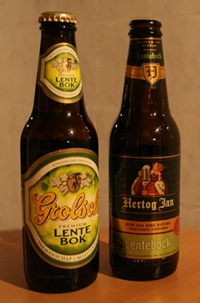
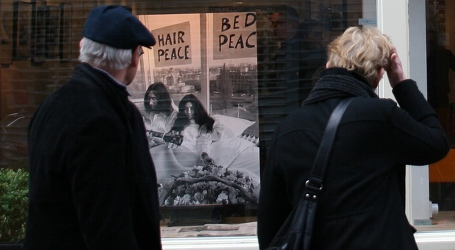

Quelques nouvelles que j'aurais du vous donner **avant** le week-end du printemps si j'avais pu trouver le temps. Tant pis, ce sera des nouvelles en retard.

## Bière de printemps
{.right}
Avec le printemps, c'est le retour des bières de saison. L'année dernière, je vous ai parlé des [bières de pâques](/les-bieres-de-paques) mais avec le succès saisonnier des [bockbeer d'automne](/la-herfst-bokbier-biere-d-automne), nous avons le droit cette année à des bockbeer de printemps: les *lentebok*. Voilà qui illustrera ce billet.

## Procession silencieuse
Dans la ville protestante d'Amsterdam, les catholiques ont une tradition très ancienne: Une procession silencieuse dans les rues du centre ville. Silencieuse parce qu'à l'époque des premières processions, le [catholicisme ne devait pas être ostensible](/catholiques-et-protestants). La procession a donc lieu la nuit en silence et perdure depuis lors de la même manière. Cette procession commémore **le miracle d'Amsterdam** dont je vous parlerais un jour. Je vous en parle maintenant parce que c'était aussi en ce week-end de [printemps](/lente-printemps).

## Semaine de la francophonie
Juste avant le printemps, c'était la semaine de la francophonie (oui oui, [comme il y a deux ans](/les-mots-migrateurs)). Il y avait plein de choses au programme. [Le lion bleu](http://www.lelionbleu.nl/?p=115) nous l'a rappelé et moi je vous en parle en retard. On fêtait aussi les un an du site [franszelfsprekend.nl,](http://www.franszelfsprekend.nl/). Le mieux était à mon avis la [soirée de Natacha](http://www.oh-la-la.nl/?p=408) à la [Maison Descartes](http://www.maisondescartes.com/site/). Hélas, j'étais au même moment dans la capitale de France justement... pour un mariage...

## Anniversaire de mariage
Ce 20 mars était aussi le jour de l'anniversaire de mariage de **John Lennon** et **Yoko Ono**. C'était [en 1969](http://www.cyberpresse.ca/arts/musique/200903/20/01-838776-au-lit-avec-yoko-ono.php), déjà 40 ans. Après leur mariage à Gibraltar, les tourtereaux ont passé leur lune de miel dans une chambre de l'Hilton d'Amsterdam. Ils sont restés une semaine au lit en pleine guerre du Viet-Nam pour appeler à la paix. Le message est passé. Cette lune de miel est si connue qu'aujourd'hui encore de nombreux couples réservent cette chambre 902 pour leur propre lune de miel. Pour fêter les 40 ans, la suite a été redécorée comme à l'époque ou elle était occupée par le couple chevelus, et [ouverte aux visiteurs](http://fr.news.launch.yahoo.com/dyna/article.html?a=/20032009/202/la-chambre-ou-john-lennon-appelait-la-paix-amsterdam-ouverte.html&e=l_news).

{.center}

## Thalys en retard
Pour rentrer de Paris, j'ai pris le [Thalys](/un-thalys-peut-en-cacher-un-autre). [Laurent se plaignait récemment de l'état du Thalys](http://kreukreuscopie.blogspot.com/2009/03/voyager-oldschool.html), je ne peux que le seconder. Le Thalys est presque toujours en retard quand il va aux Pays-Bas. En effet, à l'approche de la frontière le train est souvent immobilisé en Belgique parce que sur les voies que le train à grande vitesse emprunte, la priorité est donnée aux autres trains de la NS (*Nederlandse Spoorwegen*), les chemins de fer néerlandais. Je ne sais pas si c'est parce que le TGV [devrait déjà utiliser les lignes à grande vitesse](/des-travaux-qui-n-en-finissent-pas-encore) ou si la NS veut satisfaire ses clients avant les belges et les français; mais c'est pitoyable. Le moindre retard sur un tortillard de Zélande se répercute sur les Thalys.

Lire aussi [Le Thalys à moins grande vitesse](/le-thalys-a-moins-grande-vitesse)

## Je suis sur AT5
Moi aussi je suis célèbre, [je suis sur le site de la chaine de télé locale AT5](http://www.at5.nl/artikelen/8097/ook-keerzijde-aan-groeiend-toerisme). Apparemment c'est un accident, je suis crédité d'une photo qui n'est pas affichée sur la page. [Mes photos sur flickr](http://www.flickr.com/photos/13274211@N00/) sont en [CC-BY-SA](http://creativecommons.org/licenses/by-sa/2.0/deed.fr). Tout le monde peut les utiliser à condition de me créditer, il n'y a donc rien de surprenant à ce que [certaines](/les-velos-en-couleur-2) soit reprises avec mon nom. Ce qui est plus surprenant c'est quand aucune photo n'est reprise et qu'il y a quand même mon nom. Bref, je suis maintenant une star locale non ?
---
<!-- post notes:
http://www.flickr.com/photos/pietschreuders/3256979673/sizes/l/
http://www.hilton.com/en/hi/hotels/specials_detail_popup.jhtml?ctyhocn=AMSHITW&promoId=134750001&cid=OM,HI,HIgivepeaceachance,BannerHHP 
http://www.blurb.com/books/570520
--->
