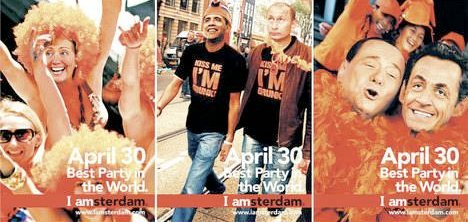

Je n'ai pas encore parlé de la fête de la reine qui arrive dans quelques jours (Le 30 avril prochain) parce que je vous ai déjà fait part des [préparatifs](/fete-de-la-reine) et de [cette fête](/koninginnedag). Que dire de plus ? Et bien voilà que l'actualité me permet de parler de dirigeants français qui haussent le ton à cette occasion. C'est même pas pour dire des choses intelligentes.

La fête de la Reine ([Koninginnedag](/?q=Koninginnedag)) attire à Amsterdam des milliers de locaux et des milliers de touristes. La mairie est très fière de cette organisation et continue de faire sa promotion en expliquant dans sa campagne que la fête de la reine est la plus grande et la plus belle fête de rue du monde. Pour ce faire, ils ont pondu [des affiches](http://gespot.at5.nl/2009/04/20/zin-in-een-feestje/) avec des dirigeants connus parmi la foule des gens qui font la fête en orange. Ces affiches ont été reprises samedi en couverture de Het Parool, le quotidien d'Amsterdam. **Hillary Clinton** offre ainsi un joli décolleté dans un bikini couleur batave, alors que **Barrak Obama** et **Vladimir Poutine** s'affiche avec un T-shirt «Kiss me I'm drunk». On retrouve aussi **Silvio Berlusconni** et **Nicolas Sarkozy** tout sourires l'un contre l'autre avec un boa à plumes orange.

{.center}

C'est cette dernière image qui n'a pas plu aux services de l'ambassade de France à la Haye qui on jugé bon de se plaindre officiellement demandant la fin de cette campagne. Résultat, l'affiche incriminée se retrouve à nouveau reproduite dans la presse à grand tirage (à nouveau [Het Parool](http://www.parool.nl/parool/nl/4/AMSTERDAM/article/detail/238130/2009/04/20/Sarkozy-beledigd-door-Amsterdam.dhtml) et [De Telegraff](http://www.telegraaf.nl/binnenland/3743772/__Ophef_om_Sarkozy_op_poster_A_dam**.html?p=8,2), le premier quotidien national) à coté d'articles relatant les récriminations françaises: *De poster zou de waardigheid van Sarkozy aantasten*. **L'affiche attaque le Président Sarkozy dans sa dignité__. Lui qui est régulièrement caricaturé dans la presse pour [ses frasques](http://sarkonneries.free.fr/) et ses revirements, serait atteint dans sa dignité par une campagne humoristique qui le montre juste en train de s'amuser. Je ne sais pas quoi dire pour commenter cette réaction inopportune des services de l'ambassade qui permet aux français d'être (à nouveau) la risée de la presse locale.

En France, il n'y a pas de crime de lèse majesté depuis qu'il n'y a plus de *majesté* à la tête de l'État. On aurait même pu trouver anachronique la condamnation pour ce motif d'un étranger en 2007. (Ce dernier a écopé de 400 euros d'amende et d'après l'histoire racontée dans les journaux, ils l'avait vraiment cherché...). Cela dit, en France, on a le crime d'offense au chef de l'État. Je ne sais pas si ce délit est très souvent évoqué mais si nos ambassadeurs réagissent aussi promptement à ce genre de campagne humoristique, la France va finir par avoir l'image d'un pays ou le gouvernement tient la presse d'une main de fer.

---- 

## Ajout du 21 avril 2009 : 
Une nouvelle recueillie [sur le site de orange.fr](http://actu.orange.fr/articles/insolite/Sarkozy-et-Berlusconi-en-boa-de-plumes-sur-des-affiches-pour-la-Fete-de-la-reine-a-Amsterdam.html) indique que selon lAFP: ''«Nous n'avons pas de réaction», a indiqué l'ambassade de France aux Pays-Bas, interrogée par l'AFP. L'ambassade des Etats-Unis n'était pas joignable.'' Je ne sais plus qui croire. Est ce que la presse Néerlandaise a envie de se foutre de la gueule des français ou bien est ce que les services de l'Ambassade de France sont capable de lancer deux messages différents à deux jours d'intervalle ?
---
<!-- post notes:
[[http://gespot.at5.nl/2009/04/20/zin-in-een-feestje/]]
--->
