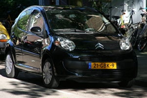

La France a fait tout un pataquès avec ses nouvelles plaques d'immatriculation. Le projet de nouvelles plaques d'immatriculation devait être applicable au premier janvier 2009 et c'est finalement au 15 avril que le les premières plaques sont délivrés. Retard du à un groupe de personnes attachées au numéro des départements que le gouvernement a décidé d'écouter après l'avoir ignoré pendant des lustres. La France apprendrait-elle la [démocratie de polder](/modele-de-polder) et la concertation? Aux Pays-Bas le système de numérotation des plaques a changé durant l'été 2008 sans que personne ne s'en émeuve. Revue des différences:

Pâte à caisse en France

**L'administration française a décidé de réviser l'attribution des numéros minéralogiques des véhicules** pour plusieurs raisons. La première parce que les services de police européens discutent du partage de leurs bases de données (pour pouvoir recouvrir les amendes plus facilement) et que les autorités françaises ne veulent pas transmettre des données personnelles (département d'immatriculation). Le seconde raison est plus une excuse fallacieuse ; on nous a expliqué que le système précédent était dépassé et arrivait bientôt à épuisement du nombre de combinaisons. J'ai un peu du mal à la croire. Même Paris, département le plus avancé avait un bon réservoir de combinaisons.

La troisième raison est une révision du système ou la voiture devrait garder son numéro à vie ce qui offre un meilleur suivit des véhicules qui devrait limiter les vols et les trafics. Sur ce point aussi j'émets quelques doutes. Outre l'aveu que la paperasserie n'évite pas les trafics et les vols, cette affirmation ne tient pas fait du compte du fait que les trafics sont souvent transfrontaliers profitant ainsi de la faiblesse des échanges de données d'un pays à l'autre[^1]. Reste la raison de simplification administrative puisque l'achat d'un nouveau véhicule n'imposera plus sa nouvelle immatriculation pour peu qu'il soit immatriculé en France avec le nouveau système[^2].

La mise en place du nouveau système a pris du temps parce qu'**un petit groupe de pression a fait suffisamment de bruit pour rendre obligatoire l'ajout facultatif du département** de son choix. Cette donnée ne sera pas transmise aux service de polices étrangers ce qui fait que tout le monde est content (si j'ai bien compris). Le gouvernement français, la Ministre de l'intérieur française est quand même très compétente d'avoir su régler cet *énorme problème* en faisant preuve d'une grande écoute et d'une infinie ingéniosité en seulement quelques mois.

## Pendant ce temps aux Pays-Bas

Pendant  ce temps, aux Pays-Bas, les plaques d'immatriculation arrivaient vraiment à saturation. Le modèle **BB-11-11**, est devenu **11-BB-11** épuisant toutes les possibilités jusqu'à **11-BB-BB** et **99-ZZ-ZZ**. Il faut dire que ce modèle est utilisé depuis des années sur l'ensemble du pays ce qui fait avancer les chiffres et les lettres plus rapidement qu'à l'échelle d'un département ou d'une province.

Le système fonctionnait bien. Il a donc été décidé de le faire évoluer en passant à trois lettres. Les immatriculations qui sont délivrées depuis l'été 2008 aux Pays-Bas sont maintenant de la forme **11-BBB-1**. Ce changement c'est fait naturellemengt sans que je n'entende parler d'aucun groupe opposé au changement ni même de grands titres dans les journaux. En fait, à ma connaissance, il n'y a que moi qui soit assez *nerd* pour en parler, vous proposant pour preuve, la photo de la voiture d'une ancienne voisine.

{.center}

C'est une jolie Citroën don la plaque d'immatriculation, récente ressemble beaucoup aux nouvelles plaques d'immatriculation françaises avec des tirets et trois *digits* au milieu.
---
[^1]: Sur ce sujet on a d'ailleurs constaté que **pas mal de voitures françaises brulées durant les émeutes de Novembre 2005 en France on servit a ré-immatriculer des voitures volées aux Pays-Bas**. Un trafic de cartes grises a été mis à jour.
[^2]: Sur le point de simplification administrative, on ne peut que se réjouir. Tant qu'on y est, quand est-ce qu'on supprime le timbre fiscal, la déclaration de revenu et autres archaïsmes ?
<!-- post notes:
http://akikcekca.over-blog.com/article-30307865.html 
http://voyages.liberation.fr/actualite/l-039-immatriculation-aa-001-aa-revient-une-mazda
--->
