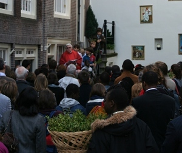
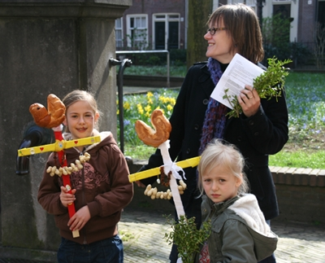

[{.right}](/les-rameaux)
Il y a deux ans, je vous ai parlé de ma paroisse, [la paroisse francophone d'Amsterdam](/bonne-fete-pascales). C'était à l'occasion de pâques. Pâques étant dans moins d'une semaine, je vous dois une mise à jour. Mise à jour annuelle avec une semaine d'avance donc.

Selon la liturgie, le dimanche d'avant pâques, c'est celui des rameaux. On rappelle que Jésus est arrivé à Jérusalem, accueillit comme un roi, et qu'il y a été mis à mort quelques jours après. Comme c'est une célébration un peu spéciale, la communauté francophone a décidé, elle aussi, de faire les choses de manière spéciale. 

Le début de la messe, **la bénédiction des rameaux** s'est fait dehors sous le soleil de [printemps](/lente-printemps). C'est important, la bénédiction des rameaux, ils y a des gens qui viennent à cette messe juste pour ça, il ne faut pas les décevoir. Ensuite **la chorale africaine** a mené toute l'assemblée le long des passages du béguinage, chacun tenant son rameau de buis, jusqu'à la petite chapelle catholique. Comme le béguinage est un haut lieu touristique de la ville, la procession a été beaucoup photographiée.

L'autre curiosité du dimanche était une découverte pour moi. Elle est survenue au moment de croiser les néerlandais qui quittait la chapelle catholique. Cette chapelle est en effet affectée à deux paroisses dont la principale assure le culte en néerlandais. Comme le dimanche des rameaux est une célébration spéciale, les Néerlandais était en retard. Ils sont sortis de la chapelle alors que les français se préparaient. J'ai croisé deux enfants portant des croix en bois sur lesquelles étaient piquées des brioches en forme d'oiseaux et pendus des colliers de cacahuètes. Les adultes portaient normalement leurs rameaux de buis mais les enfants n'étaient pas en reste. Il semble qu'ici la célébration est spéciale pour les enfant aussi. 

{.center}

Je n'arrive pas à savoir d'où leur est venue cette idée. Il existe bien une tradition charentaise de la « cornuelle » ([voir recette](http://wednesday-morning.over-blog.com/article-17760213.html)), une brioche en forme de triangle ou de **Y** qui se déguste à la période des rameaux. Mais ici les brioches sont en forme d'oiseau, il s’agit d'autre chose.

## Nouveau mot: Palmpaasstok

Après quelques recherches, j'ai découvert que cet oiseau est **un petit coq** *haantje* et que le le pain s'appelle *broodhaantje* (coquelet en pain). ce dernier est posé en haut d'une croix qu'on appelle *palmpaasstok*. On pourrait traduire cela par **bâton des rameaux**. En effet, le dimanche des rameaux se dit *palmzondag* mais aussi *palmpasen*. *Pasen* signifiant pâques, le néerlandais montre bien que les deux fêtes sont liées. Les rameaux introduisent [la Semaine Sainte](http://fr.wikipedia.org/wiki/Semaine_sainte) et pâques la termine. Tous les ornements de ce *palmpaasstok* sont des symboles religieux s'accordant avec la semaine sainte[^1].

[Une page](http://www.ah.nl/allerhande/kookschrift/recept.jsp?id=8062) de chez [Albert Hein](/albert-hein-et-compagnie) nous propose une recette de *broodhaantje* ainsi qu'un chant pour les enfants où il est question de rameaux, de pâques et d'œufs. Les coqs ne pondent pas d'œufs mais ce *palmpaasstok* est une tradition idéale pour faire patienter les enfants jusqu'à pâques. Ils peuvent ainsi grignoter avant de chercher les chocolats.
---
[^1]: Voir ma [traduction approximative sur Wikipédia](http://fr.wikipedia.org/wiki/Croix_des_rameaux)
<!-- post notes:
http://www.femmeactuelle.fr/cuisine/recettes/colombe_des_rameaux 
 
http://www.isidorusweb.nl/asp/default.asp?t=show&id=3641
http://www.knutselidee.nl/startpasen.htm?palmpasen
--->
