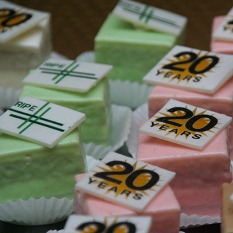

{.left}
Presque une semaine sans donner de nouvelles. Tout cela parce que j'étais fortement occupé à soutenir le meeting RIPE 58 avec un [nouveau et joli site web](http://www.ripe.net/ripe/meetings/ripe-58/). Comme ça fait un moment que je ne vous ai pas parlé de [mon boulot](/mon-nouveau-boulot-3), voici une mise à jour que vous trouverez je l'espère intéressante. Comme pour [RIPE 55](/c-etait-ripe-55-meeting) qui a eu lieu il y a un an et demi à Amsterdam, voici mon contre-rendu de RIPE 58.

Ceux qui se souviennent de mon compte-rendu de RIPE 55, savent que les professionnels de l'internet ont intérêt à passer à IPv6 avant qu'il n'y ait plus d'adresses IPv4 disponibles. Il y a 18 mois, la communauté avaient lancé un appel solennel en ce sens et aujourd'hui, on constate que très peu ont franchit le pas. Lors des premières réunions plénières, on a indiqué que les problèmes se poseraient quand les société de services internet ne pourront plus connecter leurs client par défaut d'IP dans leur stock. Il semble que d'ici là peu de gens se posent vraiment la question.

## IPv6, testé et... 

Cela ne signifie pas que tout le monde se tourne les pouces, les expériences IPv6 à plus ou moins grande échelle se multiplient et les RIPE meetings sont un excellent moment pour les partager. Lorenzo Colitti, le Monsieur IPv6 de Google fait part des avancées de l'entreprise américaine depuis plusieurs meetings et nous a livré une mise à jour qui semble dire que le moteur de recherche est maintenant en phase de production. C'est aussi le cas de Free en France. Parce que cette société maîtrise son réseau depuis les *gros tuyaux* jusqu'à la *box* de l'utilisateur, elle a pu proposer à ses clients une véritable offre IPv6. Les statistiques de l'opérateur, présentées par Alexandre Cassen ([ici en PDF](http://www.ripe.net/ripe/meetings/ripe-58/content/presentations/ipv6-free.pdf)) en ont bluffé plus d'un dans l'assistance ; bien que IPv6 reste une option, de nombreux clients l'ont activé alors qu'il n'y a aujourd'hui aucun avantage à surfer en v6. Ça rabat le claquet à tous ceux qui affirment depuis des années que personne ne veut IPv6.

Coté Néerlandais, Marco Hogewoning nous a expliqué ([ici en PDF](http://www.ripe.net/ripe/meetings/ripe-58/content/presentations/ipv6-xs4all.pdf)) qu'il travaille très dur pour que son entreprise [XS4ALL](/xs4all-suite-upc), fasse ce même travail que Free. Hélas, il n'y a que lui sur le projet en ce moment et mon fournisseur d'accès ne maîtrise ni la fabrication des boîtiers chez les clients ni les DSLAM dans les centres techniques de KPN. Marco doit donc faire pression sur le fabriquant allemand du modem fournit par XS4ALL ainsi que sur ses fournisseurs de transit, à faire des pirouettes techniques pour que tout marche avec les services prévus en v4, tout en essayant de convaincre ses chefs que son travail est utile. Pas facile. Mais depuis sa présentation, il gère une aussi liste d'attente de clients potentiels (dont moi) prêt à essuyer les plâtres pour être les premiers dans le pays à surfer en IPv6.

Il y a eu d'autres [présentations autour d'IPv6](http://www.ripe.net/ripe/meetings/ripe-58/archives.php?day=tuesday) mais celles-ci étaient il me semble les plus concrètes. Il y a eu aussi des présentations de quelques gouvernements d'Europe du nord sur le sujet mais cela restait plus dans l'ordre des déclarations d'intention. Rien de vraiment neuf. Enfin, RIPE NCC a annoncé une [nouvelle politique d'attribution d'adresse IPv6](http://www.ripe.net/ripe/docs/ipv6-policy.html). Il est désormais possible de demander des adresse IPv6 en *Provider Independent* ce qui veut dire que les utilisateurs de ces adresses peuvent changer de prestataires sans changer d'adresse IP. Une possibilité pratique attendu depuis un moment dans le microcosme de l'Internet.

## Des débats

Je n'ai biensûr, pas pu assister à toutes les sessions mais il semblerait que DNSSEC soit aussi un sujet à la mode. La revue des dépots de confiance pour clés DNSSEC  (*Review of DNSSEC Trust Anchor Repositories (TARs)*) par Olafur Gudmundson ([ici en PDF](http://www.ripe.net/ripe/meetings/ripe-58/content/presentations/tars.pdf)),  a suscité pas mal de questions de l'assemblée. Mais le débat le plus enflammé a eu lieu selon moi durant le groupe anti-abuse (habituellement très calme) suite à la présentation de Robert Bruen ([ici en PDF](http://www.ripe.net/ripe/meetings/ripe-58/content/presentations/knuj0n-aawg.pdf)) voulant renforcer l'obligation de mettre à jour les données Whois selon des critères très stricts. Ces exigences revenaient parfois à forcer les chinois à parler anglais.

## Gouvernement et flics de tous pays...

Ce RIPE meeting peut d'ailleurs être qualifié de premier meeting à s'inscrire dans la mouvance sécuritaire puisqu'il est le premier à avoir hébergé une réunion d'agences nationales de sécurité[^1]. Ces agences ont des problématiques propres qui s'avèrent être à la fois techniques et légales. Leur présence à ce meeting est plutôt un bon signe. Cela montre que ces services entendent comprendre le fonctionnement de la communauté qui se charge de certains aspects de l'Internet plutôt que d'essayer d'imposer leurs choix en faisant le forcing auprès de leurs gouvernements. Leur réunion avait lieu [lundi 4 mai](http://www.ripe.net/ripe/meetings/ripe-58/agendas.php?day=monday). Ce jour étant aussi [celui du souvenir des soldats Néerlandais morts pour leur partie](/dodenherdenking-le-jour-du-souvenir). La place devant [l'hôtel Krasnapolsky](http://www.flickr.com/photos/13274211@N00/420216118/) était surveillée de près puisque la reine devait passer pour y déposer une gerbe. Après l'incident de la fête de la reine, les services de sécurité ont été renforcés. L'hôtel servait aussi de base arrière pour les policiers assurant la sécurité de l'événement. Flics en civil et en uniforme arpentaient les allées de l'hôtel. Se doutaient-ils qu'ils y croisaient aussi des fonctionnaires d'agences de sécurité étrangères ?

## 20 ans déjà
{.right}
L'autre fait marquant de ce meeting était l'anniversaire du RIPE. Le premier meeting du nom a eu lieu dans cette même ville d'Amsterdam en 1989. Il y a vingt ans. Cela peut paraître récent mais pour l'histoire de l'Internet, cela fait beaucoup. Quand les pionniers européens  du protocole TCP/IP de l'époque se sont réunis dans les locaux prêté des années 80, ils ne se doutaient pas que plein de petit jeunes allaient les applaudir 20 ans après dans un cinq étoiles du centre ville. Daniel Karenberg en a profité pour nous expliquer pourquoi cette organisation s'est retrouvé avec un nom français ([ici en PDF](http://www.ripe.net/ripe/meetings/ripe-58/content/presentations/the-origins-of-ripe.pdf)). Cet anniversaire a été l'occasion d'une [belle soirée](http://www.ripe.net/ripe/meetings/ripe-58/social-events.php?day=thursday) à l'ancienne bourse d'Amsterdam (Beurs van Berlage[^2]). Il n'y a pas eu de chanson tube comme avec RIPE 55 mais un bon repas avec plein de monde et un joli gâteau que je n'ai pas put goûter.

Comme pour le gâteau, il y a beaucoup d'autres choses auxquelles je n'ai pas pris part et c'est pour cela que je ne vous en dis pas plus.
---
[^1]: oui oui, il y avait des agents secrets dans notre hôtel...
[^2]: Présentée récement sur ce blog...