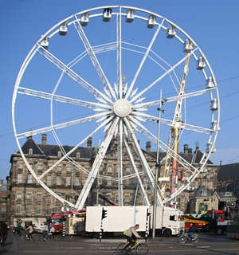

{.left}
On l'a vu, [les mots sont migrateurs](/les-mots-migrateurs), parmi les mots que les français sont
allés chercher en Hollande, il y a le mot kermesse, qui vient du mot
*kermis*, signifiant fête foraine.

À l'origine, on parlait de *kerkmis*, littéralement **la messe de l'église**. L'inauguration
d'une nouvelle église était souvent une grande messe suivit d'une fête,
en l'honneur du Saint auquel l'église était dédiée. Le deuxième "k" du
mot s'est perdu à mesure que la fête perdait son caractère religieux.

En France, on parle encore de fête patronale pour désigner la fête au
village qui coïncide souvent avec la fête du saint patron du village ou
de son église. À la fête au village, les forains s'installent sur un
lieu convenu et tous les habitants profitent des attractions.

C'est la même chose aux Pays-Bas ou *kermis* désigne aujourd'hui une fête
foraine plus ou moins grande. Il a donné en France le mot kermesse qui
convient plutôt aux petites fêtes mais l'esprit de fête est toujours là.

Bien que la tradition de kermis soit essentiellement catholique (Les protestant n'ont pas de saints)[^1], les protestants ont, eux aussi, adopté la fête foraine
d'autant que le caractère religieux de la fête n'est plus toujours évident.

Il reste quelques endroits du Brabant ou la fête locale est précédée de
processions religieuses, comme à Tilburg, où l'origine religieuse et traditionnelle de la
fête est utilisée pour défendre les intérêts des forains[^2].

---
[^1]: voir [Catholiques et protestants](/catholiques-et-protestants).
[^2]: De mémoire, les forains s'y sont vu refuser l’installation d'une grande roue pour non conformité avec les règles d'urbanisme !