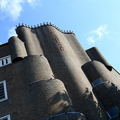
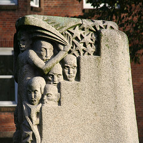

**L'école d'Amsterdam** (*Amsterdamse School*) est un mouvement artistique né dans la ville qui porte le même nom. Né dans les années 20 il regroupait des architectes, urbanistes et designers de l'époque et allait transformer pour toujours les paysages urbains des Pays-Bas. L'école d'Amsterdam est un courant artistique qui a influencé le monde entier à l'époque de son virage dans la modernité.

L'école d'Amsterdam s'inspire des grands courants architecturaux de l'époque comme l'art nouveau, la nouvelle architecture du Bauhaus et l'expressionisme. Mais les architectes néerlandais vont développer un styple propre ou les courbes épousent plus les lignes. L'utilisation de la brique (matériau de construction de base aux Pays-Bas) et de la pierre en font aussi une spécificité Néerlandaise de cette nouvealle forme moderne d'architecture.

On pense souvent que **Hendrik Petrus Berlage** est le père de ce mouvement avec son fameux bâtiment de la bourse d'Amsterdam (Beurs van Barlage), construit entre 1898 et 1903. Il est vrai que ce bâtiment est moderne et révolutionnaire pour l'époque mais reprenant la forme d'une église il pourrait tout aussi bien préfigurer le traditionalisme et l'école de Delft, autre courant architectural néerlandais du XXe siècle. Berlage est malgré tout associé à l'école d'Amsterdam parce qu'il a été l'architecte de bâtiment typiques de ce mouvement (comme la Jachthuis Sint-Hubertus du [Hooge Veluwe](/paasdagen-in-amsterdam)) et qu'il a été l'architecte urbaniste du sud d'Amsterdam, quartier ou je vis et ou la plupart des bâtiments sont de cette école.

Mon quartier est un bon point de départ pour découvrir des bâtiments typiques de l'école d'Amsterdam. Le Berlage Lyceum (encore Berlage) est juste à coté d'un chouette complexe d'habitations sociales De Dageraad, Burg.

<!-- HTML -->
<table align=center cellpadding=3><tr><td align=center style="padding:0; margin:0;">

  
De Dageraad (Michel de Klerk et Piet Kramer)

</td><td align=center>

  
Pile de pont dans le Pijp (Hildo Krop)

</td></tr>
<tr><td align=center>

  
Pile de pont dans le Pijp (Hildo Krop)

</td><td align=center>

  
Fenêtre du Dageraad (Michel de Klerk et Piet Kramer)

</td></tr>
</table>
<!-- / HTML -->

Les architectes de cette école étaient aussi très concernés par la modernité sociale. Ils défendaient les idées socialistes de l'époque et préféraient travailler sur des projets de bâtiments publics et de logement sociaux parce qu'ils estimaient que les pauvres avaient aussi le droit de vivre dans un environnement agréable. La construction du [stade olympique d'Amsterdam](/amsterdam-ville-olympique) fut l'occasion pour les architectes de manifester leurs idées de manière plus médiatique. C'est aujourd'hui le [musée historique d'Amsterdam](/gratis-week-in-ahm) qui en conserve la trace.

C'est à l'école d'Amsterdam qu'on doit les barrières en fer forgé des ponts de la ville ainsi que de nombreux hotels et bâtiments officiels ou privés qui ont depuis changé plusieurs fois d'affectation.

En dehors du Pijp, les quartiers les plus marqués par l'école d'Amsterdam sont Riverenbuurt au sud, le veux sud et le viel ouest. La place **Roeloff Artplein** est un bel exemple de carrefour ou tous les bâtiments son de cette facture. Le centre-ville offre quelques exemples parmi les plus extravagants comme la **Scheepvaarthuis** (*maison de navigation*) devenue **Grand Hotel Amrâth Amsterdam** ou le **Cinéma Tuschiski** cité dans tous les guides. Ce dernier est situé tout prêt du **Jolly Hotel Carlton**, autre exemple plus discret. Le sud de Leidseplein est aussi un bel endroit de découverte avec **l'Hotel Américain** et plus loin le **NH City Center** et d'autres bâtiments dont j'ignore la fonction. Plus au nord, autour de Spaarndammerplantsoen, l'on trouve aussi des bâtiments remarquables de cette école. Il y a notamment au numéro 140, **[Het Schip](http://www.hetschip.nl/hetschip/index.php/nl/contact)**, sûrement le meilleur endroit pour découvrir l'école d'Amsterdam puisque c'en est aujourd'hui le musée.

* Voir aussi le [groupe amsterdamseschool](http://www.flickr.com/groups/amsterdamseschool/pool/) sur Flickr

## Pour aller plus loin:

- [Margaret Staal-Kropholler, l'architecte que j'avais oublié dans cet article](/Margaret-Kropholler-Holendrechtstraat)

<!-- post notes:
http://www.flickr.com/groups/amsterdamseschool/pool/
--->
