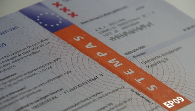
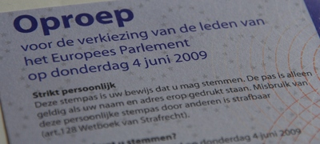
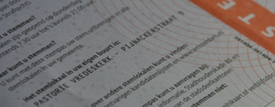
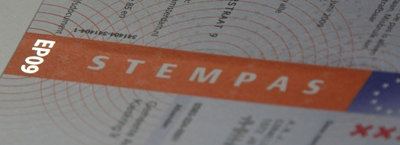
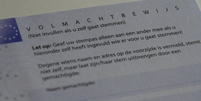

Ça y est **j'ai reçu ma carte d'électeur**, je jour ou j'ai parlé de [mon inscription sur les listes électorales](/bientot-les-elections) pour participer aux élections au parlement Européen. Puisque certains me l'on demandé ici et [sur twitter](http://twitter.com/meinamsterdam), je vous présente ce bout de papier me donnant le droit de voter.

{.right}
**Stempas**  
Voilà donc ma carte d'électeur pour les élections du parlement Européen. Il y a le logo de ma commune et le logo de l'Union Européenne. Le mot **stempas** est écrit sur la couleur ([orange](/les-drapeaux-oranges)) nationale, une couleur complémentaire du bleu européen. Il y a avec cette carte quelques nouveautés pour l'électeur français que je suis. Je vais donc vous les présenter.
<!-- HTML -->

<!-- / HTML -->

{.right}
**Appel**  
Au coté de la carte, un gros text appelle officiellement les citoyens à aller voter en rappelant le type de scrutin (*verkising va de leden van het Europees Parlement*) et la date (4 juin). Et oui, le 4 juin est un jeudi. Aux Pays-Bas on vote en semaine et les entreprises doivent donner le temps nécessaire à ses employés pour effectuer leur devoir civique. Le week-end est déjà pris pour plein d'autres choses.

<!-- HTML -->

<!-- / HTML -->

{.right}
**Bureau de vote**  
Mon bureau de vote (*stemlokaal*) est la *Pastorie Vredeskerk*, le presbytère catholique du quartier. Certain républicains français s'insurgerait de devoir aller à l'église pour voter. D'autant qu'ici les églises n'appartiennent pas à l'État. C'est donc dans un lieu privé et religieux que je vais aller voter# Ici c'est tout à fait normal tout comme il existe des lieux publics gérés par le privé (écoles, chambres de commerce, parcs etc.).

<!-- HTML -->

<!-- / HTML -->

{.right}
**Impression complexe**  
Comme pour les documents *infalsifiables* ce *stempas* reprend quelques élément de ce que les administrations appellent impression de sécurité. Papier spécial teinte bleu claire. Traits fins et dégradés de gris et pastels pour désorienter les photocopieurs, [code barres](http://fr.wikipedia.org/wiki/Code-barres) postal et [Datamatrix](http://fr.wikipedia.org/wiki/Datamatrix). Et enfin un hologramme dessinant "**EP09**", le nom du scutin, coupant court à toute copie facile.

<!-- HTML -->

<!-- / HTML -->

{.right}
**Procuration**  
Il est aussi possible de voter par procuration (*volmachtbewijs*). La section *volmachtbewijs* au dos de la carte permet à l'électeur de donner tous les renseignements pour pouvoir donner procuration à un autre électeur. Il suffit pour cela de renseigner les nom et adresse du tiers votant, de le faire signer et de signer soi même. La carte doit ensuite être apportée par le tiers votant au bureau de vote qui effectuera les vérifications.

Pour ceux qui veulent en savoir plus, une petite phrase en bas de la carte propose de visiter [uheefthetvoorhetzeggen.nl](http://uheefthetvoorhetzeggen.nl/), qu'on pourrait traduire par ''ça sert à s'exprimer''.
---