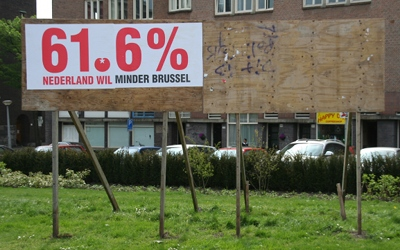
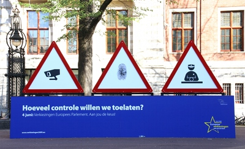

## La campagne du SP
[{.center}](http://drooderfiets.tumblr.com/post/103670031/minder-brussel)
Comme [drooderfiets nous le montrait](http://drooderfiets.tumblr.com/post/103670031/minder-brussel), la campagne d'affichage a commencé au mois d'avril avec les partis protestataires. Ici le SP nous rappelle le score du **non** au référendum pour une constitution européenne. 61,6%, c'est pas rien. Le SP compte capitaliser cet anti-européanisme en attirant les votes sur ce parti mais il n'est pas le seul dans ce cas. Le PVV a pour thème de campagne, «défendre les Pays-Bas à Bruxelles». C'est généralement le rôle endossé par les ministres nationaux à Bruxelles mais comme les ministres ne font pas beaucoup de publicité sur leur participation aux conseils des ministres européens, le populiste se charge de répéter à la télé quelques remarques de café du commerce. Personne pour le contredire, ce dernier caracole presque en tête des sondages nationaux.

De toutes façons, les thèmes de cette campagne européenne sont les thèmes nationaux. Le D66, parti libéral centriste, affiche un grand **JA** sur ces affiches, comme pour répondre au SP en rejouant le référendum de 2005. Le PvdD (parti des animaux) ne parle que des annimaux et les grands partis de gouvernements n'évoquent guère l'Europe à part quelques grandes idées plutôt molles pour satisfaire leur base. 

## La campagne du parlement
[{.center}](http://commons.wikimedia.org/wiki/File:Election-europarlement-amsterdam.jpg)
Pendant ce temps là, le parlement européen actuel tente de communiquer sur ses activités, essayant de convaincre les européens de l'importance de ces élections. [Une campagne](http://www.europarl.europa.eu/news/public/focus_page/008-52263-082-03-13-901-20090320FCS52246-23-03-2009-2009/default_fr.htm) soulignant quelques thématiques discutés au parlement montrent l'importance des choix qui y sont prononcés (Protection des consommateurs, ouverture des frontières, limite des lois sécuritaires, standardisation...). Cette campagne essentiellement en ligne est soutenue par quelques panneaux d'affichage dans certaines villes européenes. Amsterdam se retrouve avec [un panneau](http://www.europarl.europa.eu/news/public/focus_page/008-52263-082-03-13-901-20090320FCS52246-23-03-2009-2009/default_p001c006_en.htm) demandant «Quel nouveau de contrôle voulons-nous?» placé juste devant la bourse[^1].

Cette campagne dit vrai, le Parlement Européen est (aussi) le siège de beaucoup de décisions qui jouent sur notre vie. Pouvoir choisir qui le fera est important. Le Parlement Européen s'est même montré par le passé, seul organe européen à défendre les citoyens face a des directives rédigés par la commission et trop visiblement à la solde de lobbyistes. Il est donc crucial d'y porter des élus qui soit compétents et à l'écoute des problèmes des gens. Il ne s'agit donc pas d'être pour ou contre l'Europe mais de faire des choix concrets pour la vie de tous les jours. 

Hélas, cette timide campagne est loin de toucher les millions d'électeurs européens, par ailleurs arrosés par les messages simplistes et souvent populistes de leur presse nationale. C'est en tout cas le cas aux Pays-Bas.

---
[^1]: Je pense que choisir un endroit ou la multiplication des contrôles a fait preuve de son inefficacité est un pur hasard. Mais c'est quand même rigolo. 