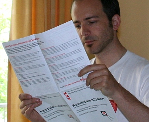

Puisque je vote aux Pays-Bas pour les élections au Parlement Européen, il me faut choisir parmi des candidats que je connais pas vraiment intervenant dans une campagne que je ne comprends pas vraiment.

Ce n'est pas que la campagne est incompréhensible du fait que les thèmes abordés sont nationaux et souvent très éloignés des enjeux réels de l'élection ; Les politiciens ont l'habitude de noyer le poisson avant de le jeter avec l'eau du bain. J'ai déjà l'habitude de ça en France où chaque élection se transforme en référendum pour ou contre le gouvernement en place. Ça a l'aire d'être la même chose ici aux Pays-Bas avec en prime un référendum pour ou contre Wilders, le très médiatique décoloré qui caracole dans les sondages et fait les gros titres de la presse étrangère avec ses provocations à deux balles[^1]. Au point que chaque leader de parti s'est senti obligé de répondre à la question de gouverner avec cet énergumène. En gros, presque tout le monde s'y refuse. Moi non plus, je ne voterais pas PVV.

### Assistance à la décision

Non ce qui rend la campagne incompréhensible pour moi est la langue, je ne peux que la suivre de loin, les articles de fond sont trop compliqués et je m'en réfère uniquement en lisant la presse que je comprend (en français et anglais). Quelque soit la langue la campagne n'est de toute façon pas passionnante. Je pourrais utiliser une [machine à décider en ligne](/les-machines-a-decider) comme c'est courant ici mais [Laurent Chambon expliquait](http://kreukreuscopie.blogspot.com/2009/05/faites-votre-shopping-politique.html) il y a peu que les questions posées étaient tellement orientées que le résultat ne pouvais pas vraiment présenter son opinion[^2].

### Assiduité des députés

Pour faire mon choix, je vais essayer de me cantonner aux enjeux réels de l'élection, voir ce que chaque parti néerlandais a fait durant la précédente investiture parlementaire et en tenir compte. Certes, les performances passées ne reflètent pas forcément les performances futures[^3]. Mais cette élection étant un scrutin de liste, il est fort probable que les partis en présence continuent à ?uvrer dans le même sens. Le parlement a même récemment publié dernièrement les [détails de l'activité parlementaire de chaque député](http://www.europarl.europa.eu/members/expert/alphaOrder.do?language=FR), dont les liste de présences qui ont permis à la presse française de confirmer que [les nationalistes en faisaient un minimum](http://www.bakchich.info/Des-eurodeputes-francais-pas,07713.html)[^4]. 

Un site anglais ([votewatch](http://votewatch.eu/cx_rezultate_cautare.php?tip_cautare=search_meps&search_pressed=1)) va plus loin et compile les votes de chaque député et chaque groupe sur l'ensemble des dossiers traités par le parlement sortant de 2004 à 2009. Plein de statistiques intéressantes et d'extrait de discours mais seuls les têtes de listes PvdA ([Thijs Berman](http://votewatch.eu/cx_parlamentar_detalii.php?euro_parlamentar_id=50&lang=en&eps=0)) et D66 ([Sophie in 't Veld](http://votewatch.eu/cx_parlamentar_detalii.php?euro_parlamentar_id=305&lang=en&eps=0)) sont députés sortants. Les autres listes aussi on des députés sortant mais les têtes de listes sont des stars politiques en recyclage, et moi je ne les connais pas vraiment. Vais-je devoir rechercher chacun des 292 candidats sur cette base pour me faire une idée?

### Ce qui me préoccupe

{.left}
La dernière solution est de me référer aux quelques dossiers passés au parlement européen que j'ai pu suivre. C'est forcément limité puisqu'il s'agit du projet sur la brevetabilité des programmes informatiques, de la directive sur la libération des services (la fameuse directive Bolkestein (VVD) et son [plombier polonais](/le-retour-du-plombier-polonais)) et la résolution sur Internet et les libertés fondamentales, et dernièrement, Le [rapport Bono](http://www.eff.org/issues/eff-europe/bono-cult-amendments) et le paquet Télécom. Sur ce dernier texte, La quadrature du net (merci Gibus) a même [archivé le vote de chaque député](http://www.laquadrature.net/wiki/Telecoms_package_directives_1st_reading), une [mémoire politique](http://www.laquadrature.net/wiki/Political_Memory) qu'on aimerait avoir à disposition plus clairement pour l'ensemble des textes.

À droite c'est le fiasco, Je ne voterais sûrement pas pour le PPE (UMP en France, CDA aux Pays-Bas) trop clientéliste et réactionnaire sur ces sujets. L'Alliance Européenne Démocrate et Libérale est plus partagé, (UDF en France et D66 et VVD aux Pays-Bas) son score est tiré vers le bas par gens qui pensent un peu trop que le marché est loi (VVD) mais on remarque surtout un gros étalement des scores à l'image de la distance qu'il peut y avoir entre Philippe Morillon (Général en retraite) et Janelly FOURTOU (femme du PDG de Vivendi) [sur la directive "brevets"](http://www.laquadrature.net/wiki/Software_patents_directive_1st_reading_ALDE). Le PSE (PS en France et PvdA aux Pays-Bas) est aussi dispersée mais à part la directive brevet, les députés PvdA on plutôt voté intelligemment ce qui me les rends sympathiques. Les groupes européens qui se retrouvent avec mes idées sur ces sujet sont les verts/EFA (Les verts en France et Groenlinks aux Pays-Bas) et surtout, les Gauchistes/Verts nordiques (PCF en France et SP aux Pays-Bas). J'ai déjà expliqué hier que la campagne démago-anti-Bruxelles du SP me déplaisait ce qui ne me rend pas ce parti sympathique.

Il me reste une nuit pour faire mon choix. Car contrairement à la France, ici, on vote en semaine et c'est demain que ça se passe.

---
[^1]: Je suis désolé mais je suis français et on m'a servit du Le Pen assez longtemps pour que je constate du manque d'intérêt de ce genre de personne. focalisant l'attention des médias avec des déclarations provocantes (et vendeuses) qui font monter leur score mais ils arrivent surtout à créer une très forte majorité contre eux. le Pen en 2002 en est le plus bel exemple.
[^2]: À voir son résultat et le connaissant un peu je me doute que le bouzin est plutôt incomplet.
[^3]: Si cette phrase vous fait penser à un avertissement sur la brochure d'un placement bancaire à risque, c'est fait exprès, il fallait en tenir compte.
[^4]: Philippe de Villiers, Madeleine Jouye de Grandmaison (une Martiniquaise) et Marine le Pen sont le plus mauvais de la classe avec tout juste le minimum de présence pour ne pas perdre les indemnités de député. Ceci confirme l'agenda uniquement national des extrémistes. voter pour eux est inutile.
<!-- post notes:
http://www.letelegramme.com/ig/dossiers/europeennes_2009/parlement-europeen-des-bretons-assidus-15-05-2009-380570.php
--->
