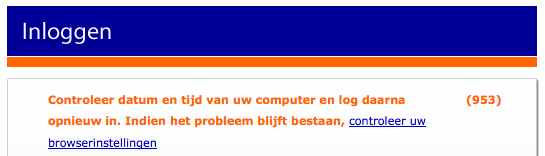

Pour poursuivre les histoires sur ma petite vie, aujourd'hui je vais vous parler de ma nouvelle carte bancaire. Elle ne fonctionne plus depuis hier soir et c'est parce que ma banque l'a bloquée. Cela faisait longtemps que ça ne m'était pas arrivé. Cette fois ci ça me fait plutôt plaisir.

<!--excerpt-->

## Changement de banque (2)

Je n'ai pas eu le temps de vous en parler mais depuis le mois de mai j'ai changé de banque[^1]. J'ai quitté [Postbank devenue ING](/postbank-devient-ing-officielement) pour aller chez **Rabobank**. Ma banque ne sponsorise pas une écurie de formule 1 mais [une équipe cycliste](/equipe-rabobank) présente sur le tour de France. Ce qui est moins polluant, vous en conviendrez. J'aurais, j'espère l'occasion de revenir sur ce choix dans un billet à venir.

## Un nouvel Internetbankiren

Je vous ai déjà parlé de l'[Internetbankiren selon Postbank](/internetbankiren-experience). La façon de procéder de ma nouvelle banque est un peu différente que chez ING. En fait toutes les banques néerlandaises sauf ING on adopté ce système. J'espère vous en parler plus longuement dans un billet à venir. Toujours-est-il que j'ai besoin de ma carte bancaire pour me connecter. Hier soir, la connexion à mon compte en ligne était impossible. J'y ai perdu des heures à essayer de voir ce qui ne marchait pas.

{.center}

## Soudain un banquière  vous appelle

Aujourd'hui, j'ai reçu un appel d'une employée au siège de ma banque. Cette dernière m'informe que ma carte est bloquée et m'en explique les raisons. Dimanche, j'ai effectué un retrait dans [un distributeur de billets](/choisir-une-banque) du Jordaan. Ce distributeur a été identifié comme le point d'origine de plusieurs cartes copiées et d'escroqueries bancaires. Ma banque a préféré bloquer ma carte avant que j'en soit un éventuelle victime supplémentaire. 

Ceux qui n'ont jamais été victime d'escroquerie bancaire peuvent trouver cette précaution disproportionnée mais je trouve trouve au contraire qu'il est sage de prévenir de gros problèmes quand la menace est avérée. Je ne suis pas mécontent d'avoir changé de banque.

---
[^1]: écoutant [les conseils de...](/changement-de-banque)
<!-- post notes:
http://www.volkskrant.nl/archief_gratis/article583292.ece/ABN_Amro_en_Rabobank_azen_op_het_hockeyveld
http://www.dutchcowboys.nl/crossmedia/10293
http://narrativebranding.files.wordpress.com/2009/06/274617506_5_ghki.jpeg
--->
