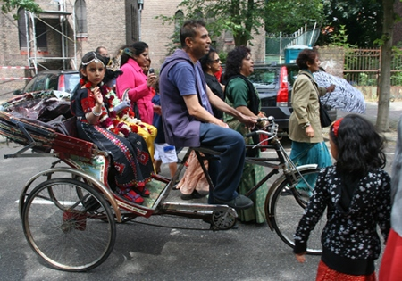
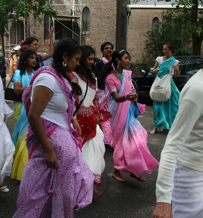
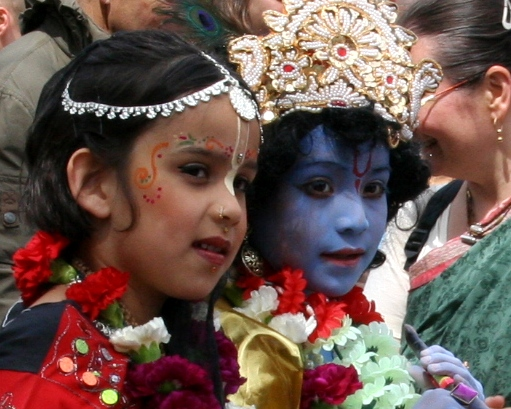

Il se passe souvent des choses sur Dam, au centre de la ville. Je ne vous en parle pas tout le temps mais puisque je n'ai pas mis à jour ce blog depuis longtemps, je vais vous raconter ma surprise du week end.

Il y avait une flashmob en hommage à Michael Jackson ce dimanche. Le rendez-vous était dans [le Vondelpark](/le-vondelpark) mais je ne suis pas allé, j'avais d'autres choses à faire. 

Il y avait aussi une exposition et une fête indienne ce dimanche sur la place du Dam. Je n'y suis pas allé non plus parce que j'avais d'autres choses à faire. 

Seulement en partant de la maison, je suis tombé sur un défilé peu ordinaire : des Hare Krishna qui défilaient dans mon quartier vraisemblablement en direction du Dam pour cette fête indienne. Une procession haute en couleurs et peu habituelle. Ça vaut bien quelques photos.

((/public/images/photos/2009-03/are krishna-char.jpg|Le char Hare Krishna|C))

Voici le char dont les hauts parleurs chantaient le mantra de Haré Krishna, repris en c?ur par les manifestants qui défilaient à l'avant. Il y avait des indiens et des européens. Je ne sais pas du tout comment les religions indiennes sont représentés à Amsterdam mais je sais qu'il y avait quelques salles de réunion Haré Krishna dans mon quartier[^1]. C'est au moins ça.

{.center}

{.center}

{.center}
---
[^1]: avec des ?, sweet ? dessinés sur la porte.