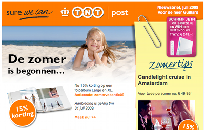
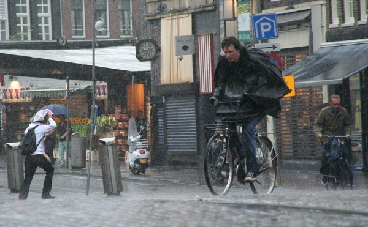
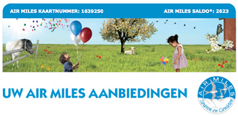

L'arrivée de l'été se confirme par de nombreux changements en ville. Si certains changements sont des classiques marronniers de la saison, d'autres sont typiques d'Amsterdam. Ça mérite donc que je m'y attarde le temps d'un billet.

## Vacances
Tout a commencé le 29 juin. Ce lundi matin, je suis aller bosser à vélo, comme tous les matins. Au lieu de slalomer dans la cohue des bicyclettes, je filais droit sur une route presque déserte. Les quelques touristes déjà debout ne me gênaient pas. Les Néerlandais sont tous [partis en vacances](/millions-de-neerlandais). Ils ne reviendront que dans un mois, quand ils auront dépensé tout [leur argent de vacances](/nouveau-mot-vakantiegeld) (ou pécule de vacances).

{.center}

Autre preuve du départ massif des citadins vers des cieux plus ensoleillés est la petite taille des tas d'ordure qui jonchent les trottoirs. [Ces tas d'ordures](/eugene-poubelle-prefet-amsterdam) font la réputation d'Amsterdam, fière ville ou la poubelle n'a toujours pas été inventée.

## Soleil
Ils ont raisons les citadins de partir vers des cieux plus ensoleillés. Les jours de beau temps sont souvent le privilège du printemps. Généralement, il faut [profiter du soleil](/prendre-le-soleil-autre-solution) dès qu'il est là parce qu'on sait qu'il ne reste pas longtemps. Cette année 2009 est quelque peu exceptionnelle puisque toutes les semaines depuis début mai ont des jours de beau temps. Quand je suis allé travailler à vélo le lundi 6 juillet au matin, j'ai pris une averse qui m'a trempé jusqu'aux os. L'été est bien arrivé puisque le soleil est parti. Il a plut toute la journée.

{.center}

## Pub
J'ai continué cette belle matinée du 6 juillet en relevant mon courrier. Les services en ligne ne ratent pas une occasion pour bourrer votre boite de messages importants mais inutiles. J'ai là aussi eu confirmation que c'était l'été. On me l'annonçait (*de zomer is begonnen...*) en me souhaitant bonnes vacances sous le soleil. Ceci pour vous rappeler qu'il ne faut pas croire les publicités. Comparez donc la photo ci-dessous ? ou l'on essaye de vous faire croire que votre vie est belle alors qu'elle ressemble plutôt à la photo ci-dessus ?.

{.center}
