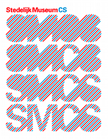
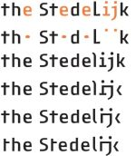

Le musée municipal d'art moderne de la ville d'Amsterdam vit de grand changement. Chassé de sa résidence provisoire dans le vieux centre de tri postal, il attends la fin de la rénovation de son bâtiment historique. Un nouveau logo, un nouvelle signalétique en maintenant une nouvelle directrice.

Pendant que le musée n'a pas de toit, il s'impose [entre les murs d'autres musées](/stedelijk-musee-hors-murs) comme Nieuwe Kerk ou le Van Gogh Museum (Avant-gardes ?20 / ?60 jusqu'au 23 aout). Et prépare sa nouvelle ouverture avec plein de changement.

Le musée nous annonce aujourd'hui [son nouveau conservateur](http://stedelijkindestad.nl/projects/nieuws/posts/new_director_stedelijk_museum_announced). Ann Goldstein, de Los Angeles remplacera Gijs van Tuyl, conservateur du musée municipal depuis 2005. La photo et le CV d'Ann Goldstein est diffusée avec fierté sur le site du musée. C'est la première femme à prendre cette charge depuis la création du musée en 1895 ; c'est aussi la première concervatrice immigrée, me semble-t-il, quand je regarde [les noms des précédents](http://fr.wikipedia.org/wiki/Stedelijk_Museum) *directeurs*.

Mais l'inspiration étrangère ne s'arrête pas là, le musée est certe connu pour ses collections de peintres Néerlandais des mouvements [de Stijl](/voctorie-boogie-woogie-decortique) ou [CoBrA](/dimanche-musee-cobra) mais il est aussi connu pour ses toiles de peintres français comme Henri Matisse ou russes comme Casimir Malevitch. L'art moderne ne connait pas de frontières.

<!-- HTML -->
<table align="center" style="text-align:center;"><tr><td>
<!-- / HTML -->
{.center}
<!-- HTML -->
</td><td>
<!-- / HTML -->
{.center}
<!-- HTML -->
</td></tr><tr><td>
<!-- / HTML -->
**avant**
<!-- HTML -->
</td><td>
<!-- / HTML -->
**après**
<!-- HTML -->
</td></tr></table>
<!-- / HTML -->

En janvier dernier,  **le musée Stedelijk a choisit la signalétique pour son futur musée**. C'est [un français qui a été sellectionné](http://www.stedelijkindestad.nl/projects/nieuwe_stedelijk/posts/studio_pierre_di_sciullo_winnaar_pitch_nieuwe_huisstijl_stedelijk_museum). Pierre di Sciullo est en effet l'auteur de ce qui sera le logo du musée Stedelijk d'Amsterdam et de toute la signalétique à l'intérieur du musée. [Une carte de visite prestigieuse](http://quiresiste.com/projet.php?lang=fr&id_projet=115&id_gabarit=0) et une preuve de plus que le musée Stedelijk est ouvert sur le monde...
---
<!-- post notes:
http://quiresiste.com/projet.php?lang=fr&id_projet=115&id_gabarit=0 
http://www.stedelijk.nl/oc2/page.asp?PageID=1962
http://stedelijkindestad.nl/projects/nieuws/posts/new_director_stedelijk_museum_announced
--->
