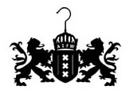

{.left}
Ce n'est pas parce que [tout le monde est parti en vacances](/millions-de-neerlandais) que la ville arrête de vivre. En juillet, Amsterdam se peuple de touristes qui n'ont pas compris que c'est maintenant la saison des pluies. Enfin, la métoé importe guère puisque certain visiteurs viennent pour certaines festivités organisées ça et là.

La semaine dernière, c'était [fashion week](http://www.amsterdamfashionweek.com/). Amsterdam voudrait être une capitale de la mode et fait beaucoup de bruit autour de sa semaine de la mode. [Viktor et Rolf](http://www.viktor-rolf.com/index.htm), les icones de cette mode néerlandaise sont eux aussi mis à contribution pour agrandir la renommée d'Amsterdam dans le monde de la mode. Cela fait peut être bien rire les parisiens et les milanais mais il y a quand même [des défilés](http://www.ethicle.com/nl/search.php?q=amsterdam+fashion+week&time=1d&type=images&sa=Search) avec de hautes pointures de la haute couture durant cette semaine. Fashion week, c'est pas rien. Ce que j'en ai vu, peut-être quelques mannequins qui visitaient le centre ville au moment ou je sortais du boulot.

Maintenant tout cela est fini. Il y a bien d'autres visiteurs en ville mais ce n'est pas pareil. Une ribambelle de vélos custom, de cruisers et de choppers y circule parce que le nouvelle évènement c'est [FBI 8](http://www.choppernewsnetwork.com/fbi-part-8/fbi-8-program) une concentration de vélos dingues avec des concours idiots et des randonnées en ville. Hier soir il y avait même une randonnée nocturne jusqu'à la plage. Je n'y suis pas allé parce que je bossais le lendemain.

{.right}
FBI 8 n'est pas fini que déjà la ville se pare des couleurs de l'arc en ciel. Le drapeau de [la gay pride](http://www.gaypride.nl/) est hissé aux facade de nombreuses maisons et les touristes gays se font plus nombreux. En fait la gay pridea commencé depuis le 23 juillet|http://www.gaypride.nl/agenda.html] mais [la grande parade sur les canaux](http://www.canalparade.nl/) c'est ce samedi et cette fois ci, je ne vais pas la rater ([comme l'autre fois](/amsterdam-ville-de-la-fierte-gay)). Depuis quelques temps, le slogan de la parade est «we are», ce qui est surement une manière d'encourager l'émancipation des gays, lesbiennes, bi et trans. mais pas de revendication précise. Les partis politiques qui veulent montrer qu'ils sont pro gay participent aussi à la parade. La parade sera d'ailleurs ouvert par le bateau de la mairie avec le bourgmestre Job Cohen et [surtout Ahmed Marcouch](http://www.parool.nl/parool/nl/5/POLITIEK/article/detail/255997/2009/07/29/De-gayboot-van-Marcouch-is-vol.dhtml), maire très populaire de l'arrondissement de Slotervaart.

Après la gay pride, [l'été devrait continuer](/le-retour-du-general-ete).
---