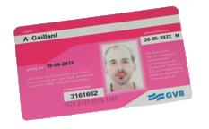

{.left}
Enfin, les Pays-Bas se sont enfin dotés de moyens modernes pour permettre aux voyageurs de régler leur voyages en transports en commun. Plus de papier, de coups de tampons, d'encre à changer dans les composteurs, les compagnies de transports en commun ont adopté **une carte à puce sans contact nommée ov-chipkaart**. Une solution électronique dont les avantages ne se compte pas. Fluidification des queues dans les trams, impossibilité de falsification des billets, réduction des queues dans les trams puisque le compostage sans contact est plus rapide, simplification de gestion des abonnements etc. Comme avant avec [la strippenkaart](/la-strippenkaart), la ov-chipkaart sera valable dans (presque) tous les Pays-Bas, pour peu que les bus ou trams soit équipés.

La compagnie municipale des transports en communs (GVB) a lourdement investi pour équiper tous les trams de lecteurs adaptés et toutes les gares de machines permettant de recharger les nouvelles ov-chipkaart. C'est maintenant le grand changement, Amsterdam a décidé qu'à partir du 27 août 2009, seul le nouveau système serait accepté dans les transports GVB. Un grand pas vers la modernité. Fini les strippenkaart et les [cartes d'abonnement](/ma-carte-pas-orange) en papier. C'est là que les emmerdes commencent vraiment.

## ov chipkaart: Ce qui change
Oubliez le système des bandes et des zones de la strippenkaart, l'ov-chipkaart s'occupe de tout. Ce sont désormais des vrais euros qui sont crédités sur la carte et décomptés à chaque voyage. La tarification est simple. 75 centimes de prise en charge (*basistarief*) puis 10 centimes par kilomètre parcouru (0,50 et 0,06 pour les voyageurs bénéficiant de réductions). Si vous changez de ligne après 35 minutes, il faut à nouveau payer la prise en charge. Pour payer son voyage, il faut valider sa carte à l'entrée du tram comme avant ainsi qu'à la sortie. L'appareil validant la sortie affiche le solde de la carte, ce qui permet au voyageur qui a le temps de lire (tout en regardant s'il ne rate pas une marche) de savoir s'il doit recharger sa carte ou pas. 

Cette nouvelle tarification est un tantinet plus chère pour les trajet moyens mais puisqu'elle est plus précise elle permet aussi de facturer au plus juste les petits trajets et les changements de zone. Le gros inconvénient est qu'il est impossible maintenant de connaitre le prix d'un trajet avant de l'avoir effectué.

La carte est nominative, même si elle est anonyme. Il n'est donc plus possible de valider le trajet de plusieurs personnes sur la même carte comme on pouvait le faire avec la strippenkaart.

## ov-chipkaart: branle bas de combat
Toutes ces différences, vont changer la vie de milliers de voyageurs et la mairie a donc mis un plan spécial à partir d'aujourd'hui pour expliquer tous ces changements. des dixaines de jeunes payés au lance-pierre sont postés dans las gares et les stations de métro pour répondre aux questions des usagers. L'achat de cartes doit se faire à un guichet mais des bornes d'informations peuvent aussi délivrer des cartes pré-chargées. Il est  possible de recharger carte à puce à des guichets automatiques. Le fonctionnement est assez simple mais pour les gens qui ont peur de la nouveauté, les jeunes sont là encore pour en expliquer le fonctionnement. 

Tout est prèt pour que le changement de système ne se fasse pas dans la douleur. Pourtant, depuis des années de nombreuses personnes se plaignent de ce nouveau système. On pourrait croire qu'il s'agit que de râleurs anti-progrès mais plus il y a d'utilisateurs de la carte, plus il y a des râleurs. Il semblerait bien que la mise en place de ce nouveau système ait été bâclé.

## ov-chipkaart: de la colère
Pour faire court, je ne vais pas dévolopper la liste des griefs dont j'ai eu vent, juste les lister.

* Les verts [ont monté un site](http://www.ov-chipklacht.nl/) pour montrer les problèmes de sécurité des cartes d'abonnements, les données personnelles peuvent être lues à distance par n'importe qui.
* Un groupe de hackers allemand [a craqué le système ov-chipkaard en 2008](http://www.ad.nl/binnenland/article1949659.ece). Le prestataire Trans Link Systems a indiqué qu'il maîtrisait le problème mais tout le monde sait que les moyens de cryptage employés sur ces puces [sont facilement craquables](http://events.ccc.de/congress/2007/Fahrplan/events/2378.en.html).
* Le changement de tarif est perçu comme une augmentation en fait les associations d'usagés parlent d'[augmentation flagrante](http://nieuws.uilenstede.nl/2008/04/24/ov-chipkaart-veel-duurder-dan-strippenkaart/) pouvant aller jusqu'à +50% pour certains trajets.
* Les magasins HEMA se sont plaint que ces cartes déclanchait les alarmes anti-vols de leurs magasins.
* La presse annonçait hier que 120 appareils automatique de recharge ont des problèmes de fonctionnement quotidiens.
* Les cartes à puces jetables en carton sont proposées aux touristes mais selon la presse d'hier, 2% d'entre elles ne marchent pas ce qui fait environ 600 clients floués par jour!
* La ville de Rotterdam a introduit ce système plus tôt cet été et [le Telegraaf](http://www.telegraaf.nl/video/binnenland/article4700657.ece) rappelle tous les problèmes techniques auquels les usagés ont du faire face.

----

J'ai oublié de vous montrer le premier site de protestation contre la ov-chikaart construit par le partit des *verts de gauche* (*groenelinks*), il s'appelle [ov-chipklacht](http://www.ov-chipklacht.nl/). Klacht signifie plainte. C'est une vieille capture d'écran qui date de 2008 et que j'avais oublié dans [les cartons](/demenagement-en-photos).

<!-- HTML -->
<table align="center"><tr><td>
<!-- / HTML -->
original:  

<!-- HTML -->
</td><td>
<!-- / HTML -->
parodie:  

<!-- HTML -->
</td></tr></table>
<!-- / HTML -->
---
<!-- post notes:
http://nieuws.uilenstede.nl/2008/04/24/ov-chipkaart-veel-duurder-dan-strippenkaart/
--->
