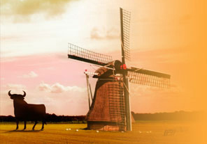

La *Vuelta* ([tour d'Espagne](http://www.lavuelta.com/)) a commencé il y a trois jours et les coureurs pédalent toujours aux Pays-Bas. Quatres jours que les Pays-Bas reçoivent *la vuelta* pour la première fois de son histoire. Les espagnols sont de retour dans un pays qu'ils ont naguère occupé. Cette fois, juste quelques villes sont occupées pendant un maximum de deux jour avec attractions et caravane publicitaire. Assen, avec le premier contre la montre, Emmen, Zutphen, Venlo et enfin Liège (en Belgique) que les néerlandais appellent Luik et les espagnols Lieja. Le détail du parcours est visible sur [la carte officielle](http://www.lavuelta.com/09/imgrecorrido/mapa_peque.jpg) ou les Pays-Bas sont coloriés comme la province espagnole du nord.

{.center}

Les Pays-Bas sont très content d'accueillir ce genre de courses, il y a trois ans, [le tour de France est passé pare le Limbourg](/etape-en-pays-bas) et a remporté un franc succès. Les villes d'Amsterdam et de Rotterdam se sont ensuite battues pour être le point de départ du Tour de France. C'est finalement de Rotterdam que partira le tour en 2010 et tout le monde est content.  Les instances cyclistes du pays aiment bien quand les grandes courses passent par le pays, cela fait parler du vélo et crée des vocations.  Cela fait tellement longtemps qu'il n'y a pas eu de grand champion batave que le vélo n'attire plus les jeunes et la [fédération cycliste](http://www.ntfu.nl/) s'en inquiète. Ça peut paraître bizarre dans un pays ou tout le monde fait du vélo mais passer du transport quotidien au sport est un pas très difficile à franchir. 

Le passage du tour d'Espagne en 2009 et du tour de France en 2010 sont l'occasion de faire la promotion de ce sport et des régions traversées par la même occasion. Cette année la vuelta a commencé aux Pays-Bas en province de Drente. La province est donc [aux couleurs espagnoles](http://www.vueltadrenthe.com/tableaux/index.php?pageId=1) pendant ces quelques jours en espérant susciter des inscription dans les clubs après le spectacle.
---
<!-- post notes:
http://hamperium.wordpress.com/ 
http://www.lavuelta.com/
http://www.flickr.com/photos/hamperium_espana/3870941527/in/pool-bicy
--->
