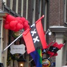
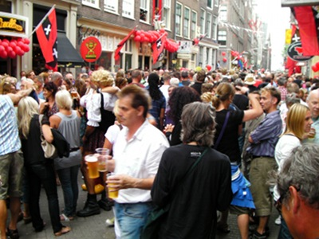
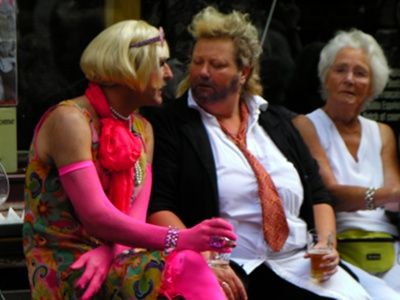
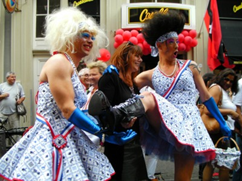
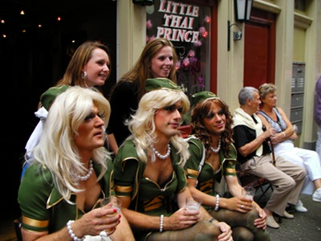
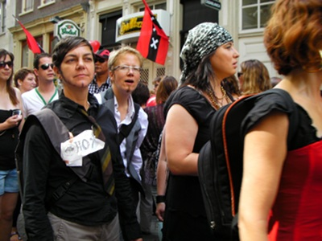
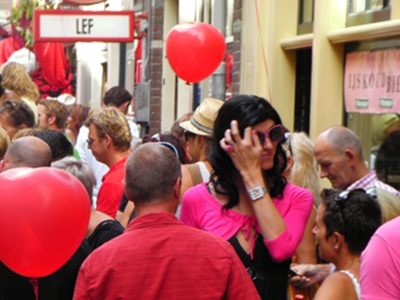
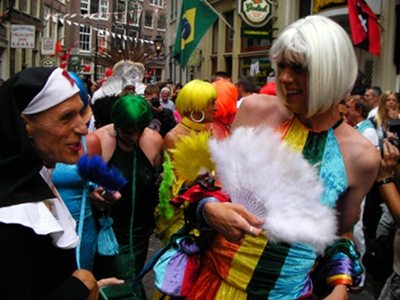

{.right}
C'est une bien jolie journée à laquelle j'ai été invité dimanche. les *Hartjesdagen* sur *Zeedijk* que l'on peut traduire par le titre ci dessus de **journées des cœurs**. À Amsterdam, cette fête ne se fait plus que dans la rue de *Zeedijk* (**la digue sur la mer**). Mais bien que très ancienne, elle n'a aujourd'hui perdu ni sa vigueur ni son attachement à de curieuses traditions.

## Zeedijk d'hier et d'aujourd'hui
Autrefois quartier populaire peuplé de marins et autres travailleurs du port d'Amsterdam, Zeedijk est resté un quartier animé du centre ville de part sa proximité du quartier rouge et d'autres lieux touristiques. Une pagode, y a été construite, point d'origine de l'installation de nombreux commerçants chinois freinant un peu l'expansion des maisons closes. l'extrémité coté Nieuwmarkt propose aussi des Coffeeshops qui sont nombreux de ce coté de la ville tandis que l'extrémité coté Warmoestraat concentre plus de bars gays. Un curieux mélange qui ravi les touristes et explique la présence de boutiques de souvenirs, sandouitcheries et autres marchands de babioles. Ce n'est vraiment pas la rue qu'on imagine au cœur d'une vie de quartier à la hollandaise.

{.center}

## Une vieille tradition
Un almanach néerlandais des fêtes du monde [nous explique](http://www.beleven.org/feest/hartjesdag) que la tradition des *Hartjesdagen* est très ancienne. Qu'elle était avant fêtée dans le Jordaan, à Haarlem ou Bloemendaal le troisième lundi d'août. C'était une fête populaire avec des feux d'artifices et un carnaval ou les hommes s'habillaient en femme et les femmes s'habillaient en homme. Pendant la seconde guerre mondiale, l'occupant allemand interdit la fête qui tombe en désueetude après la guerre.

{.center}

## Remise au goût du jour
C'est en 1997 qu'une association de quartier a décidé de redonner vie à ces *Hartjesdagen* (**journées des cœurs**) en [organisant des animations](http://www.dehartjesdagen.nl/) le troisième week-end d'août. J'ai pu voir douze ans après que ça avait bien pris. La rue Zeedijk était blindée. Le point fort de ces journée est le défilé déguisé du dimanche. Plusieurs jurés évalue les participants depuis des fenêtres au premier étage. Le défilé est très sympathique parce que les déguisés se mêlent aux passants dans une ambiances de rigolade. Beaucoup de gays viennent voir les *dragqueens* mais c'est plus qu'un concours de *dragqueen*, les déguisement sont variés, originaux et les femmes déguisées en hommes sont aussi de la partie. Les participants font les fous jusqu'à épuisement et la journée se conclue par un concert.

{.center}

{.center}

{.center}

{.center}

{.center}
---