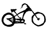

J'ai oublié de lister quelques vélos dans [la liste des vélos hollandais](/plein-de-velos), je vais donc les lister ici et les ajouter sur la page en question.

## Le fabriekfiets (le vélo d'usine)
{.left}
Comme si l'on avait confié aux ouvriers d'une usine le soin de fabriquer un vélo rapidement avec ce qu'ils trouvaient sur place, le vélo d'usine ressemble à deux roues reliées par trois tubes. Le vélo d'usine est un vélo simple et très solide qui a vraisemblablement été inventé pour aller d'un hangar à l'autre sur les sites industriels néerlandais. Il est reconnaissable car son cadre est formé d'une grosse tige épaisse et solide au lieu du traditionnel cadre triangle. Peu de marques proposent des fabriekfiets mais on peut signaler **Azor**.

## Le ligtfiets (le vélo couché)
{.left}
Se vélo pourrait avoir sa propre page tellement il est spécial. Conçu pour permettre les longues randonnées de plusieurs mois sans casser le dos, il soutient le cyclisete selon la meilleur position possible, façon chaise longue. Les jambes pédalent à l'avant pour entrainner une roue arrière ce qui oblige de disposer d'une chaine de plusieurs mètres. Même s'il est peu répandu, surement à cause de son prix, le ligfiets a ses adeptes qui ne changerais de vélo pour rien au monde. C'est vraiment un produit à part, les fabricants de vélos couchés ne fabriquent pas de vélo assis et n'ont généralement pas plus de 5 modèles à leur gamme. Citons **Roeifiets**, **Nasca**, **Zephyr**, **Flevobike** ou **Optima**. Notons aussi que **Gazelle** et **Giant** proposent des vélos dont l'ergonomie est proche du vélo couché.

## Le moederfiets (le vélo de maman)
{.left}
Ce vélo est une combinaison de omafiets et de transportfiets dont les paniers aurait été remplacés par des sièges pour enfants. Du transportfiets. il reprend la solidité (pour porter les mioches) et la stabilité (pour les attacher à leur siège sans renverser le vélo). Du omafiets, il reprend la forme ergonomique permettant de monter en selle sans lever les jambes. Mieux encore que le omafiets, le cadre du moederfiets est très bas, permettant à la maman de monter et descendre très rapidement pour stabiliser la machine et protéger ses enfants. Les vélos **Er-Go** illustrent bien cette histoire de cadre rabaissé tandis que les **Fietsfarbriek** repoussent les limites du nombre d'enfants transportables à vélo.

## Le Tandem
{.left}
Le tandem est une forme de vélo très connue. Deux vélocipédistes peuvent monter sur la même machine et conjuguer leur forces pour avancer. Le modèle que je vous présente est une variante de ce principe puisque l'une des selle est plus basse pour pouvoir accueillir un enfant. Ce dernier pédale d'ailleurs souvent dans le vide laissant au parent le soin de porter tout le monde, comme dans un bakfiets. D'ailleurs certains de ces tandems sont des bakfiets dont on peut remplacer la benne par une selle. **Onderwater** est un bel exemple du genre tandis que les marques comme **Gazelle**, **Sparta** et **Batavus** proposent aussi des tandem à leur catalogue.

## Le Kinderfiets (vélo d'enfant)
Il fallait que je le liste pour rappeler que le vélo s'apprend très jeune. Les parents qui n'ont pas envie de porter les enfants, peuvent toujours leur donner un vélo d'enfant (*kinderfiets*) et les attendre à chaque croisement. Le kinderfiets est  souvent utilisé le week end uniquement pour que l'enfant apprenne le vélo quand les parents peuvent rester dans les parages. Les déplacements quotidiens se faisant en bakfiets ou moederfiets.

## Le chopper fiets
{.left}
J'ai déjà parlé des beach cruiser d'inspiration américaine, les chopper sont eux aussi d'inspiration américaines et le but est d'en mettre plein la vue. C'est l'équivalent des montures customisées qu'on voit dans les festivals de motos américains. Les guidons sont hauts et les châssis sont allongés et c'est pareil pour ces vélos. Les cadres sont bombés et arrondis tous en étant prêt du sol. Les pneus sont larges et les rayons serrés. Le must avec ce genre de vélo est d'avoir l'antivol en forme de menottes. Il n'y a pas de marque de Chopper vraiment hollandaise, la plupart de ces engins étant importés des États-Unis mais on peut signaler **Electra**, marque étasunienne qui appartient à un groupe hollandais.

## Le Filibus (filibus)
{.left}
Parmi les nombreux transportfiets différent, le *filibus* en un un que l'on retrouve souvent dans les rues d'Amsterdam. Il est plus long et peut donc transporter un bac plus grand. Il est suffisamment costaud pour transporter mioches et clébards ou des parpaings. il est malgré tout moins compliqué à garer qu'un bakfiets puisque sa largeur n'est pas imposante. bien que d'allure rustique et masculine, il est souvent conduit par des femmes ce qui doit être une mode. Il est fabriqué par plusieurs marque qui lui donne toujours le même nom de Filibus. **'t Mannetje**, **Dutch-ID**, **de Fietsfabriek**, l'affichent à leur catalogue, avec une préférence pour le dernier dont le cadre est plus stylisé.

## Le cross fiets (bicross)
{.left}
Alors qu'il était à la mode partout dans les années 80, le bicross a presque disparu d'Amsterdam. Il faut dire que son absence de grade boue, sa chaine apparente et son cadre bas n'en fait pas vraiment un vélo taillé pour la ville. On croise encore ces vélos, enfourchés par des jeunes peu friqués loin du centre ville. Ces derniers ont trouvé une bonne occasion qui leur permettent de s'amuser à bon prix et sans suivre les modes. Certains s'attaquent avec brio au mobilier urbain avec leur BMX mais ce n'est pas le sport le plus couru ici.

<!-- post notes:
http://www.fietsen-kopen.nl/fiets-soorten
--->
