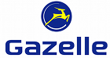
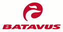
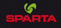
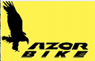
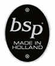
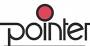
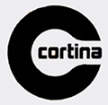
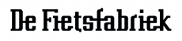
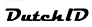
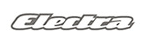

Comme vous le savez, j'ai dû trouver un nouveau vélo. Et puisque je suis au pays du fromage, autant acheter un vélo hollandais fait sur place. J'ai donc tenté de passer en revue tous les fabricants de vélos aux Pays-Bas. Il y en a tellement que je ne peux pas être exhaustif mais je vous présente ci-dessous toutes les grandes marques de vélos hollandais qu'il faut connaitre.

{.right}
## Gazelle
C'est la première marque du pays, tant en terme de notoriété qu'en volume. Depuis des lustres, les vélos Gazelle sont une référence en terme de robustesse et d'efficacité. C'est en partie cette marque qui a fait la notoriété des vélos hollandais connus dans le monde entier. La gamme gazelle est très Étendue, des vélos de ville classiques aux vélos de course mais la marque est surtout recherchée aujourd'hui pour ces vélos de cyclotourisme. Cette marque est un peu plus chère que les autres, du au fait que Gazelle fabrique ses propres pièces détachées. Une réputation de qualité qui n'est pas usurpée et qui assure les ventes de ce numéro un du vélo hollandais pour encore longtemps. [Koninklijke Gazelle Rijwielfabriek B.V.](http://www.gazelle.nl/nl/gazelle/organisatie.html) est installée à Diemen dans [la Gueldre|] et produit plus de 300.000 vélos par an.

----

{.right}
## Batavus
Cette deuxième marque est un sérieux challengeur de Gazelle. Batavus est aussi connu pour la qualité de ses vélos et Batavus produit aussi beaucoup de ses pièces détachées. En fait, Batavus était numéro un dans les années 70 mais l'histoire de la compagnie est un peu mouvementée . Elle a un temps été regroupée avec Gazelle qui s'en sépare rapidement. Elle est ensuite reprise par un groupe qui fait faillite en 1986. La marque a été reprise par le Conglomérat Néerlandais Accel qui possède de nombreuses marques européennes. À l'origine cette société est Frisone (de [Frise](/les-provinces-des-pays-bas)) et [fabriquait aussi des vélos-moteurs](http://www.rijwiel.net/batavusn.htm). L'usine basée à Heerenveen a récement été [transformée en musée](http://www.heerenveensecourant.nl/profile/RedactieHeerenveen/article25417.ece).

----

{.right}
## Sparta
Cette vieille marque Néerlandaise de vélos était elle aussi productrice de motos et mobylettes pendant de nombreuses années. Elle est basée à Apeldoorn, dans la Gueldre et a elle aussi eu des difficultés. Elle a arrêté la production de motos en 1982 et se retrouve en difficulté en 1999 avant d'être reprise le 28 septembre par le groupe Accel. En 2003 Sparta lance le Sparta Ion, un vélo à assistance électrique dont les batteries sont cachées dans le cadre. Ce vélo connaît un succès immédiat et assure aujourd'hui la renommé de la marque au sein du groupe Accel. Sparta propose aujourd'hui une gamme complète de bicyclettes pour tous les goûts.

----

{.right}
## Azor
Cette marque de vélo a une diffusion beaucoup plus confidentielle (environ 11.000 vélos produits par an) et son histoire est toute récente puisque sa création date de 1998. Un marchand de vélo m'a raconté que son créateur, Jan Rijkeboer, était technicien chez Gazelle et a pensé un jour qu'il pouvait faire des vélos de meilleure qualité. Les pièces sont choisies pour leur robustesse plus que pour leur prix et la peinture est aussi de très bonne facture. Les modèles sont de conception récente mais d'inspiration hollandaise classique. L'usine, situé à Hoogeveen dans le [Drente|] produit les vélos Azor mais aussi les bakfiets de marque **Bakfiets**, les tandems **Onderwaterfiets** et les moederfiets **er-go**.

----

{.right}
## Koga-Miyata
**Koga-Miyata** est a marque phare du groupe frison **Accel**. Les vélos Koga sont des vélos de course hauts de gamme et la marque possède un impressionnant catalogue de vélos de course avec toutes les options et pièces détachés possibles. Ce n'est pas pour rien que Koga est le fournisseur officiel d'une équipe Néerlandaise [SKIL-Shimano](http://www.skilcyclingteam.com/index.php?table=fiets), la deuxième équipe Néerlandaise à concourir au tour de France 2009. Koga Miyata est aussi fournisseur des [vélos des coureurs en salle Néerlandais](http://www.koga.com/kimera/) qui sont des habitués des médailles d'or.

---- 

{.right}
## BSP 
À l'inverse de la marque précédente, BSP est surtout connue pour ses vélos de ville d'entrée de gamme. Ce sont eux qui fabriquent ces vélos colorés que les marchands aiment exposer devant leur magasin pour le plaisir des photographes [comme moi](/les-velos-en-couleur). Pour moins de 300 euros, BSP propose un vélo *made in Holland* simple et solide dans un large choix de couleurs. Ce fabricant est basé à Utrecht et propose des vélos plus élaborés à son catalogue. Certains vélos comme les [transportfiets](/plein-de-velos) sont vendus sous la marque **Metropolis** mais les bicyclettes sortent de la même usine. Tous sont la réputation de la marque, simples, peu d'options solides et pas cher (pour des vrai vélos hollandais).

----
{.right}
## Pointer
Cette marque frisonne n'est pas la plus connue et pourtant il n'est pas rare de croiser des bicyclettes **Pointer** de tout âge dans les rues. Ce fabricant affiche fièrement ses 20 ans (et plus) à fabriquer entièrement des vélos fiables, fonctionnels et d'un bon rapport qualité/prix. Ceci, peut-être au détriment d'une manque de variété dans les produits. Pointer propose une petite gamme de vélos de ville et de route. Point. Pas de vélos spéciaux ou de fantaisie.
La société situé dans le petit village de Boelenslaan est restée indépendante. Elle diffuse ses produits dans tous les Pays-Bas et même à l'export.

----
{.right}
## Montego
Montego est une marque du groupe [Blomson International](http://www.blomson.com/) BV, basé à Beverwijk NH. **Montego** est la marque des vélos de ville du groupe. Certains sont des omafiets simples et d'autre des transportfiets qui semblent plus robustes. D'un aspect plus moderne et coloré que les BSP et pointer, ces vélos restent abordables. Leur réputation qualitative est encore à faire puisque la marque n'existe que depuis 1991.

----
{.right}
## Cortina
J'ai trouvé peu d'information sur cette marque en dehors de la brochure que l'on m'a envoyé. La gamme est peu étendue mais les vélos semblent de bonne facture. Je connais quand même deux personnes qui sont contentes de leur **Cortina** transportfiets. Il semble que la marque soit récente et les vélos n'ont d'ailleurs pas de look rétro. Ils sont fabriqués à Zwolle et sont vendus aux Pays-Bas à un tarif attrayant. Il me semble que Montego et Cortina soit exactement sur le même segment.

----
{.right}
## De Fietsfabriek
**De Fietsfabriek** est une marque créée en 2003 accompagnant le retour à la mode des vélos traditionnels avec une touche de couleur en plus. La marque a vu le jour dans le quartier du Pijp, crée par un immigré turc qui est maintenant une des star du quartier. Les vélos de Fietsfabriek sont des transportfiets, des bakfiets ou des vélos capable de transporter plein d'enfants et marchandises. La marque a aussi innové en proposant un [marquage du vélo découpé dans le cadre](http://www.flickr.com/photos/13274211@N00/3031129201/) permettant d'éviter le vol d'opportunité. Ceci est possible parce que chaque vélo est fabriqué quasiment sur demande. Tout ce choix en fait une marque chère mais la qualité des vélos justifie largement le prix.

----
{.right}
## Dutch-ID
Cette marque, crée par [un importateur](http://www.amazingwheels.nl/) de vélo spéciaux (souvent fabriqués au Danemark) d'IJmuiden suit la mode des vélos hollandais traditionnels remis au gout du jour par un design étudié ou des couleurs voyantes. Beaucoup de modèles Dutch-ID sont donc des transportfiets ou des bakfiets. Mon préféré est le double dutch, un transportfiets ou les porte bagage avant et arrière semblent pouvoir transporter un sacré poids, d'autant que le cadre en alu est très solide. Les vélos, bien que conçus aux Pays-Bas sont fabriqué à Taiwan, ce qui la fout mal pour une marque qui reprend en anglais le nom du premier pays producteur de vélo du monde.

----
{.right}
## Johnny Loco
La marque Johnny Loco est depuis deux ans la nouvelle marque à la mode, coqueluche des devanture de magasins de mode et des panneaux d'affichage. Johnny Loco produit des *beach cruiser* parce que c'est le genre de vélo le plus *trendy* et quelques bakfiets au look très *beach cruiser* pour toujours coller à la mode. Basée à Amsterdam Noord, la marque a beaucoup de succès dans la capitale où il est courant de voir les gens adopter les marques à la mode. Le fabriquant de vélo l'a d'ailleurs compris puisqu'il décline maintenant la marque en accessoires de vélo/voiture et en habits. Malgré tout ce coté *hype*, les vélos de la marque restent du bon matériel et pas si cher que ça.

----
{.right}
## Electra
**Electra** est aussi une marque de **Blomson International B.V.** ce qui en fait une marque de vélos hollandais mais quand on regarde la gamme **Electra**, on comprend vite que l'inspiration est américaine. Electra propose des *beach cruiser* et des *choppers* de toutes formes et de toutes couleurs. Leur gamme est très étendue et se développe à la fois pour les hommes et pour les femmes. Le catalogue fait rêver et les prix sont gère plus élevés que les vélos de ville mais on hésite toujours à se retrouver avec un vélo trop voyant qui attire les convoitises.
