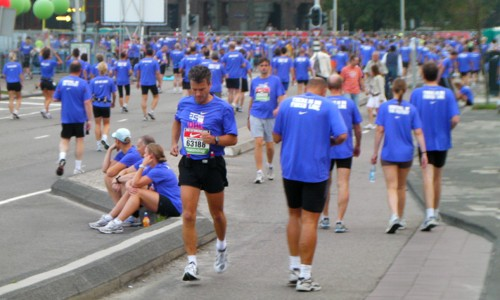
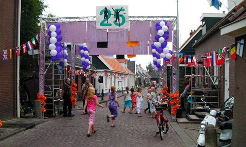

C'est dans la nuit du 19 au 20 que la 25ème course Dam tot Dam s'est déroulé. 16 kilomètres à pied entre *Amsterdam* (le barrage sur l'Amstel) et *Zaandam* (le barrage sur le Zaan). La course tient donc son nom de deux barrages qui ont donné leur nom à deux villes. **Amsterdam**, point de départ, capitale des Pays-Bas, sur la rive sud de l'[IJ](/nouveau-mot-ij-2) et **Zaandam**, la ville industrielle au nord de l'IJ, au bord du Zaan, chargée elle aussi d'histoire[^1] mais ce n'est pas ici l'objet de ce post.

Cette course n'est pas longue, 16km, moins qu'un semi marathon, ce n'est donc pas la longueur qui en fait la course la plus mythique des Pays-Bas. Pour aller d'Amsterdam à Zaandam, il y a de nombreux tunnels sous l'IJ mais ces derniers sont réservés aux voitures. Le plus connu d'entre eux, l'IJtunnel passe du centre ville au quartiers nord en passant sous le musée Nemo. C'est ce tunnel, habituellement réservé aux autos que les coureurs empruntent pour aller d'Amsterdam à Zaandam.

## Histoire du Dam tot dam

L'histoire raconte que la première course s'est déroulé en 1959 et que les participants pouvaient emprunter tout les moyens à leur disposition pour traverser l'IJ. Cette course était surtout une manifestation pour demander au gouvernement la construction d'un tunnel reliant les deux villes. C'est en 1981 que l'histoire du *Dam tot damloop* (à pied du Dam au Dam) commence vraiment. La société [Le Champion](http://www.lechampion.nl/) a eu l'idée d'organiser une couse passant sous le tunnel. Il a fallut attendre 1985 pour les organisateurs obtiennent toutes les autorisations des mairies des communes traversées.  Cette année là, le point de départ de la course était proche du tunnel pour incommoder au minimum la circulation automobile. 

La première couse s'étant bien déroulé, les autorisations ont été délivrées pour les années suivantes et la couse a commencé a avoir du succès. 1988 a vu l'inscription des premiers coureurs professionnels. Aujourd'hui, ils sont plus de 2000.

En 2003, la journée du dimanche profite de la fermeture continue du tunnel pour organiser des randonnées, c'est la [Dam tot Dam wandeltocht](  http://www.damtotdamwandeltocht.nl). Enfin, depuis trois ans, les vélos sont de la partie avec la [Dam tot Dam FietsClassic](http://www.damtotdamfietsclassic.nl/). La société Le Champion profite de son expérience dans l'organisation de couses classiques comme Paris-Bruxelles ou Liège-Bastogne-Liège pour créer une classique à Amsterdam.

## 25 ans
Cette année pour fêter les 25 ans de la course, les organisateurs avaient décidé de faire la course de nuit. Le sponsor donnait un t-shirt souvenir à chaque participant ce qui a transformé les abords de la gare centrale en marée bleue de maillots Nike. 

{.center}

D'après les nombreux témoignages que j'ai reçu, la course de nuit était un moment magique. Ce devait être la fête dans les villages traversés.

{.center}

Pour l'année prochaine, si vous voulez participer à la couse **Dam tot Dam**, n'attendez pas que je vous en parle, les inscription commencent en août et sont closes trois semaines avant le jour du départ.
---
[^1]: Surveillez [cette page de wikipedia](http://fr.wikipedia.org/wiki/Zaandam) pour voir si j'y écrit un jour l'histoire de Zaandam.
<!-- post notes:
http://www.zaanstad.nl/sct/sportstad/sportevenem/geschied/?view=Standard
--->
